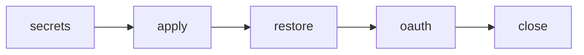

# Platform cutover: `rednaw.nl`

Execute one step. Explain. Wait for go. Human runs `task` they want to run, and clicks what this agent cannot reach. Tokens and key IDs stay off chat.



## Decisions

| | |
|--|--|
| TFC | Org **Rednaw**, reuse `platform-dev` / `platform-prod` |
| Platform DNS | `dev`/`prod`/`auth`/`registry` on `rednaw.nl`. TF does not manage `@`/`www` there |
| Band site | `dev`/`prod.tientjeketama.nl`; apex/`www` → `prod.tientjeketama.nl` |
| App image | tientje-ketama `main` HEAD via GitHub Actions. No image tar. Prisma migrate after restore if HEAD is ahead of the dump |
| Prod data | Restic restore required (Postgres + uploads) |
| Dev data | Not restored. `platform-dev` state is empty |
| Abort | Until the old account is closed: `ferry/` (restic + encrypted old `infra.yml`) |

## Facts

- Optional `app_domain`; empty → `site_domain = base_domain`. Compose labels pin app hosts; `iac.yml` `app_domains` does not drive DNS.
- Registry DNS is prod-only. Same `registry_username` / `password`.
- CMS: simonacella `admin/config.yml`, anticobagliosiciliano `static/admin/config.yml` + `tests/sveltia-admin.test.ts`. `cms_oauth_allowed_domains` unchanged. tientje-ketama does not use OAuth.
- One GitHub OAuth app; proxy does not send `redirect_uri`. Homepage + callback + both `base_url`s flip together after `https://auth.rednaw.nl` serves. Pages stay up; CMS login is down from destroy until that flip.
- Rebuild the container after `base_domain` changes (reopen is not enough). Delete `.decrypted~infra.yml` after every `infra.yml` edit.
- Let’s Encrypt may refuse duplicate `auth`/`registry`/`prod` names if abort recreates them twice in a week.
- Old Hetzner SSH key `wander@casa` is id `105413073`. New project has the same pubkey; numeric id unknown until API (console hides it).
- Both zones NS at TransIP. `rednaw.nl` has no A/AAAA/MX/TXT/`www`. Not used for mail.
- This host’s public IPv4 is in `allowed_ssh_ips`.
- TFC: no workspace variables. Both `platform-dev` and `platform-prod` state are empty (destroy done).
- New Hetzner project: billing on. Pubkey uploaded. **API token not created yet** — generate Read+Write now. Then `hcloud ssh-key list` (or `GET /v1/ssh_keys`) for the new numeric id.
- Old Hetzner console may still show backup images, volumes, IPs, firewalls. SSH keys are not in TF — leave them until that account is closed.

## Secrets

Change only `hcloud_token`, `ssh_keys` (new numeric ids), `base_domain: rednaw.nl`, `app_domain: tientjeketama.nl`. Keep TransIP, TFC, registry, OAuth, `allowed_ssh_ips`.

## Apply

Wait until `dig +short prod.rednaw.nl` matches Terraform output, then bootstrap. Configure **prod** first. After `https://registry.rednaw.nl` and `https://auth.rednaw.nl` serve, **ask** to:

1. Set tientje-ketama `vars.REGISTRY_URL` to `registry.rednaw.nl`
2. Run **build-and-push** on `main` (`gh workflow run` needs `workflow_dispatch`, or push `main`)

Then configure **dev**. Deploy that sha: `task app:deploy -- prod tientje-ketama <7-char sha>`. Do not merge other tientje-ketama changes until restore is done. Dev app deploy optional.

## Restore

Ferry check:

```text
export RESTIC_REPOSITORY=/workspaces/iac/ferry/tientje-ketama RESTIC_PASSWORD=local
test -f "$RESTIC_REPOSITORY/config"
restic check
restic ls latest
```

`latest` must list `postgres_db.dump` and `app_app_uploads.tar`.

Upload task reads `.backup-repos/tientje-ketama`. Symlink/copy `ferry/tientje-ketama` there. Stop `app`, upload, restore `--confirm`, start, `workflow:deploy`.

## Abort

Until the old Hetzner account is closed.

1. Destroy any new VPS **while new secrets are still loaded**.
2. `cp ferry/infra.yml secrets/infra.yml`. Delete `.decrypted~infra.yml`.
3. Rebuild container. Apply; you run GH build-and-push; deploy; stop `app`; upload + restore; start. Revert OAuth homepage/callback, both `base_url`s + test, Pages, `REGISTRY_URL` if changed.

After the old account is gone, there is no return.

## After this

[vpn-travel-china.md](../../docs/future/vpn-travel-china.md) — `vpn-dev.rednaw.nl` / `vpn-prod.rednaw.nl`.
