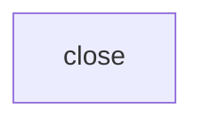

# Platform cutover: `rednaw.nl`

Execute one step. Explain. Wait for go. Human runs `task` they want to run, and clicks what this agent cannot reach. Tokens and key IDs stay off chat.

## Decisions

| | |
|--|--|
| TFC | Org **Rednaw**, reuse `platform-dev` / `platform-prod` |
| Platform DNS | `dev`/`prod`/`auth`/`registry` on `rednaw.nl`. TF does not manage `@`/`www` there |
| Band site | `dev`/`prod.tientjeketama.nl`; apex/`www` → `prod.tientjeketama.nl` |
| App image | tientje-ketama `main` HEAD via GitHub Actions. No image tar. Prisma migrate after restore if HEAD is ahead of the dump |
| Prod data | Restic restore required (Postgres + uploads) |
| Dev | Skip this cutover. `platform-dev` stays empty; apply later if you want `dev.rednaw.nl` |
| Abort | Until the old account is closed: `ferry/` (restic + encrypted old `infra.yml`) |

## Facts

- Optional `app_domain`; empty → `site_domain = base_domain`. `iac.yml` `app_domains` does not drive DNS. Deploy sets `APP_HOST` from the `app_domains` entry for this env; compose `Host(${APP_HOST})` only.
- Registry DNS is prod-only. Same `registry_username` / `password`.
- CMS: simonacella `admin/config.yml`, anticobagliosiciliano `static/admin/config.yml` + `tests/sveltia-admin.test.ts`. `cms_oauth_allowed_domains` unchanged. tientje-ketama does not use OAuth.
- One GitHub OAuth app; proxy does not send `redirect_uri`. Homepage + callback + both `base_url`s flip together after `https://auth.rednaw.nl` serves. Pages stay up; CMS login is down from destroy until that flip.
- Rebuild the container after `base_domain` changes (reopen is not enough). Delete `.decrypted~infra.yml` after every `infra.yml` edit.
- Let’s Encrypt may refuse duplicate `auth`/`registry`/`prod` names if abort recreates them twice in a week.
- Both zones NS at TransIP. `rednaw.nl` has no A/AAAA/MX/TXT/`www`. Not used for mail.
- This host’s public IPv4 is in `allowed_ssh_ips`.
- TFC: no workspace variables. `platform-prod` applied and configured; `platform-dev` empty (skipped). Site `https://prod.tientjeketama.nl` is up (`7fc9c1f`, snapshot `a5c63363`). Registry, auth, and both CMS logins work.
- New Hetzner project: billing on. Container rebuilt: `BASE_DOMAIN=rednaw.nl`, `REGISTRY=registry.rednaw.nl`, hcloud sees `wander@casa`.
- Old Hetzner console may still show leftover backup images from the old account. SSH keys there are not in TF — leave them until that account is closed.

## Restore

Done. Snapshot `a5c63363`. App `7fc9c1f` listening. Prefect flows deployed.

`ln -sfn` into an existing `.backup-repos/tientje-ketama/` dir nests the symlink; replace the dir, then `ln -s`. Stop/start as `sudo -u iac`. Restore with explicit snapshot id.

## Abort

Until the old Hetzner account is closed.

1. Destroy any new VPS **while new secrets are still loaded**.
2. `cp ferry/infra.yml secrets/infra.yml`. Delete `.decrypted~infra.yml`.
3. Rebuild container. Apply; you run GH build-and-push; deploy; stop `app`; upload + restore; start. Revert OAuth homepage/callback, both `base_url`s + test, Pages, `REGISTRY_URL` if changed.

After the old account is gone, there is no return.

## After this

[vpn-travel-china.md](../../docs/future/vpn-travel-china.md) — `vpn-dev.rednaw.nl` / `vpn-prod.rednaw.nl`.
