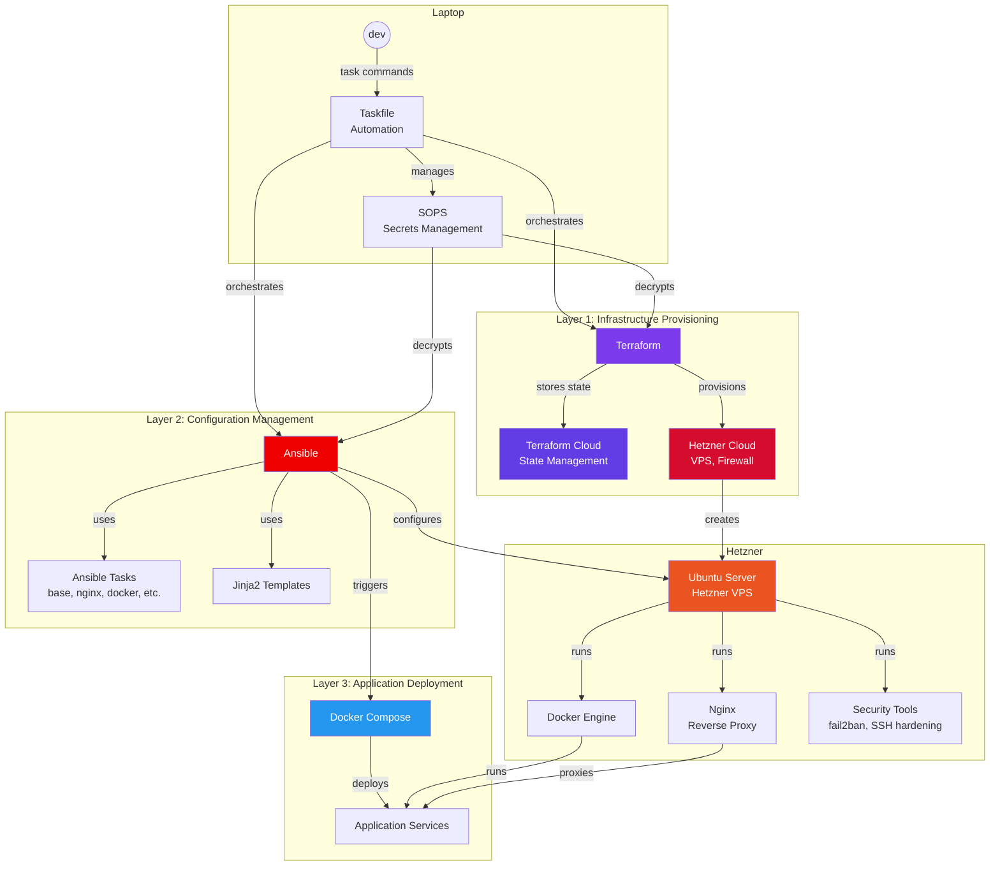

# Infrastructure as Code

**TL;DR** Bring me to the [documentation](docs/README.md)

You want to self-host. Maybe you left Heroku after the pricing changes. Maybe you care about data sovereignty. Maybe you just want a €4/month server instead of a $25/month platform.

Your options:
1. **PaaS-in-a-box** (Coolify, CapRover) — Click buttons, hope it works, don't look under the hood
2. **Kubernetes** — Spend months learning, over-engineer everything, feel clever
3. **Wing it** — SSH in, docker-compose up, forget how you set it up, dread the next server

None of these feel right.

## This Project

A fourth option: proper infrastructure-as-code, but approachable.

- **Terraform** provisions your server (Hetzner, cheap and European)
- **Ansible** configures it (Docker, security hardening, Nginx)
- **SOPS** encrypts your secrets (committed to Git, decrypted transparently in VS Code)
- **docker-compose** runs your apps (the format you already know)

Everything is code. Everything is versioned. Nothing is magic.

## Who This Is For

- **Indie hackers** — Ship your side project on a €4/month VPS
- **Small teams** — Deploy 2-5 apps without a platform team
- **Learners** — Understand IaC properly, not through a GUI
- **Privacy-conscious developers** — Your data, your servers, your jurisdiction

## Who This Is Not For

- Teams that need auto-scaling (use Kubernetes)
- People who don't want to touch a terminal (use Coolify)
- Enterprises with compliance requirements (hire a platform team)

## Philosophy

**Teach, don't hide.** Every decision is documented. When you outgrow this, you'll understand what you're moving to.

**Opinionated defaults.** Hetzner. Ubuntu. Docker. Nginx. SOPS. You can change them, but you don't have to decide.

**Single server, done well.** Most projects don't need a cluster. They need one reliable server, properly configured.

**Developer experience matters.** Open the repo in a Dev Container and get a consistent environment; edit encrypted secrets in VS Code; run commands through Taskfile. No context-switching to web consoles.

## Automate everything

