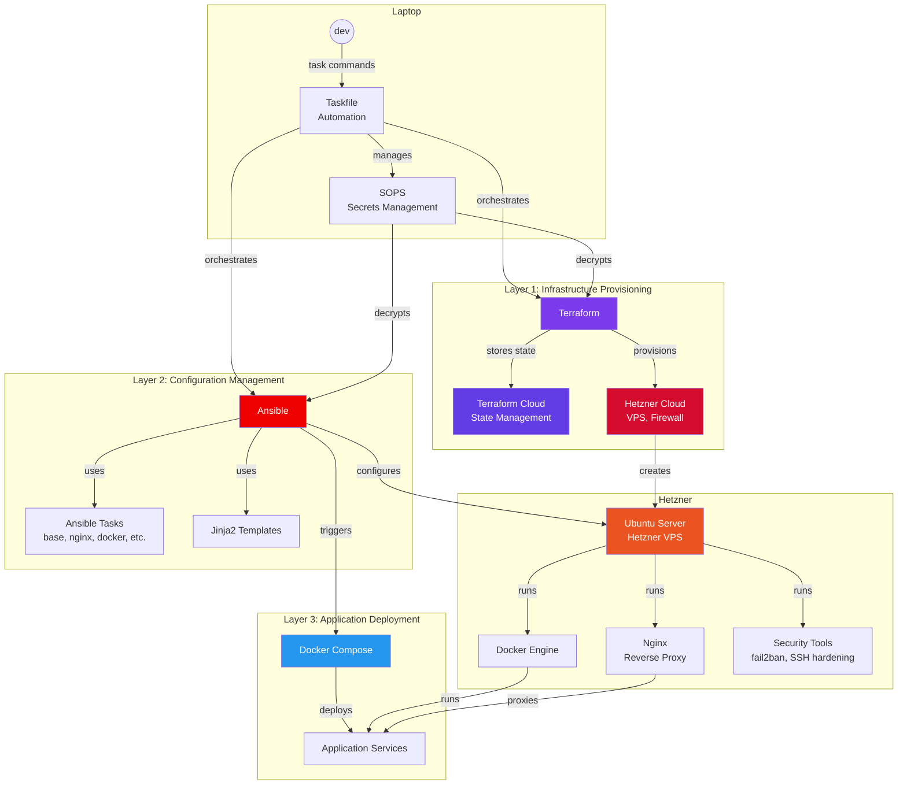

# Infrastructure as Code

Bring me to the [documentation](docs/README.md)

## Overview

## Automate everything

```mermaid
graph TB
    subgraph "Laptop"
        DEV((dev))
        TASK[Taskfile<br/>Automation]
        SOPS[SOPS<br/>Secrets Management]
    end

    subgraph "Layer 2: Configuration Management"
        ANS[Ansible]
        TASKS[Ansible Tasks<br/>base, nginx, docker, etc.]
        TEMP[Jinja2 Templates]
    end
    
    subgraph "Layer 1: Infrastructure Provisioning"
        TF[Terraform]
        TFC[Terraform Cloud<br/>State Management]
        HETZ[Hetzner Cloud<br/>VPS, Firewall]
    end
        
    subgraph "Layer 3: Application Deployment"
        DC[Docker Compose]
        APP[Application Services]
    end
    
    subgraph "Hetzner"
        SERVER[Ubuntu Server<br/>Hetzner VPS]
        NGINX[Nginx<br/>Reverse Proxy]
        DOCKER[Docker Engine]
        SEC[Security Tools<br/>fail2ban, SSH hardening]
    end
    
    DEV -->|task commands| TASK
    TASK -->|orchestrates| TF
    TASK -->|orchestrates| ANS
    TASK -->|manages| SOPS
    
    SOPS -->|decrypts| TF
    SOPS -->|decrypts| ANS
    
    TF -->|provisions| HETZ
    TF -->|stores state| TFC
    HETZ -->|creates| SERVER
    
    ANS -->|uses| TASKS
    ANS -->|uses| TEMP
    ANS -->|configures| SERVER
    ANS -->|triggers| DC
    
    SERVER -->|runs| NGINX
    SERVER -->|runs| DOCKER
    SERVER -->|runs| SEC
    
    DC -->|deploys| APP
    DOCKER -->|runs| APP
    NGINX -->|proxies| APP
    
    style TF fill:#7c3aed,color:#fff
    style ANS fill:#ee0000,color:#fff
    style DC fill:#2496ed,color:#fff
    style TFC fill:#623ce4,color:#fff
    style HETZ fill:#d50c2d,color:#fff
    style SERVER fill:#e95420,color:#fff
```
