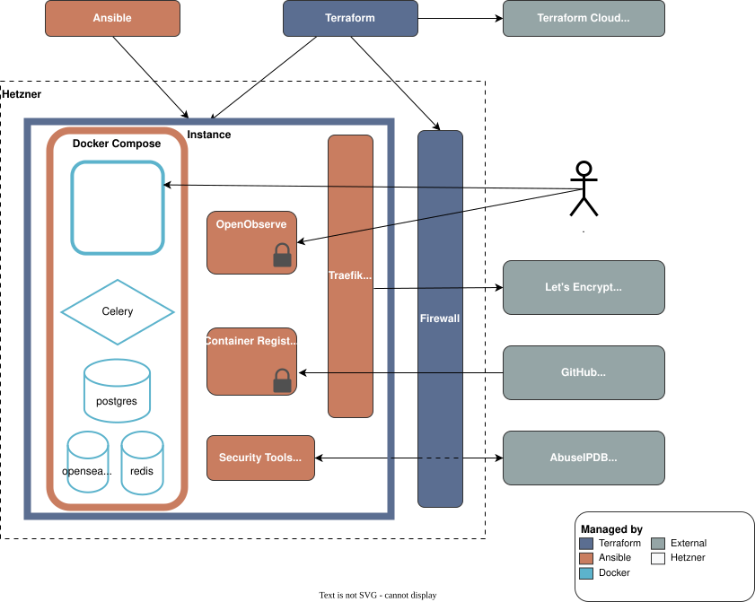

# Infrastructure as Code

Opinionated IaC for a **single Hetzner VPS**: Terraform provisions, Ansible configures, SOPS encrypts secrets, Docker Compose runs apps.



## Included

- Hardened Ubuntu (SSH keys, fail2ban, unattended upgrades)
- Traefik (HTTPS / Let’s Encrypt) + private Docker registry
- OpenObserve (logs/metrics) + Prefect (scheduled jobs) + Restic backups
- Devcontainer with Task, Ansible, Terraform, SOPS, Docker CLI

## Work here

1. Clone this repo as a folder named **`iac`**, and each app as a **sibling** (same parent directory).
2. **File → Open Folder** on **`iac`** → **Reopen in Container**.
3. Fork-local secrets: `secrets/infra.yml` (SOPS). App runtime secrets live in the app’s `.iac/.env`.

Tasks resolve apps at `/workspaces/<app>/` (parent mount). The editor sidebar is IaC-only.

```bash
task secrets:init                          # first-time fork secrets
task platform:provision:plan -- prod       # Terraform
task platform:configure:apply -- prod      # Ansible
task app:versions -- prod <app>
task app:deploy -- prod <app> <7-char-sha>
task tunnel:start -- prod                  # OpenObserve / Traefik / Prefect UI
task server:ssh -- prod
```

Run `task` for the full list.

## Where things live

| What | Path |
|------|------|
| OS + Docker baseline | `ansible/roles/base/` |
| Traefik, registry, OpenObserve, Prefect | `ansible/roles/platform/` |
| App deploy | `ansible/roles/deploy_app/`, `tasks/Taskfile.app.yml` |
| Server provisioning | `terraform/platform/` (+ `terraform/modules/server/`) |
| Scheduled flows | `prefect/` |
| Automation | `Taskfile.yml`, `tasks/` |
| Dev environment | `.devcontainer/` |
| Infra secrets (fork) | `secrets/infra.yml` |
| App contract | `/workspaces/<app>/.iac/` (`iac.yml`, `docker-compose.yml`, `.env`) |

## Roadmap

Planned work (OAuth proxy for Sveltia, VPN, honeypot, …): [`docs/future/`](docs/future/).
