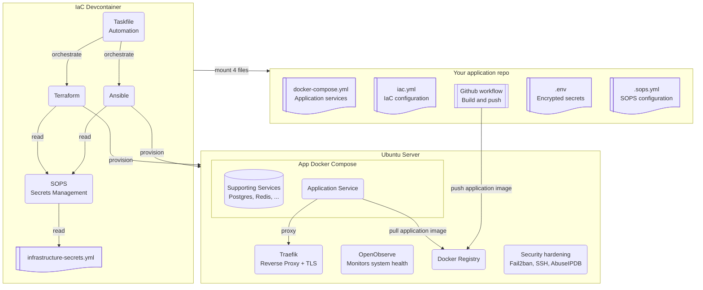

[**<---**](../README.md)

# Documentation

This diagram shows the main pieces: the IaC devcontainer, your app repo, and the server. 

The IaC devcontainer mounts four files in your local application clone so you can deploy without installing tools like Task, Ansible or Terraform on your local machine or application Devcontainer.

---

## Onboarding

[**Onboarding**](onboarding.md) — Choose your path: create a new project or join an existing one.

---

## Reference

**Infrastructure**

- [Traefik](traefik.md) — Reverse proxy, TLS, operations, adding apps
- [Registry](registry.md) — Auth, commands, operations
- [Monitoring](monitoring.md) — OpenObserve, dashboards, logs

**Application**

- [Application deployment](application-deployment.md) — Commands, app mount, records, implementation details
- [Secrets](secrets.md) — File locations, editing, SOPS, app secrets

**Operations**

- [Troubleshooting](troubleshooting.md) — Common issues and fixes
- [Upgrading dependencies](upgrading.md) — Renovate, PRs
- [Remote-SSH](remote-ssh.md) — Connect to the server via Remote-SSH (tunnel, dashboards)

**Meta**

- [Private (local config)](private.md) — Local config files
- [Code analysis](code-analysis.md) — What runs, when (CI), how to run locally
- [Tools and technologies](technologies.md) — Link list

---

**Other**

- [Contributing](../CONTRIBUTING.md) · [Documentation strategy](documentation-strategy.md)
