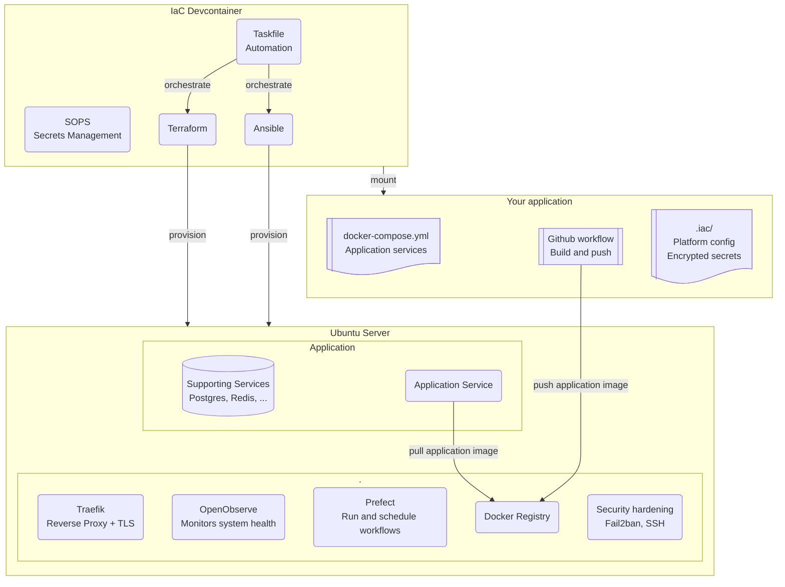

[**<---**](../README.md)

## Getting started
[Choose your path](onboarding.md): create a new project or join an existing one.

This diagram shows how the various components work together:

  
Click to expand diagram

```mermaid
graph TB
    subgraph IAC[IaC Devcontainer]
        TASK(Taskfile<br/>Automation)
        SOPS(SOPS<br/>Secrets Management)
        TF(Terraform)
        ANS(Ansible)
    end

    subgraph SERVER[Ubuntu Server]
      subgraph DMZ[.]
        TRAEFIK(Traefik<br/>Reverse Proxy + TLS)
        OBSERVE(OpenObserve<br/>Monitors system health)
        WORKFLOWS(Prefect<br/>Run and schedule workflows)
        REGISTRY(Docker Registry)
        SEC(Security hardening<br/>Fail2ban, SSH)
      end
      subgraph DOCKER[Application]
        SUPPORTING_SERVICES@{ shape: cyl, label: "Supporting Services<br/>Postgres, Redis, ..." }
        APP_SERVICE(Application Service)
      end
    end

    subgraph APP[Your application]
      COMPOSE@{ shape: lin-doc, label: "docker-compose.yml<br/>Application services" }
      PUSH@{ shape: subproc, label: "Github workflow<br/>Build and push" }
      IAC_YML@{ shape: lin-doc, label: ".iac/<br/>Platform config<br/>Encrypted secrets" }
    end

    IAC --->|mount| APP

    TASK -->|orchestrate| TF
    TASK -->|orchestrate| ANS
        
    TF -->|provision| SERVER    
    ANS -->|provision| SERVER

    APP_SERVICE -->|pull application image| REGISTRY
    PUSH --->|push application image| REGISTRY 
```

## Reference

**Main components**
- [Traefik](traefik.md) — Reverse proxy, TLS, operations, adding apps
- [Registry](registry.md) — Auth, commands, operations
- [Observe](monitoring.md) — OpenObserve, dashboards, logs
- [Workflows](workflows.md) — Scheduled tasks and multi-step workflows with Prefect

**Application management**
- [Application deployment](application-deployment.md) — Commands, app mount, records, implementation details
- [Secrets management](secrets.md) — File locations, editing, SOPS, app secrets

**Operations and infrastructure**
- [DNS](dns.md) — Zone and records managed by Terraform (Hetzner DNS)
- [Backups](backups.md) — Automated application aware backups using Restic
- [Remote-SSH](remote-ssh.md) — Connect to the server via Remote-SSH (tunnel, dashboards)
- [Private (local config)](private.md) — Local config files
- [Code analysis](code-analysis.md) — What runs, when (CI), how to run locally
- [Technologies and upgrading](technologies.md) — Tools used, Renovate, package files
- [Troubleshooting](troubleshooting.md) — Common issues and fixes

---

**Other**

- [Contributing](../CONTRIBUTING.md) · [Documentation strategy](documentation-strategy.md)
