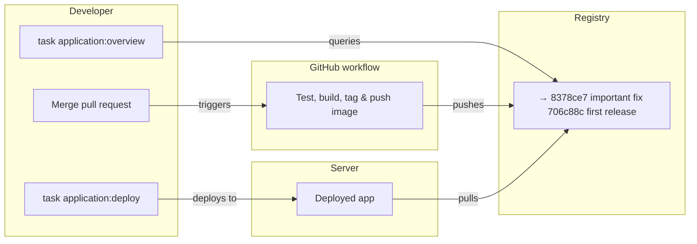

# Application Deployment (Operations Guide)

**Audience:** Infrastructure operators working in the IAC repository

This guide explains how to **deploy and inspect applications** from the infrastructure perspective. Use this when managing deployments, troubleshooting, or understanding the deployment system internals.

---

## Overview




The deployment system provides two main commands:

- `task application:deploy` — Deploy an application version
- `task application:overview` — Inspect deployment status

Both commands are implemented as Python scripts (`scripts/application_deploy.py` and `scripts/application_overview.py`) that handle tag→digest resolution, metadata extraction, and delegation to Ansible.

---

## Commands

### `task application:deploy`

Deploy an application version to a workspace:

```bash
task application:deploy -- <WORKSPACE> <APP_ROOT> <SHA>
```

**Arguments:**
- `<WORKSPACE>`: `dev` or `prod`
- `<APP_ROOT>`: Absolute or relative path to the application root directory
- `<SHA>`: Short commit SHA (7 characters) of the image tag to deploy

**Examples:**
```bash
task application:deploy -- dev ../hello-world 706c88c
task application:deploy -- prod /path/to/app abc1234
```

**What happens internally:**

1. **Validates inputs:**
   - Checks `APP_ROOT/deploy.yml` exists
   - Extracts `registry_name` and `image_name` from `deploy.yml`

2. **Resolves image identity:**
   - Constructs image reference: `registry.rednaw.nl/rednaw/app:SHA`
   - Resolves tag → digest using `crane digest`
   - Extracts metadata using `crane config`:
     - `org.opencontainers.image.description`
     - `org.opencontainers.image.created`

3. **Deploys via Ansible:**
   - Prepares SSH host keys (`task hostkeys:prepare`)
   - Runs `deploy.yml` playbook with variables:
     - `image_digest`: Digest-pinned reference (`registry/app@sha256:...`)
     - `image_tag`: Original SHA tag
     - `image_description`: From image labels
     - `image_built_at`: From image labels
     - `workspace`: Environment name

4. **Records deployment:**
   - Writes `/opt/giftfinder/<app>/deploy-info.yml` (current state)
   - Appends to `/opt/giftfinder/<app>/deploy-history.yml` (audit trail)

**Error handling:**
- Tag doesn't exist → Clear error with crane output
- Image not found → Suggests `docker login`
- Invalid workspace → Validation error
- Missing `deploy.yml` → File not found error

---

### `task application:overview`

Show deployment status for an image repository:

```bash
task application:overview -- <WORKSPACE> <IMAGE_REPO>
```

**Arguments:**
- `<WORKSPACE>`: `dev` or `prod`
- `<IMAGE_REPO>`: Image repository name (e.g., `rednaw/hello-world`)

**Examples:**
```bash
task application:overview -- dev rednaw/hello-world
task application:overview -- prod rednaw/my-app
```

**What happens internally:**

1. **Reads deployment state:**
   - SSHs to workspace hostname (e.g., `dev.rednaw.nl`)
   - Reads `/opt/giftfinder/<app>/deploy-info.yml`
   - Extracts currently deployed digest

2. **Lists registry tags:**
   - Uses `crane ls` to list all tags for the repository
   - For each tag:
     - Resolves tag → digest
     - Extracts creation timestamp and description from image config
     - Compares digest with deployed digest

3. **Displays formatted output:**
   - Shows TAG, CREATED, DESCRIPTION columns
   - Marks currently deployed digest with `→`
   - Sorted newest first

**Output format:**
```
IMAGE: rednaw/hello-world

     TAG              CREATED              DESCRIPTION                             
     ---              -------              -----------                             
     706c88c          2026-01-25 23:41:11  step                                    
  →  4359642          2026-01-26 16:45:50  restore labels                          
```

---

## Deployment Records

### `deploy-info.yml`

**Location:** `/opt/giftfinder/<app>/deploy-info.yml`  
**Purpose:** Current deployment state  
**Format:**
```yaml
app: hello-world
workspace: prod

image:
  repo: registry.rednaw.nl/rednaw/hello-world
  tag: 706c88c
  digest: sha256:99f9385b2f625e7d656aaff2c8eb5ef73c2e2913626ba162428473ec09241928
  description: "add healthcheck + fix nginx proxy header"
  built_at: "2026-01-24T22:41:03Z"

deployment:
  deployed_at: "2026-01-25T01:10:00Z"
  deployed_by: "alice"
```

**Lifecycle:** Overwritten on each successful deployment

---

### `deploy-history.yml`

**Location:** `/opt/giftfinder/<app>/deploy-history.yml`  
**Purpose:** Append-only audit trail  
**Format:**
```yaml
- image:
    tag: 706c88c
    digest: sha256:99f9385b2f625e7d656aaff2c8eb5ef73c2e2913626ba162428473ec09241928
    description: "add healthcheck + fix nginx proxy header"
    built_at: "2026-01-24T22:41:03Z"

  deployment:
    deployed_at: "2026-01-25T01:10:00Z"
    workspace: prod

- image:
    tag: 4359642
    digest: sha256:abc123...
    ...
```

**Lifecycle:** Append-only, never rewritten

---

## Implementation Details

### Scripts

- **`scripts/application_deploy.py`**: Handles deployment orchestration
  - Tag→digest resolution
  - Metadata extraction
  - Ansible playbook invocation
  - Error handling and user feedback

- **`scripts/application_overview.py`**: Handles deployment inspection
  - SSH to read `deploy-info.yml`
  - Registry tag listing
  - Digest resolution and comparison
  - Formatted output

### Ansible Role

**`ansible/roles/deploy-app/tasks/main.yml`** handles:
- Decrypting app secrets (`env.enc` → `.env`)
- Copying `docker-compose.yml` to server
- Configuring Docker registry authentication
- Running Docker Compose with digest-pinned image
- Writing deployment records

**Key variables:**
- `image_digest`: Digest-pinned image reference (e.g., `registry/app@sha256:...`)
- `image_tag`: Original tag for reference
- `workspace`: Environment name
- `deployed_by`: Attribution string

---

## Troubleshooting

### Deployment Failures

**"Could not resolve digest"**
- Check image exists: `crane ls registry.rednaw.nl/rednaw/app`
- Verify registry auth: `docker login registry.rednaw.nl`
- Check tag format (7 hex characters)

**"deploy.yml not found"**
- Verify `APP_ROOT` path is correct
- Check application has `deploy.yml` in root

**"Host key verification failed"**
- Run `task hostkeys:prepare -- <WORKSPACE>` manually
- See [SSH Host Keys](SSH-host-keys.md) for details

**Ansible playbook failures**
- Check Ansible logs for specific errors
- Verify infrastructure secrets are decrypted
- Check server connectivity: `task server:check-status`

### Inspection Failures

**"Could not read deploy-info.yml"**
- App may not be deployed yet
- Check SSH access to workspace hostname
- Verify app name matches directory name

**"No tags found"**
- Image repository may not exist
- Check registry access: `docker login registry.rednaw.nl`
- Verify image name is correct

---

## Registry Tools

### `task registry:overview`

List all repositories and tags in the registry:

```bash
task registry:overview
```

Shows TAG, CREATED, DESCRIPTION for all repos. Useful for global registry inspection.

---

## Design Principles

- **Humans deploy by tag** — Short SHAs are readable
- **Machines run by digest** — Immutable digests ensure safety
- **Delegation over duplication** — App-side tasks delegate to IAC
- **Convention over configuration** — Image names follow `rednaw/<app-slug>`
- **History is never lost** — Append-only audit trail

---

## See Also

- [Developer Guide](application-deployment-dev.md) — For application developers
- [SSH Host Keys](SSH-host-keys.md) — Host key management
- [Ansible Roles](../ansible/roles/deploy-app/) — Deployment role implementation
