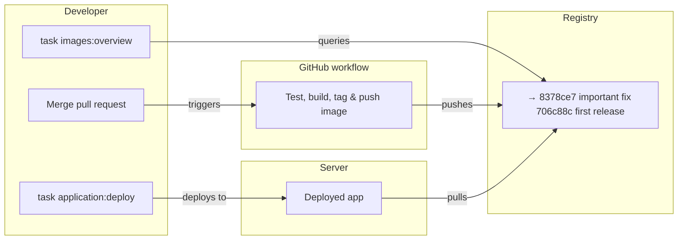

# Deploy Your Application

This page explains how to **deploy your application** using this Infrastructure‑as‑Code (IaC) repository.

You stay in control of:
- your application code
- your CI workflow
- when and what you deploy

This repository provides **safe rails** for deploying Docker images to a remote server.

---

## Overview



---

## Prerequisites

You need:
- a Docker image built and pushed by your GitHub Actions workflow
- access to this IaC repository
- the `task` CLI installed

> For now, 
> - the IaC repository should be cloned next to your project
> - deployment commands are run from the IaC repository root


---

## See What Can Be Deployed

List available images and versions:

```bash
task images:overview
```

This shows:
- image tags (usually short SHAs)
- build time
- description (from commit message)
- which version is currently deployed (`→`)

Use this to decide *what* you want to deploy.

---

## Deploy a Version

Deploy a specific version:

```bash
task application:deploy -- <workspace> <app_path> <tag>
```

Example:

```bash
task application:deploy -- dev ../hello-world 6350192
```

What happens:
- the tag is resolved to an immutable digest
- Docker Compose is updated on the server
- the app is restarted
- deployment metadata is recorded

---

## Roll Back

Rollback is just deploying an earlier version:

```bash
task application:deploy -- dev ../hello-world eb53023
```

No special rollback logic.  
No hidden state.

---

## GitHub Actions Workflow

Your project should have a workflow that
- Only runs on push or merge to main
- Only runs if all tests succeed
- Builds a container image for each commit to `main`
- Tags the image with the short commit SHA
- Pushes the image to the private registry
- Includes basic OCI metadata:
  - `org.opencontainers.image.description`
  - `org.opencontainers.image.created`
  - `org.opencontainers.image.revision`
  - `org.opencontainers.image.source`

### Recommended Approach

1. Copy the `hello-world` workflow into your repository.
2. Update image name and build args as needed.
3. Keep tag and label conventions to ensure deploy and inspection tools work.

---

## What Gets Recorded

Each deployment records:
- image digest
- image tag
- description
- image build time
- deployment time

This enables:
- reliable rollbacks
- answering “what was running when?”
- safe cleanup later

---

## Design Notes

- **Humans deploy by tag**
- **Machines run by digest**
- No auto‑deploys
- No forced workflows
- No GitOps assumptions

You decide when a version goes live.
