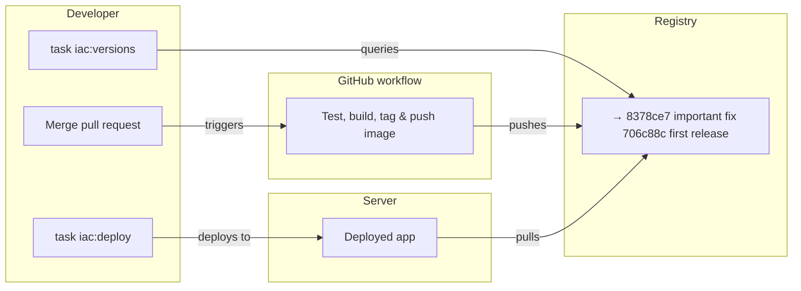

# Application Deployment (Operations Guide)

**Audience:** Infrastructure operators working in the IAC repository

This guide explains how to **deploy and inspect applications** from the infrastructure perspective. Use this when managing deployments, troubleshooting, or understanding the deployment system internals.

---

## Overview



The deployment system provides two commands (run from your app directory):

- `task iac:deploy -- <env> <sha>` — Deploy an application version
- `task iac:versions -- <env>` — List available versions

The `versions` command is implemented as a Python script (`scripts/application_versions.py`). The `deploy` command runs an Ansible playbook that orchestrates the entire deployment.

---

## Commands

### `task iac:deploy`

Deploy an application version (run from app directory):

```bash
task iac:deploy -- <environment> <sha>
```

**Arguments:**
- `<environment>`: `dev` or `prod`
- `<sha>`: Short commit SHA (7 characters) of the image tag to deploy

**Examples:**
```bash
task iac:deploy -- dev 706c88c
task iac:deploy -- prod abc1234
```

**What happens internally:**

1. **Validates inputs:**
   - Validates environment is `dev` or `prod`
   - Reads `REGISTRY_NAME` and `IMAGE_NAME` from app's Taskfile.yml

2. **Prepares and runs Ansible:**
   - Prepares SSH host keys (`task hostkeys:prepare`)
   - Runs the IAC `deploy-app.yml` playbook

3. **The `deploy_app` role:**
   - Resolves tag → digest using `crane digest`
   - Extracts metadata using `crane config` (description, build time)
   - Decrypts app secrets if `env.enc` exists
   - Copies files, configures Docker auth
   - Deploys the application with Docker Compose
   - Records deployment metadata

4. **Records deployment:**
   - Writes `/opt/deploy/<app>/deploy-info.yml` (current state)
   - Appends to `/opt/deploy/<app>/deploy-history.yml` (audit trail)

**Error handling:**
- Tag doesn't exist → Clear error with crane output
- Image not found → Suggests `docker login`
- Invalid environment → Validation error
- Missing required vars → Error with message

---

### `task iac:versions`

List available versions (run from app directory):

```bash
task iac:versions -- <environment>
```

**Arguments:**
- `<environment>`: `dev` or `prod`

**Examples:**
```bash
task iac:versions -- dev
task iac:versions -- prod
```

**What happens internally:**

1. **Reads deployment state:**
   - SSHs to workspace hostname (e.g., `dev.rednaw.nl`)
   - Reads `/opt/deploy/<app>/deploy-info.yml`
   - Extracts currently deployed digest

2. **Lists registry tags:**
   - Uses `crane ls` to list all tags for the repository
   - For each tag:
     - Resolves tag → digest
     - Extracts creation timestamp and description from image config
     - Compares digest with deployed digest

3. **Displays formatted output:**
   - Shows TAG, CREATED, DESCRIPTION columns
   - Marks currently deployed digest with `→`
   - Sorted newest first

**Output format:**
```
IMAGE: rednaw/hello-world

     TAG              CREATED              DESCRIPTION                             
     ---              -------              -----------                             
     706c88c          2026-01-25 23:41:11  step                                    
  →  4359642          2026-01-26 16:45:50  restore labels                          
```

---

## Application Configuration

Applications configure deployment in their `Taskfile.yml`:

```yaml
version: '3'

vars:
  REGISTRY_NAME: registry.rednaw.nl
  IMAGE_NAME: rednaw/hello-world

includes:
  iac:
    taskfile: ../iac/tasks/Taskfile.app.yml
```

**Required vars:**
- `REGISTRY_NAME`: Docker registry hostname
- `IMAGE_NAME`: Image name in the registry

**Required files in app directory:**
- `Taskfile.yml`: Configuration and commands (as above)
- `docker-compose.yml`: Service definition with `image: ${IMAGE}`
- `env.enc`: (optional) Encrypted environment variables

---

## Deployment Records

### `deploy-info.yml`

**Location:** `/opt/deploy/<app>/deploy-info.yml`  
**Purpose:** Current deployment state  
**Format:**
```yaml
app: hello-world
workspace: prod

image:
  repo: registry.rednaw.nl/rednaw/hello-world
  tag: 706c88c
  digest: sha256:99f9385b2f625e7d656aaff2c8eb5ef73c2e2913626ba162428473ec09241928
  description: "add healthcheck + fix nginx proxy header"
  built_at: "2026-01-24T22:41:03Z"

deployment:
  deployed_at: "2026-01-25T01:10:00Z"
```

**Lifecycle:** Overwritten on each successful deployment

---

### `deploy-history.yml`

**Location:** `/opt/deploy/<app>/deploy-history.yml`  
**Purpose:** Append-only audit trail  
**Format:**
```yaml
- image:
    tag: 706c88c
    digest: sha256:99f9385b2f625e7d656aaff2c8eb5ef73c2e2913626ba162428473ec09241928
    description: "add healthcheck + fix nginx proxy header"
    built_at: "2026-01-24T22:41:03Z"

  deployment:
    deployed_at: "2026-01-25T01:10:00Z"
    workspace: prod

- image:
    tag: 4359642
    digest: sha256:abc123...
    ...
```

**Lifecycle:** Append-only, never rewritten

---

## Implementation Details

### Taskfile

**`tasks/Taskfile.app.yml`**: Included by apps, provides `iac:deploy` and `iac:versions`. Runs Ansible and Python directly.

### Scripts

- **`scripts/application_versions.py`**: Lists available versions
  - SSH to read `deploy-info.yml`
  - Registry tag listing
  - Digest resolution and comparison
  - Formatted output

### Ansible Playbook

**`ansible/playbooks/deploy-app.yml`** is the entry point:
- Loads infrastructure secrets
- Includes the `deploy_app` role

### Ansible Role

**`ansible/roles/deploy_app/tasks/`** contains:
- `main.yml` — Orchestrates all steps
- `resolve-image.yml` — Tag → digest resolution, metadata extraction
- `decrypt-secrets.yml` — Decrypts `env.enc` if present
- `prepare-server.yml` — Copies files, configures Docker auth
- `run-container.yml` — Runs Docker Compose
- `record-deployment.yml` — Writes deployment records

**Required variables:**
- `registry_name`: Registry hostname
- `image_name`: Image name
- `app_root`: Path to the application directory
- `workspace`: Environment name (`dev` or `prod`)
- `sha`: Commit SHA tag to deploy

---

## Troubleshooting

### Deployment Failures

**"Could not resolve digest"**
- Check image exists: `crane ls registry.rednaw.nl/rednaw/app`
- Verify registry auth: `docker login registry.rednaw.nl`
- Check tag format (7 hex characters)

**"missing required vars"**
- Ensure `REGISTRY_NAME` and `IMAGE_NAME` are set in app's Taskfile.yml

**"Host key verification failed"**
- Run `task hostkeys:prepare -- <WORKSPACE>` manually
- See [SSH Host Keys](SSH-host-keys.md) for details

**Ansible playbook failures**
- Check Ansible logs for specific errors
- Verify infrastructure secrets are decrypted
- Check server connectivity: `task server:check-status`

### Inspection Failures

**"Could not read deploy-info.yml"**
- App may not be deployed yet
- Check SSH access to workspace hostname
- Verify app name matches directory name

**"No tags found"**
- Image repository may not exist
- Check registry access: `docker login registry.rednaw.nl`
- Verify image name is correct

---

## Registry Tools

### `task registry:overview`

List all repositories and tags in the registry:

```bash
task registry:overview
```

Shows TAG, CREATED, DESCRIPTION for all repos. Useful for global registry inspection.

---

## Design Principles

- **Minimal app configuration** — Just `REGISTRY_NAME` and `IMAGE_NAME` in Taskfile
- **Humans deploy by tag** — Short SHAs are readable
- **Machines run by digest** — Immutable digests ensure safety
- **History is never lost** — Append-only audit trail

---

## See Also

- [Developer Guide](../../hello-world/README.md) — For application developers
- [SSH Host Keys](SSH-host-keys.md) — Host key management
- [Ansible Role](../ansible/roles/deploy_app/) — Deployment role implementation
