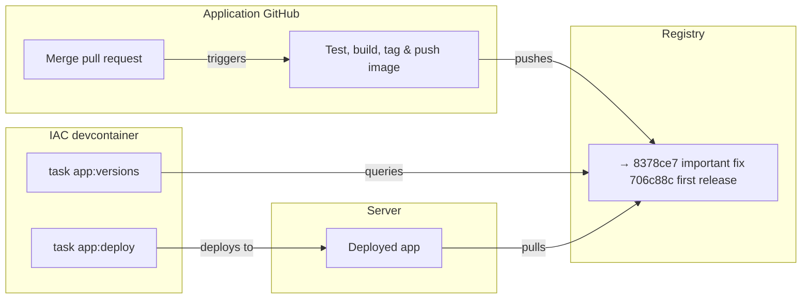

[**<---**](README.md)
# Application Deployment (Operations Guide)

**Audience:** Infrastructure operators working in the IAC repository

This guide explains how to **deploy and inspect applications** from the infrastructure perspective. Use this when managing deployments, troubleshooting, or understanding the deployment system internals.

---

## Overview



The deployment system provides two commands:

- `task app:deploy -- <env> <sha>` — Deploy an application version
- `task app:versions -- <env>` — List available versions

Four app files must be mounted at `/workspaces/iac/app`: `iac.yml`, `docker-compose.yml`, `.env`, `.sops.yaml` (see [App mount](#app-mount) below).

The `versions` command is implemented as a Python script (`scripts/application_versions.py`). The `deploy` command runs an Ansible playbook that orchestrates the entire deployment.

---

## App mount


The devcontainer mounts four files from your app repo at `/workspaces/iac/app`: `iac.yml`, `docker-compose.yml`, `.env`, `.sops.yaml`. This lets you run `app:deploy` and `app:versions` from the IAC repo without installing Task or Ansible on your machine. The mount uses **`APP_HOST_PATH`** from the environment of the process that opens the workspace (e.g. Cursor or VS Code).

**Required files** — Each app must have all four. `.env` can be minimal (e.g. empty or a comment) if the app has no secrets; it must exist. `.sops.yaml` is the SOPS config for the app (used when decrypting `.env`). The IAC devcontainer includes the **dotenv** extension and `files.associations` so SOPS-decrypted `.env` files are edited as dotenv.

**Traefik (routing)** — The app's `docker-compose.yml` must attach the app service to the external `traefik` network and add Traefik labels so the reverse proxy routes traffic. See [Traefik documentation](traefik.md#adding-a-new-application) for details: add `networks: [ default, traefik ]`, `networks.traefik.external: true`, and labels for the router rule (e.g. `Host(\`dev.rednaw.nl\`) || Host(\`prod.rednaw.nl\`)`), entrypoints, TLS cert resolver, and loadbalancer server port.

### Set which app you're working on

Run the setup script from the host (once per machine, and again whenever you switch to a different app):

```bash
./scripts/setup-app-path.sh /path/to/your/app
```

If you omit the path, the script will prompt you. The script:

1. **Validates** that the app has `iac.yml`, `docker-compose.yml`, `.env`, and `.sops.yaml`
2. Adds or updates **`export APP_HOST_PATH=/path/to/app`** in your profile (`~/.zprofile` on macOS, `~/.profile` on Linux)
3. On macOS: runs `launchctl setenv APP_HOST_PATH ...` so the current session gets it without re-login

After running it, open `iac.code-workspace` (or **Reopen in Container** if already open) so the devcontainer picks up the mount. To work on a different app later, run the script again with the other app's path.

---

## Commands

### `task app:deploy`

Deploy an application version (run from IAC devcontainer):

```bash
task app:deploy -- <environment> <sha>
```

**Arguments:**
- `<environment>`: `dev` or `prod`
- `<sha>`: Short commit SHA (7 characters) of the image tag to deploy

**Examples:**
```bash
task app:deploy -- dev 706c88c
task app:deploy -- prod abc1234
```


### `task app:versions`

List available versions (run from IAC devcontainer):

```bash
task app:versions -- <environment>
```

**Arguments:**
- `<environment>`: `dev` or `prod`

**Output format:**
```
IMAGE: rednaw/tientje-ketama

     TAG              CREATED              DESCRIPTION                             
     ---              -------              -----------                             
     706c88c          2026-01-25 23:41:11  step                                    
  →  4359642          2026-01-26 16:45:50  restore labels                          
```

---

## Application Configuration

Applications declare deployment settings in an **`iac.yml`** file in the app repository root:

```yaml
REGISTRY_NAME: registry.rednaw.nl
IMAGE_NAME: rednaw/tientje-ketama
```

**Required keys:**
- `REGISTRY_NAME`: Docker registry hostname
- `IMAGE_NAME`: Image name in the registry

**Required files in app directory (mounted at `/workspaces/iac/app`):**
- `iac.yml`: Registry and image name (as above)
- `docker-compose.yml`: Single compose file that defines the **full stack** (app, database, and any other services). The app service must use `image: ${IMAGE}`. Deploy copies only this file (plus `.env`) to the server; no other compose files are copied.
- `.env`: SOPS-encrypted environment variables (dotenv format); can be minimal if no secrets
- `.sops.yaml`: SOPS config for the app (used when decrypting `.env`)

### App development workflow

App development is **devcontainer-first**. The app repo’s devcontainer uses the same `docker-compose.yml`, with a **minimal** override under `.devcontainer/` that overrides the app service with `build: .` and an `image:` tag so the app container is built from source when the devcontainer starts. Running the stack locally outside the devcontainer (e.g. `docker compose up` on the host) is optional; apps can add a `docker-compose.override.yml` later if they want.

---

## Deployment Records

### `deploy-info.yml`

**Location:** `/opt/deploy/<app>/deploy-info.yml`  
**Purpose:** Current deployment state  
**Format:**
```yaml
app: tientje-ketama
workspace: prod

image:
  repo: registry.rednaw.nl/rednaw/tientje-ketama
  tag: 706c88c
  digest: sha256:99f9385b2f625e7d656aaff2c8eb5ef73c2e2913626ba162428473ec09241928
  description: "add healthcheck + fix proxy header"
  built_at: "2026-01-24T22:41:03Z"

deployment:
  deployed_at: "2026-01-25T01:10:00Z"
```

**Lifecycle:** Overwritten on each successful deployment

---

### `deploy-history.yml`

**Location:** `/opt/deploy/<app>/deploy-history.yml`  
**Purpose:** Append-only audit trail  
**Format:**
```yaml
- image:
    tag: 706c88c
    digest: sha256:99f9385b2f625e7d656aaff2c8eb5ef73c2e2913626ba162428473ec09241928
    description: "add healthcheck + fix proxy header"
    built_at: "2026-01-24T22:41:03Z"

  deployment:
    deployed_at: "2026-01-25T01:10:00Z"
    workspace: prod

- image:
    tag: 4359642
    digest: sha256:abc123...
    ...
```

**Lifecycle:** Append-only, never rewritten

---

## Implementation Details

### Taskfile

**`tasks/Taskfile.app.yml`**: Included from the IAC root Taskfile, provides `app:deploy` and `app:versions`. Uses `APP_ROOT=/workspaces/iac/app`, reads `REGISTRY_NAME` and `IMAGE_NAME` from `iac.yml`, and runs the Ansible playbook and versions script.

### Scripts

- **`scripts/application_versions.py`**: Lists available versions
  - SSH to read `deploy-info.yml`
  - Registry tag listing
  - Digest resolution and comparison
  - Formatted output

### Ansible Playbook

**`ansible/playbooks/deploy-app.yml`** is the entry point:
- Loads infrastructure secrets
- Includes the `deploy_app` role

### Ansible Role

**`ansible/roles/deploy_app/tasks/`** contains:
- `main.yml` — Orchestrates all steps
- `resolve-image.yml` — Tag → digest resolution, metadata extraction
- `decrypt-secrets.yml` — Decrypts `.env` if present (output is already dotenv)
- `prepare-server.yml` — Copies files, configures Docker auth
- `run-container.yml` — Runs Docker Compose
- `record-deployment.yml` — Writes deployment records

**Required variables:**
- `registry_name`: Registry hostname
- `image_name`: Image name
- `app_root`: Path to the application directory
- `workspace`: Environment name (`dev` or `prod`)
- `sha`: Commit SHA tag to deploy

---

## Troubleshooting

### App mount

**App directory missing at `/workspaces/iac/app` (e.g. after reboot or when opening from Dock/Spotlight)**  
The editor process didn't have `APP_HOST_PATH` in its environment. Run `./scripts/setup-app-path.sh /path/to/your/app` on the host to set the path file and profile snippet; on macOS it will update the current session. Then open `iac.code-workspace` and **Reopen in Container**. See [App mount](#app-mount).

### Deployment Failures

**"Could not resolve digest"**
- Check image exists and registry auth: see [Registry](registry.md#troubleshooting)
- Check tag format (7 hex characters)

**"missing required vars" / "iac.yml not found"**
- Ensure `/workspaces/iac/app` has `iac.yml`, `docker-compose.yml`, `.env`, and `.sops.yaml`. Run `./scripts/setup-app-path.sh /path/to/your/app` on the host; see [App mount](#app-mount).

**"Host key verification failed"**
- Run `task hostkeys:prepare -- <WORKSPACE>` manually before deploy. We use `StrictHostKeyChecking=accept-new` only; see [Troubleshooting](troubleshooting.md) for details.

**Ansible playbook failures**
- Check Ansible logs for specific errors
- Verify infrastructure secrets are decrypted
- Check server connectivity: `task server:check-status`

### Inspection Failures

**"Could not read deploy-info.yml"**
- App may not be deployed yet
- Check SSH access to workspace hostname
- Verify app name matches directory name

**"No tags found"**
- Image repository may not exist; check registry access: see [Registry](registry.md#troubleshooting)

---

[Registry](registry.md) documents overview, commands, and troubleshooting.

---

## Design Principles

- **Minimal app configuration** — Just `REGISTRY_NAME` and `IMAGE_NAME` in `iac.yml`; no Task/Ansible in the app repo
- **Single full-stack compose file** — One `docker-compose.yml` defines the whole stack (app + db + rest); app service uses `image: ${IMAGE}`; deploy copies only that file
- **App dev is devcontainer-first** — The app’s devcontainer builds the app container from source via a minimal override under `.devcontainer/`; local `docker compose` run is optional
- **Ops from IAC** — Deploy and versions run from the IAC devcontainer; four app files (`iac.yml`, `docker-compose.yml`, `.env`, `.sops.yaml`) are mounted via `APP_HOST_PATH`
- **Humans deploy by tag** — Short SHAs are readable
- **Machines run by digest** — Immutable digests ensure safety
- **History is never lost** — Append-only audit trail

---

## See Also

- [Registry](registry.md) — Private registry auth, commands, troubleshooting
- [Troubleshooting](troubleshooting.md) — Host key verification, connection issues
- [Ansible Role](../ansible/roles/deploy_app/) — Deployment role implementation
