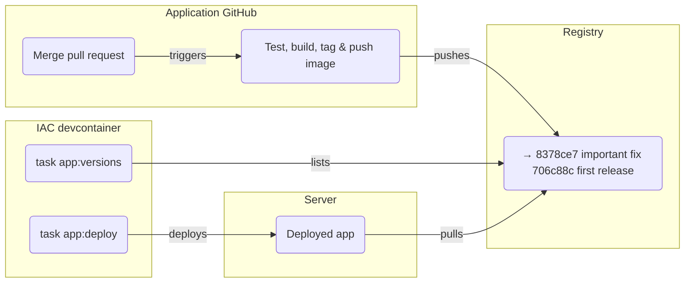

[**<---**](README.md)

# Application Deployment

Deploy and manage applications from the IaC devcontainer. If you **created the project**, start at [App mount](#app-mount) to set up your app files. If you **joined**, skip to [Commands](#commands) — the app is already configured.

---

## Overview


```mermaid
flowchart LR
    subgraph LOCAL["IAC devcontainer"]
        B(task app:versions)
        C(task app:deploy)
    end

    subgraph GITHUB["Application GitHub"]
        A(Merge pull request)
        D(Test, build, tag & push image)
    end

    subgraph REGISTRY["Registry"]
      E(→ 8378ce7 important fix 706c88c first release)
    end

    subgraph SERVER["Server"]
      F(Deployed app)
    end

    A -->|triggers| D
    B -->|lists| E
    C -->|deploys| F
    D -->|pushes| E
    F -->|pulls| E
```

From the IaC devcontainer you run:

- `task app:versions -- <env>` — List available versions
- `task app:deploy -- <env> <sha>` — Deploy an application version

## Set which app you're working on

Run the setup script from the host (run again whenever you switch to a different app):

```bash
./scripts/setup-app-path.sh /path/to/your/app
```

If you omit the path, the script will prompt you. The script:

1. **Validates** that the app has `docker-compose.yml` and a **`.iac/`** directory
2. Adds or updates **`export APP_HOST_PATH=/path/to/app`** in your profile (`~/.zprofile` on macOS, `~/.profile` on Linux)

After running it, open `iac.code-workspace` (or **Reopen in Container** if already open) so the devcontainer picks up the mount.

## App mount

The devcontainer mounts your app repo at `/workspaces/iac/app`: the **`.iac/`** directory and **`docker-compose.yml`**. This lets you run **app:versions** and **app:deploy** from the IaC devcontainer. The mount uses **`APP_HOST_PATH`** from the environment of the process that opens the workspace (e.g. Cursor or VS Code).

**Required layout** — Each app must have:

- **`docker-compose.yml`** — Generic stack (no domain or Traefik labels here).
- **`.iac/`** — Platform config and secrets:
  - **`iac.yml`** — SOPS-encrypted platform credentials; unencrypted: `base_domain`, `image_name`, `app_domains`.
  - **`.env`** — SOPS-encrypted app runtime secrets (dotenv); can be minimal.
  - **`.sops.yaml`** — SOPS config for `iac.yml` and `.env`.
  - **`docker-compose.override.yml`** — Traefik labels, `traefik` network, `restart` policies.

**Traefik (routing)** — Production routing is defined in **`.iac/docker-compose.override.yml`**: attach the app service to the `traefik` network and add Traefik labels (Host rule, websecure, letsencrypt, loadbalancer port). See [Traefik](traefik.md#adding-an-application). The main `docker-compose.yml` stays generic; the override is applied only when deploying from the IaC devcontainer.

## Commands

### `task app:versions`

List available versions (run from IAC devcontainer):

```bash
task app:versions -- <environment>
```

**Arguments:**
- `<environment>`: `dev` or `prod`

**Output format:**
```
IMAGE: rednaw/tientje-ketama

     TAG              CREATED              DESCRIPTION                             
     ---              -------              -----------                             
     706c88c          2026-01-25 23:41:11  step                                    
  →  4359642          2026-01-26 16:45:50  restore labels                          
```


### `task app:deploy`

Deploy an application version (run from IAC devcontainer):

```bash
task app:deploy -- <environment> <sha>
```

**Arguments:**
- `<environment>`: `dev` or `prod`
- `<sha>`: Short commit SHA (7 characters) of the image tag to deploy

**Examples:**
```bash
task app:deploy -- dev 706c88c
task app:deploy -- prod abc1234
```

---

## Application Configuration (if you created the project)

Applications declare deployment settings in **`.iac/iac.yml`** (in the app repo). Unencrypted keys:

- **`base_domain`** — Your domain (e.g. `example.com`). Registry is `registry.<base_domain>`.
- **`image_name`** — Image name in the registry (e.g. `myorg/myapp`).
- **`app_domains`** — List of domains for Traefik TLS (e.g. `["dev.example.com", "example.com"]`).

For the full file layout, see [App mount: Required layout](#app-mount) above. For creating these files from scratch, see [New project](new-project.md#7-create-the-remaining-iac-files).

**Key rules:**
- The app service in `docker-compose.override.yml` must use `image: ${IMAGE}` — the deploy task sets this to the resolved image digest.
- Put `restart: unless-stopped` on every service in the override. Without it, after a reboot only the platform restarts; your app stays stopped. See [Backups](backups.md#after-an-in-place-restore).

App development is **devcontainer-first**: the app repo's own devcontainer uses `docker-compose.yml` plus a minimal override under `.devcontainer/`. Production uses `docker-compose.yml` + `.iac/docker-compose.override.yml` on the server.

---

## Deployment Records (if you joined)

### `deploy-info.yml`

**Location:** `/opt/iac/deploy/<app>/deploy-info.yml`  
**Purpose:** Current deployment state  
**Format:**
```yaml
app: tientje-ketama
workspace: prod

image:
  repo: registry.<base_domain>/rednaw/tientje-ketama   # e.g. registry.rednaw.nl
  tag: 706c88c
  digest: sha256:99f9385b2f625e7d656aaff2c8eb5ef73c2e2913626ba162428473ec09241928
  description: "add healthcheck + fix proxy header"
  built_at: "2026-01-24T22:41:03Z"

deployment:
  deployed_at: "2026-01-25T01:10:00Z"
```

**Lifecycle:** Overwritten on each successful deployment

---

### `deploy-history.yml`

**Location:** `/opt/iac/deploy/<app>/deploy-history.yml`  
**Purpose:** Append-only audit trail  
**Format:**
```yaml
- image:
    tag: 706c88c
    digest: sha256:99f9385b2f625e7d656aaff2c8eb5ef73c2e2913626ba162428473ec09241928
    description: "add healthcheck + fix proxy header"
    built_at: "2026-01-24T22:41:03Z"

  deployment:
    deployed_at: "2026-01-25T01:10:00Z"
    workspace: prod

- image:
    tag: 4359642
    digest: sha256:abc123...
    ...
```

**Lifecycle:** Append-only, never rewritten

---

## Implementation Details (if you joined)

### Taskfile

**`tasks/Taskfile.app.yml`**: Included from the IaC root Taskfile, provides `app:deploy`, `app:versions`, and `app:delete-tag`. Uses `APP_ROOT=/workspaces/iac/app`, reads `image_name` (and registry from `base_domain`) from `.iac/iac.yml`, and runs the Ansible playbook and versions script.

### Scripts

- **`scripts/application_versions.py`**: Lists available versions
  - SSH to read `deploy-info.yml`
  - Registry tag listing
  - Digest resolution and comparison
  - Formatted output

### Ansible Playbook

**`ansible/playbooks/deploy-app.yml`** is the entry point:
- Loads infrastructure secrets
- Includes the `deploy_app` role

### Ansible Role

**`ansible/roles/deploy_app/tasks/`** contains:
- `main.yml` — Orchestrates all steps
- `resolve-image.yml` — Tag → digest resolution, metadata extraction
- `decrypt-secrets.yml` — Decrypts `.env` if present (output is already dotenv)
- `prepare-server.yml` — Copies files, configures Docker auth
- `run-container.yml` — Runs Docker Compose
- `record-deployment.yml` — Writes deployment records

**Required variables:**
- `registry_name`: Registry hostname
- `image_name`: Image name
- `app_root`: Path to the application directory
- `workspace`: Environment name (`dev` or `prod`)
- `sha`: Commit SHA tag to deploy

---

## Troubleshooting

### App mount

**App directory missing at `/workspaces/iac/app` (e.g. after reboot or when opening from Dock/Spotlight)**  
The editor process didn't have `APP_HOST_PATH` in its environment. Run `./scripts/setup-app-path.sh /path/to/your/app` on the host to set the path file and profile snippet; on macOS it will update the current session. Then open `iac.code-workspace` and **Reopen in Container**. See [App mount](#app-mount).

### Deployment Failures

**"Could not resolve digest"**
- Check image exists and registry auth: see [Registry](registry.md#troubleshooting)
- Check tag format (7 hex characters)

**"missing required vars" / "iac.yml not found"**
- Ensure `/workspaces/iac/app` has `docker-compose.yml` and a `.iac/` directory containing `iac.yml`, `.env`, `.sops.yaml`, and `docker-compose.override.yml`. Run `./scripts/setup-app-path.sh /path/to/your/app` on the host; see [App mount](#app-mount).

**"Host key verification failed"**
- Run `task hostkeys:prepare -- <WORKSPACE>` manually before deploy. We use `StrictHostKeyChecking=accept-new` only; see [Troubleshooting](troubleshooting.md) for details.

**Ansible playbook failures**
- Check Ansible logs for specific errors
- Verify infrastructure secrets are decrypted
- Check server connectivity: `task server:check-status`

### Inspection Failures

**"Could not read deploy-info.yml"**
- App may not be deployed yet
- Check SSH access to workspace hostname
- Verify app name matches directory name

**"No tags found"**
- Image repository may not exist; check registry access: see [Registry](registry.md#troubleshooting)

---

## Design Principles

- **Minimal app configuration** — Platform config in `.iac/iac.yml` (`base_domain`, `image_name`, `app_domains`); no Task/Ansible in the app repo
- **Generic compose + override** — `docker-compose.yml` is generic; `.iac/docker-compose.override.yml` adds Traefik labels, networks, restart; deploy copies both
- **App dev is devcontainer-first** — The app’s devcontainer builds the app container from source via a minimal override under `.devcontainer/`; local `docker compose` run is optional
- **Ops from IaC** — Deploy and versions run from the IaC devcontainer; app repo (`.iac/` and `docker-compose.yml`) is mounted via `APP_HOST_PATH`
- **Humans deploy by tag** — Short SHAs are readable
- **Machines run by digest** — Immutable digests ensure safety
- **History is never lost** — Append-only audit trail

---

## See Also

- [Registry](registry.md) — Private registry auth, commands, troubleshooting
- [Troubleshooting](troubleshooting.md) — Host key verification, connection issues
- [Ansible Role](../ansible/roles/deploy_app/) — Deployment role implementation
