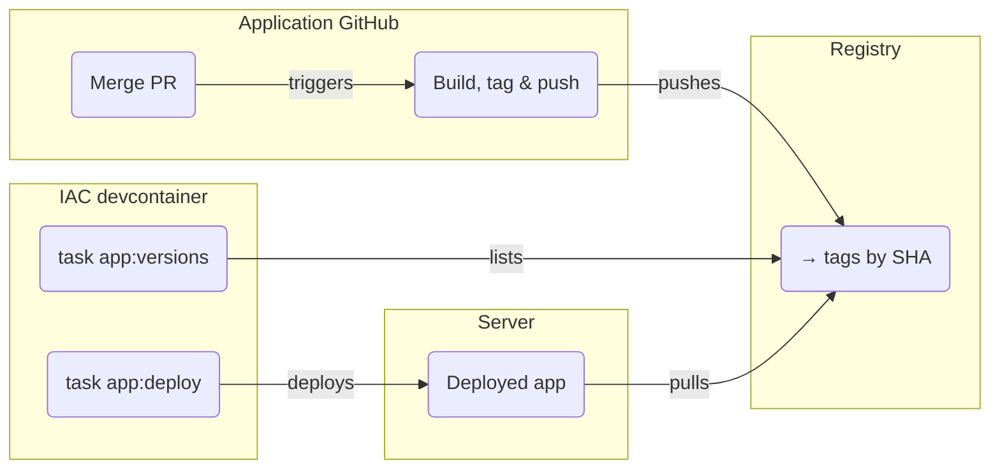

[**<---**](README.md)

# Application deployment

Deploy and manage apps from the IaC devcontainer. **New workspace layout?** See [Workspace layout](#workspace-layout). **Commands:** [Commands](#commands).


```mermaid
flowchart LR
    subgraph LOCAL["IAC devcontainer"]
        B(task app:versions)
        C(task app:deploy)
    end
    subgraph GITHUB["Application GitHub"]
        A(Merge PR)
        D(Build, tag & push)
    end
    subgraph REGISTRY["Registry"]
      E(→ tags by SHA)
    end
    subgraph SERVER["Server"]
        F(Deployed app)
    end
    A -->|triggers| D
    B -->|lists| E
    C -->|deploys| F
    D -->|pushes| E
    F -->|pulls| E
```

**Commands:**

- `task app:versions -- <env> <app>`
- `task app:deploy -- <env> <app> <sha>`

`<app>` is the **directory name** under **`/workspaces/iac/apps/`** (sibling folder of your IaC clone on disk).

---

## Workspace layout

Application repos are mounted at **`/workspaces/iac/apps/<app>/`** via the parent-directory bind ([Launch devcontainer](launch-devcontainer.md)). No per-host script — place repos next to **`iac/`** and open **`iac.code-workspace`**.

---

## App contract

Paths below are relative to each app repo root (visible as **`apps/<app>/`** in the container):

| Path | Purpose |
|------|---------|
| `.iac/iac.yml` | **Plain** YAML: **`image_name`**, **`app_domains`** only (no infra keys — those belong in **`secrets/infra.yml`**). |
| `.iac/.env` | SOPS-encrypted runtime secrets for Compose. |
| `.iac/.sops.yaml` | SOPS rules — encrypt **`.env`** only. |
| `.iac/docker-compose.yml` | Full stack Ansible deploys (Traefik labels, **`traefik`** external network, **`image: ${IMAGE}`**, **`restart: unless-stopped`**). |
| `.iac/backup.yml` | *Optional.* Restic contract → **`backup.yml`** on server. [Backups](backups.md). |
| `docker-compose.yml` | *Optional.* Local dev only — **not** uploaded by deploy. |

Routing and middlewares: [Traefik](traefik.md#adding-an-application).

---

## Commands

### `task app:versions`

```bash
task app:versions -- <environment> <app>   # dev or prod, plus folder name
```

Lists registry tags; **`→`** marks the digest currently deployed.

### `task app:deploy`

```bash
task app:deploy -- <environment> <app> <sha>
# e.g. task app:deploy -- dev my-app 706c88c
```

`<sha>` is the 7-character Git SHA tag. Deploy resolves it to a digest and runs the stack from **`apps/<app>/.iac/docker-compose.yml`**.

---

## Configuration references

- **Infra** (registry, domains base, cloud): **`secrets/infra.yml`** in the IaC fork — [New project](new-project.md), [Secrets](secrets.md).
- **App routing domains:** **`app_domains`** in **`apps/<app>/.iac/iac.yml`** (plain YAML).

---

## Deployment records

| File | Location | Purpose |
|------|----------|---------|
| deploy-info.yml | `/opt/iac/deploy/<app>/deploy-info.yml` | Current deployment (overwritten each deploy). |
| deploy-history.yml | `/opt/iac/deploy/<app>/deploy-history.yml` | Append-only audit trail. |

Shape: [`ansible/roles/deploy_app/tasks/record-deployment.yml`](../ansible/roles/deploy_app/tasks/record-deployment.yml).

---

## Implementation

- **Taskfile:** [`tasks/Taskfile.app.yml`](../tasks/Taskfile.app.yml)
- **Playbook:** [`ansible/playbooks/deploy-app.yml`](../ansible/playbooks/deploy-app.yml) → [`ansible/roles/deploy_app/`](../ansible/roles/deploy_app/)

See [Troubleshooting](troubleshooting.md), [Registry](registry.md), [Traefik](traefik.md), [Backups](backups.md).
