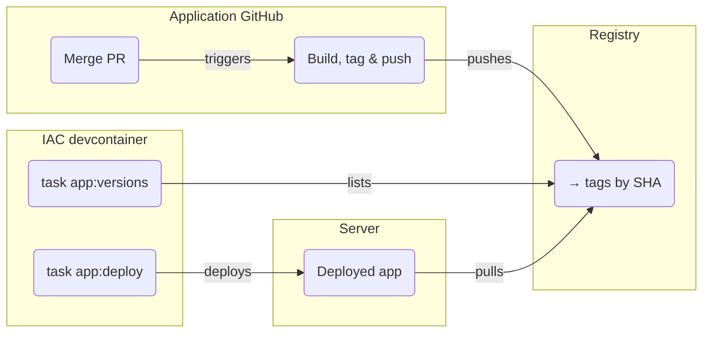

[**<---**](README.md)

# Application Deployment

Deploy and manage apps from the IaC devcontainer. **Created the project?** Start at [App mount](#app-mount). **Joined?** Go to [Commands](#commands).


```mermaid
flowchart LR
    subgraph LOCAL["IAC devcontainer"]
        B(task app:versions)
        C(task app:deploy)
    end
    subgraph GITHUB["Application GitHub"]
        A(Merge PR)
        D(Build, tag & push)
    end
    subgraph REGISTRY["Registry"]
      E(→ tags by SHA)
    end
    subgraph SERVER["Server"]
      F(Deployed app)
    end
    A -->|triggers| D
    B -->|lists| E
    C -->|deploys| F
    D -->|pushes| E
    F -->|pulls| E
```

**Commands:** `task app:versions -- <env>` · `task app:deploy -- <env> <sha>`

## Set which app you're working on

On the **host** (run again when you switch app):

```bash
./scripts/setup-app-path.sh /path/to/your/app
```

Validates `docker-compose.yml` and `.iac/` exist; writes `APP_HOST_PATH` to your profile. Then open `iac.code-workspace` and **Reopen in Container** so the devcontainer sees the mount.

## App mount

The devcontainer mounts your app at `/workspaces/iac/app`: **`.iac/`** and **`docker-compose.yml`**. Mount uses `APP_HOST_PATH` from the process that opened the workspace (Cursor/VS Code).

**Required layout:**

| Item | Purpose |
|------|---------|
| `docker-compose.yml` | Generic stack (no Traefik/domain here). |
| `.iac/iac.yml` | SOPS-encrypted; unencrypted: `base_domain`, `image_name`, `app_domains`. |
| `.iac/.env` | SOPS-encrypted app secrets (dotenv). |
| `.iac/.sops.yaml` | SOPS config for iac.yml and .env. |
| `.iac/docker-compose.override.yml` | Traefik labels, `traefik` network, `restart: unless-stopped`. |
| `.iac/backup.yml` | *Optional.* Retention + postgres + volumes for Restic. Deploy → `backup.yml` next to compose. [Backups](backups.md). |

Routing: override defines Traefik labels and network. See [Traefik](traefik.md#adding-an-application). App service must use `image: ${IMAGE}` (deploy sets it to digest). `restart: unless-stopped` on every service so the app survives reboot.

## Commands

### `task app:versions`

```bash
task app:versions -- <environment>   # dev or prod
```

Lists tags (TAG, CREATED, DESCRIPTION) from registry; `→` marks the one currently deployed.

### `task app:deploy`

```bash
task app:deploy -- <environment> <sha>
# e.g. task app:deploy -- dev 706c88c
```

`<sha>` = 7-char commit tag. Deploy resolves tag to digest and runs the app from the digest.

## Application config (if you created the project)

In **`.iac/iac.yml`** (app repo): `base_domain`, `image_name`, `app_domains`. See [New project](new-project.md#7-create-the-remaining-iac-files) for creating from scratch. App dev is devcontainer-first (app’s devcontainer + `.devcontainer/` override); production uses `docker-compose.yml` + `.iac/docker-compose.override.yml` on the server.

## Deployment records (if you joined)

| File | Location | Purpose |
|------|----------|---------|
| deploy-info.yml | `/opt/iac/deploy/<app>/deploy-info.yml` | Current deployment (overwritten each deploy). |
| deploy-history.yml | `/opt/iac/deploy/<app>/deploy-history.yml` | Append-only audit trail. |

Shape: see [`ansible/roles/deploy_app/tasks/record-deployment.yml`](../ansible/roles/deploy_app/tasks/record-deployment.yml).

## Implementation

- **Taskfile:** [`tasks/Taskfile.app.yml`](../tasks/Taskfile.app.yml) — `app:deploy`, `app:versions`; reads from `.iac/iac.yml`, runs Ansible and [`scripts/application_versions.py`](../scripts/application_versions.py).
- **Playbook:** [`ansible/playbooks/deploy-app.yml`](../ansible/playbooks/deploy-app.yml) → role [`ansible/roles/deploy_app/`](../ansible/roles/deploy_app/)**: main, resolve-image, decrypt-secrets, prepare-server, run-container, record-deployment.

See [Troubleshooting](troubleshooting.md) for app mount, deploy, and registry issues.

See [Registry](registry.md), [Traefik](traefik.md), [Backups](backups.md).
