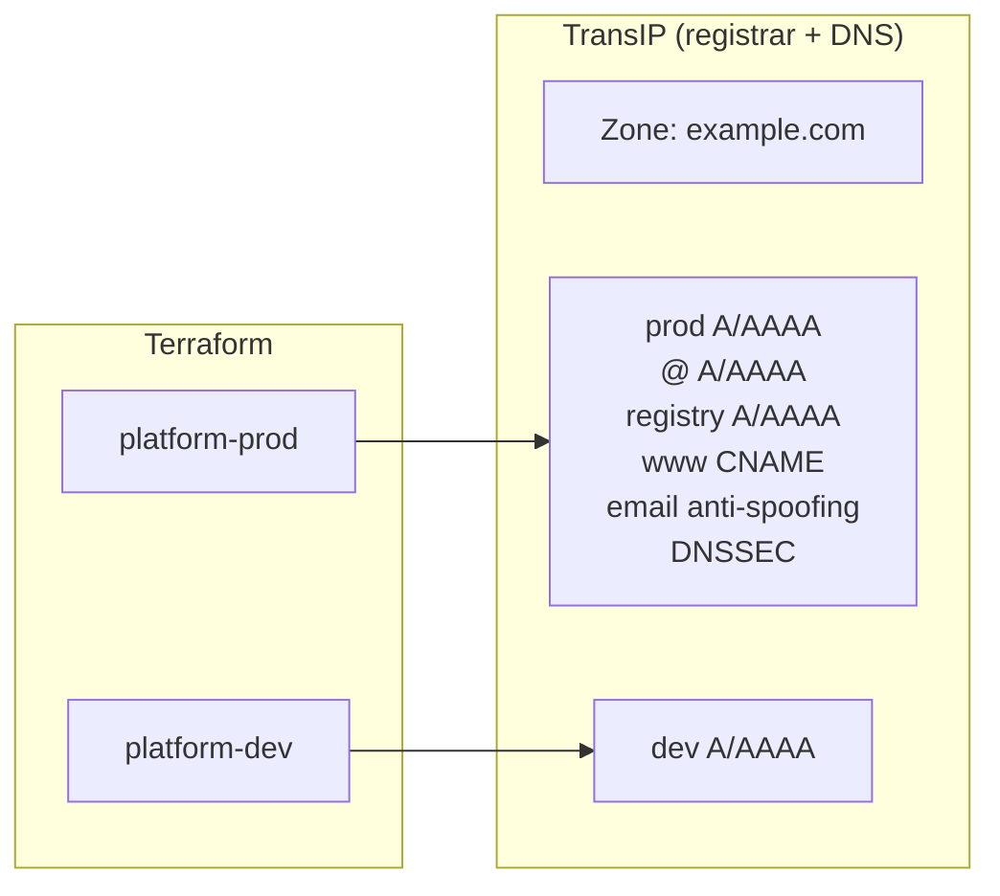

[**<---**](README.md)

# DNS

DNS zones and records are managed by Terraform via the [aequitas/transip](https://registry.terraform.io/providers/aequitas/transip/latest) provider. TransIP acts as both registrar and authoritative DNS provider. DNSSEC is managed via `transip_domain_dnssec`.

**Configuration:** [`terraform/dns.tf`](../terraform/dns.tf)

## How it works

TransIP manages the zone automatically as registrar — no zone creation step needed. Each workspace manages the DNS records that point to its own server. Both workspaces are independent (no ordering constraint).

  
Click to expand diagram

## Record ownership

| Workspace | Records | Dynamic? |
|-----------|---------|----------|
| **prod** | `prod` A/AAAA, `@` A/AAAA, `registry` A/AAAA | Yes — derived from server IP |
| **prod** | `www` CNAME | Static — points to `prod.<domain>` |
| **prod** | Null MX, SPF, DMARC | Static — email anti-spoofing |
| **prod** | DNSSEC (`transip_domain_dnssec`) | Static — key material from TransIP |
| **dev** | `dev` A/AAAA | Yes — derived from server IP; destroyed with dev server |

## DNSSEC

DNSSEC is declared as a `transip_domain_dnssec` resource in the prod workspace. The key material (key_tag, flags, algorithm, public_key) comes from TransIP's control panel once DNSSEC is enabled for the domain. Add the values to the `dns.tf` resource block and apply.

## Adding a new domain

For a new app on a different domain:

- If the domain is registered at TransIP: no code changes — set `base_domain` in `iac.yml` and apply.
- If the domain is at another registrar: delegate NS records to TransIP's nameservers (`ns0.transip.net`, `ns1.transip.nl`, `ns2.transip.eu`), then apply.

## Credentials

`transip_account_name` and `transip_private_key` are stored in the sops-encrypted `app/.iac/iac.yml` and passed to Terraform as `TF_VAR_` environment variables by the Taskfile. Generate the key pair at https://www.transip.eu/cp/account/api/.
