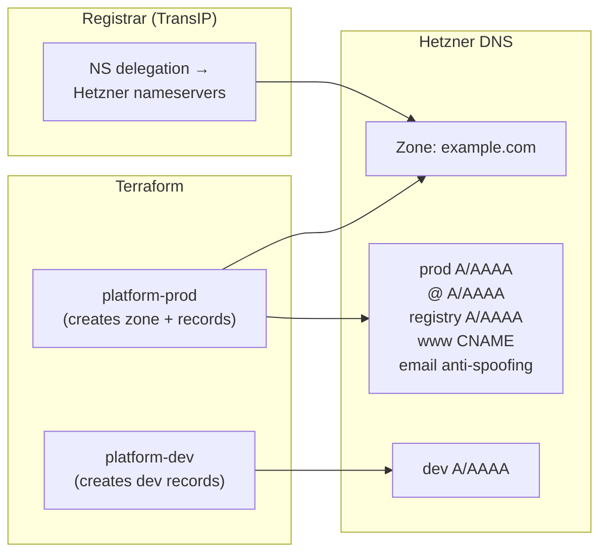

[**<---**](README.md)

# DNS

DNS zones and records are managed by Terraform via the [hcloud provider](https://registry.terraform.io/providers/hetznercloud/hcloud/latest/docs), using [Hetzner DNS](https://docs.hetzner.com/networking/dns/) as the nameserver. Domain registration stays at the original registrar (e.g. TransIP); only the NS delegation points to Hetzner.

**Configuration:** [`terraform/dns.tf`](../terraform/dns.tf)

## How it works

The prod workspace owns the DNS zone and all shared records. The dev workspace looks up the zone as a data source and manages only its own records. This means `terraform apply -- prod` must run before `terraform apply -- dev`.

  
Click to expand diagram

## Record ownership

| Workspace | Records | Dynamic? |
|-----------|---------|----------|
| **prod** | `prod` A/AAAA, `@` A/AAAA, `registry` A/AAAA | Yes — derived from server IP |
| **prod** | `www` CNAME | Static — points to `prod.<domain>` |
| **prod** | Null MX, SPF, DMARC | Static — email anti-spoofing |
| **dev** | `dev` A/AAAA | Yes — derived from server IP; destroyed with dev server |

## Adding a new domain

For a new app on a different domain
1. No code changes needed in `dns.tf` — it keys off `var.base_domain` from `iac.yml`
2. Point the new domain's NS records at Hetzner's nameservers (`hydrogen.ns.hetzner.com`, `oxygen.ns.hetzner.com`, `helium.ns.hetzner.de`)
3. Run `terraform apply -- prod` to create the zone and records

## Changing NS delegation

This is a one-time step per domain at the registrar:

1. `terraform apply -- prod` to create the zone and records in Hetzner DNS
2. Verify records resolve: `dig @hydrogen.ns.hetzner.com prod.<domain>`
3. At the registrar, change nameservers to Hetzner's three nameservers
4. Wait for propagation (minutes to hours): `dig NS <domain>`
