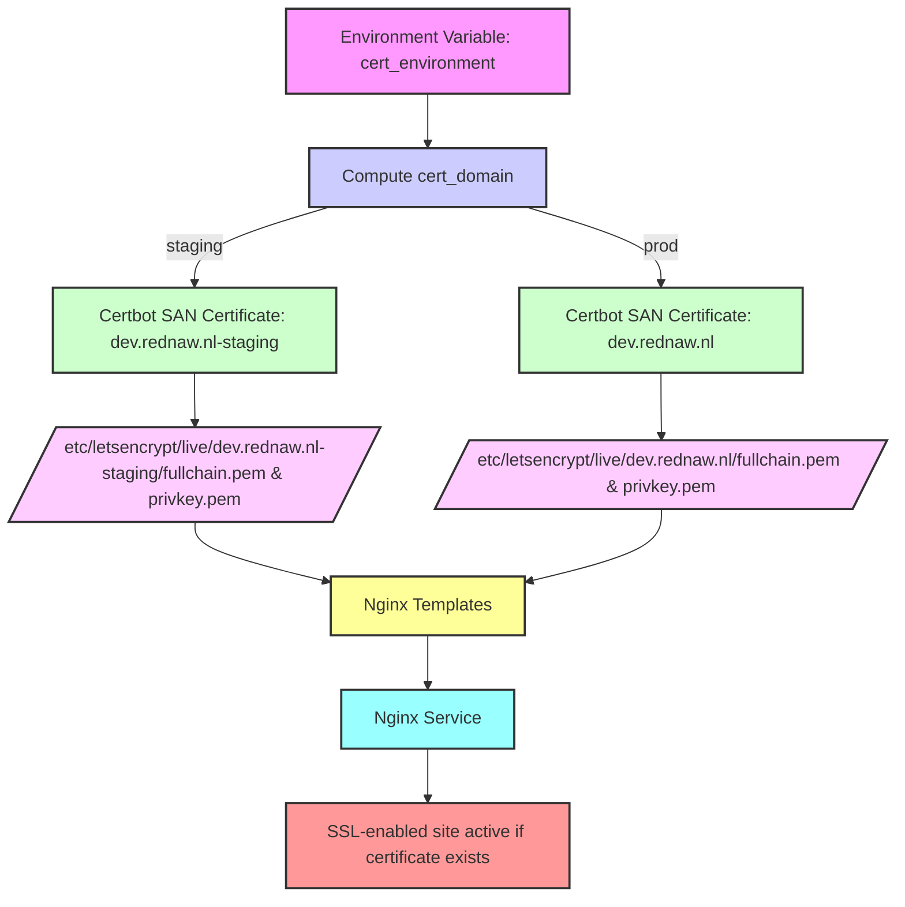

# LetsEncrypt SSL Management – Staging vs Production

## Objective

Enable switching between staging (testing) and production certificates for Nginx without reissuing Let’s Encrypt certificates on every switch.

---

## Current State

* Single `cert-name` per environment (e.g., `dev.rednaw.nl`).
* Dev/staging previously used `--staging`, production uses real CA.
* Switching flags in Certbot (`--staging`) does **not trigger a new cert** if a cert with the same `cert-name` exists.
* Nginx templates rely on `ssl_certs_exist` fact, which references the existing cert path.
* Existing staging cert is invalid for production clients (`curl: SSL certificate problem`).

---

## Proposed Design

### 1. Certificate Names

| Environment | Cert-name               | Purpose         | CA         |
| ----------- | ----------------------- | --------------- | ---------- |
| Dev         | `dev.rednaw.nl-staging` | Testing only    | Staging    |
| Prod        | `dev.rednaw.nl`         | Production live | Production |

* Staging certs **coexist** with production certs.
* No re-issuance required when switching Nginx to use one or the other.

---

### 2. Ansible Variables

```yaml
cert_environment: "prod"           # "prod" or "staging"
cert_domain: "{{ 'dev.rednaw.nl' if cert_environment == 'prod' else 'dev.rednaw.nl-staging' }}"
all_domains:
  - "{{ cert_domain }}"
  - "registry.rednaw.nl"
  - "www.rednaw.nl"
```

* Used to compute the certificate path in Nginx templates.
* `cert_domain` drives both Certbot and Nginx SSL file references.

---

### 3. Certbot Task Logic

* **Idempotent SAN certificate acquisition:**

```yaml
certbot certonly
--cert-name {{ cert_domain }}
--expand
--webroot
--webroot-path=/var/www/html
--non-interactive
--agree-tos
--register-unsafely-without-email
--keep-until-expiring
-d {{ d }}
```

* Produces one certificate per `cert-name`.
* Switching between `staging` and `prod` only requires changing `cert_environment`.
* No unnecessary re-requests for existing certs.

---

### 4. Nginx Template

```jinja
ssl_certificate /etc/letsencrypt/live/{{ cert_domain }}/fullchain.pem;
ssl_certificate_key /etc/letsencrypt/live/{{ cert_domain }}/privkey.pem;
```

* `cert_domain` variable allows **flipping staging ↔ production** without reissuing.
* `ssl_certs_exist` fact ensures templates render correctly based on available certs.

---

### 5. Workflow

1. Set `cert_environment` to `"staging"` or `"prod"`.
2. Run Ansible playbook:

```bash
ansible-playbook -i <inventory> playbook.yml
```

3. Certbot ensures SAN cert exists for `cert_domain`.
4. Nginx templates reference `cert_domain`.
5. Restart Nginx if cert exists.

**Switching environment**: change `cert_environment` variable → rerun playbook → Nginx switches to new certificate.

---

### 6. Benefits

* Fully idempotent.
* No reissuance of certificates when flipping environments.
* Clear separation between staging (dev testing) and production.
* Simplifies testing workflows without touching production CA.

---


