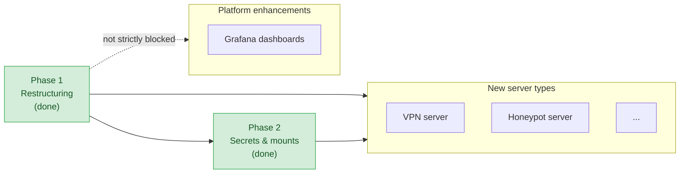

[**<---**](../README.md)

# Roadmap

The repo supports one server type ("the platform") with multiple mounted apps and fork-local infra secrets; Phase 3 adds further server types and optional enhancements.

---

## Phase 1 — Restructuring (complete)

Decomposed the repo so different server types compose from shared building blocks. Three sequential steps, each independently deployable and verifiable:

| Step | What | Verifiable by | Status |
|------|------|---------------|--------|
| **1a. Task layer** | Extract `_terraform:*`, `_ansible:*` internal tasks. Rename `terraform:*`+`ansible:*` to `platform:*`. | All existing `task` commands still work under new names. | Done |
| **1b. Ansible** | Split `roles/server/` into `roles/base/` + `roles/platform/`. | `task platform:configure:apply -- dev` produces identical server state. | Done |
| **1c. Terraform** | Extract `modules/server/`, move root to `terraform/platform/`. | `terraform plan` shows zero changes. | Done |

Layout reference: **[Repo layout](restructuring.md)**

---

## Phase 2 — Secrets and mounts (complete)

Fork-local **`secrets/infra.yml`**, **`apps/<app>/.iac/`** contract (plain **`iac.yml`**, single **`docker-compose.yml`**, SOPS **`.env`**), **`iac/apps/`** bind ([`.devcontainer/devcontainer.json`](../../.devcontainer/devcontainer.json)), **`task app:deploy -- <env> <app> <sha>`**.

Open items: **[Secrets and mounts → Remaining work](secrets-and-mounts.md#remaining-work)**.

Design: **[Secrets and mounts](secrets-and-mounts.md)**

---

## Phase 3 — New server types

Each server type follows the same pattern: Terraform root composing `modules/server`, an Ansible role composing `roles/base`, and a Task namespace calling the shared internal tasks. Independent of each other — build in any order.

### VPN server

Dedicated Hetzner VPS for personal VPN (Xray/VLESS+REALITY, WireGuard). Built for a China trip, destroyable after.

- **Cost:** ~€4.50/month (CX23, Germany) or ~€7/month (CX23 equivalent, Singapore)
- **Blocked by:** Phase 1 **✓** · Phase 2 **✓** · Phase 3 implementation only

Design: **[VPN for China travel](vpn-travel-china.md)**

### Honeypot server

Low-interaction honeypot (T-Pot) to observe attacker behavior. Completely isolated from the platform, strict egress filtering.

- **Cost:** ~€18/month (CX43 + block storage, Germany)
- **Blocked by:** Phase 1 **✓** · Phase 2 **✓** · Phase 3 implementation only

Design: **[Honeypot server](honeypot.md)**

---

## Platform enhancements

Not blocked by the modular Terraform/Ansible split, lower priority.

### Grafana as dashboard layer

Add Grafana on top of OpenObserve for community dashboards (WireGuard, Xray, system metrics). Parked — revisit when dashboard needs outgrow OpenObserve.

Design: **[Grafana exploration](grafana-exploration.md)**
