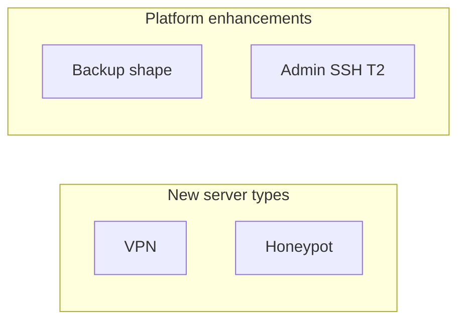

[**<---**](../../README.md)

# Roadmap (open work)

Completed baseline includes platform layout, secrets/mounts, and the Sveltia CMS OAuth proxy (`auth.<base_domain>`). Below is only what is still to do.

```mermaid
flowchart LR
  subgraph servers [New server types]
    vpn[VPN]
    honeypot[Honeypot]
  end
  subgraph enhancements [Platform enhancements]
    backup[Backup shape]
    sshT2[Admin SSH T2]
  end
```

## New server types

Pattern: `terraform/<purpose>/` composing `modules/server`, Ansible `roles/<purpose>/` + playbook `[base, <purpose>]`, thin Task namespace (`provision` / `configure`). `_terraform:*` / `_ansible:*` / `hostkeys:*` are purpose-parameterised (landed with the VPN): `ansible_host` is always the API IPv4, `hostkeys:accept -- <purpose>` records host keys, and root `ssh-allow-me` / `ssh-revoke-me` add/remove a travel `/32` on **all** iac firewalls (label `iac_managed=true`); next provision apply on a box drops its extra rule.

### VPN

Personal travel VPN: throwaway VPS next to long-running platform (`nbg1`). REALITY-only (dest roster, pick at smoke). Daily path = OneXray; eSIMs = management only.

Design: [vpn-travel-china.md](vpn-travel-china.md) · Manual: [vpn-travel-china-manual.md](vpn-travel-china-manual.md)

### Honeypot

Ephemeral standalone T-Pot Hive on CX53. Strict runtime egress. Kibana on the box only (no OpenObserve). Manual campaign length; destroy when done.

Design: [honeypot.md](honeypot.md)

## Platform enhancements

### Admin SSH (T2)

This Intel Mac’s Secure Enclave as the iac SSH identity (P-256, not the file Ed25519). Uncoupled from the China trip.

Design: [ssh-admin-t2.md](ssh-admin-t2.md)

### Smaller open items

| Item | Notes |
|------|--------|
| Backup shape | Standardize `backup:` in `iac.yml` vs `.iac/backup.yml`; align Taskfile + Prefect |
| Platform UX | Docker context naming, registry hostname clarity |

## Business (portfolio)

Lives in sibling `rednaw`: [`.cursor/ideas/monetize-rednaw.md`](../../../rednaw/.cursor/ideas/monetize-rednaw.md). Not an iac roadmap.

## Done (reference)

- **Platform on `rednaw.nl`** — live; band site apex `tientjeketama.nl`.
- **CMS OAuth proxy** — implemented; contract notes: [oauth-auth-proxy-implementor-brief.md](oauth-auth-proxy-implementor-brief.md)
