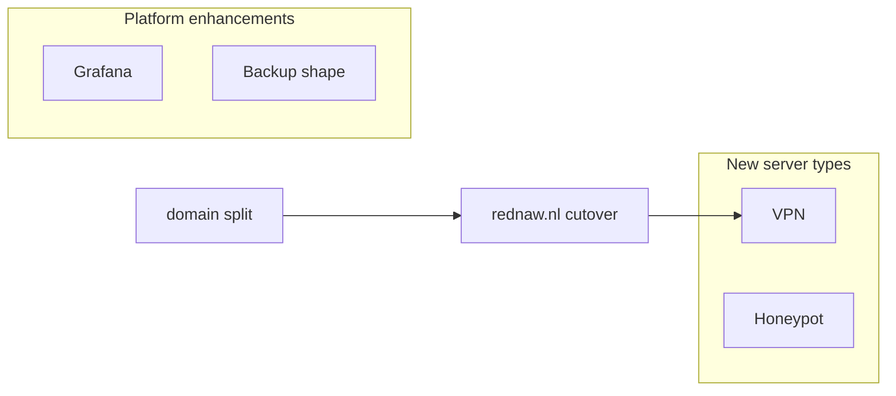

[**<---**](../../README.md)

# Roadmap (open work)

Completed baseline includes platform layout, secrets/mounts, and the Sveltia CMS OAuth proxy (`auth.<base_domain>`). Below is only what is still to do.

```mermaid
flowchart LR
  split[domain split]
  cutover[rednaw.nl cutover]
  subgraph servers [New server types]
    vpn[VPN]
    honeypot[Honeypot]
  end
  subgraph enhancements [Platform enhancements]
    grafana[Grafana]
    backup[Backup shape]
  end
  split --> cutover --> vpn
```

## Platform cutover

Blocked on the **domain split** landing on main (backward compatible). Then destroy the current VPS and provision on a new Hetzner account. Platform on **`rednaw.nl`**, band site stays on **`tientjeketama.nl`**. Blocks VPN.

Design: [rednaw-cutover.md](rednaw-cutover.md)

## New server types

Pattern: `terraform/<purpose>/` composing `modules/server`, Ansible `roles/<purpose>/` + playbook `[base, <purpose>]`, thin Task namespace over `_terraform:*` / `_ansible:*`.

### VPN

Personal VPN VPS (Xray/VLESS+REALITY, WireGuard); destroyable after use.

Design: [vpn-travel-china.md](vpn-travel-china.md)

### Honeypot

Isolated T-Pot style host, strict egress.

Design: [honeypot.md](honeypot.md)

## Platform enhancements

### Grafana

Optional dashboards on top of OpenObserve when built-in UI is not enough. Parked.

Design: [grafana-exploration.md](grafana-exploration.md)

### Smaller open items

| Item | Notes |
|------|--------|
| Backup shape | Standardize `backup:` in `iac.yml` vs `.iac/backup.yml`; align Taskfile + Prefect |
| Platform UX | Docker context naming, registry hostname clarity across envs |

## Done (reference)

- **CMS OAuth proxy** — implemented; contract notes: [oauth-auth-proxy-implementor-brief.md](oauth-auth-proxy-implementor-brief.md)
