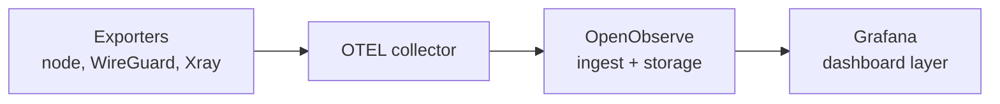
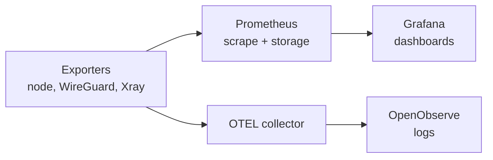

[**<---**](../README.md)

# Grafana as dashboard layer (exploration)

**Status:** Parked. Captured here for future reference.

OpenObserve handles ingest, storage, and querying well but its dashboard builder is limited and has no ecosystem of reusable dashboards. Grafana has [thousands of community dashboards](https://grafana.com/grafana/dashboards/) that can be imported as JSON. This doc explores adding Grafana as a dashboard layer on top of OpenObserve -- not replacing it.

---

## Why this came up

The [VPN project](future/vpn-travel-china.md) would benefit from dashboards for WireGuard peers, Xray traffic, and system metrics. Building those from scratch in OpenObserve is slow. Grafana has ready-made dashboards for all three. This applies to the platform too -- any new exporter or service likely already has a Grafana dashboard.

---

## Available dashboards (VPN-relevant)

| Component | Dashboard | ID | What it shows |
|-----------|-----------|-----|---------------|
| **WireGuard** | [WireGuard](https://grafana.com/grafana/dashboards/17251-wireguard) | 17251 | Per-peer traffic, last handshake, endpoint, keepalive. Pairs with [MindFlavor exporter](https://github.com/MindFlavor/prometheus_wireguard_exporter). |
| **Xray** | [Xray Dashboard](https://grafana.com/grafana/dashboards/23145-xray-dashboard) | 23145 | Traffic per inbound/outbound, connection counts. Uses [xray-exporter](https://github.com/anatolykopyl/xray-exporter). |
| **Xray (full)** | [CompassVPN](https://grafana.com/grafana/dashboards/23181-compassvpn-dashboard) | 23181 | Xray analytics + system metrics (CPU, memory, disk, network). Requires Grafana v12+. |
| **System** | [Node Exporter Single Server](https://grafana.com/dashboards/22) | 22 | CPU, load, memory, disk, network. The classic minimal dashboard. |
| **System** | [Server Metrics Summary](https://grafana.com/grafana/dashboards/9901-server-metrics-short) | 9901 | Compact summary with disk predictions. |

Platform-relevant dashboards also exist for Docker, Traefik, and many other exporters.

---

## Architecture options

### Option A: Grafana queries OpenObserve

OpenObserve exposes a Prometheus-compatible query API. Grafana uses it as a data source. You keep OpenObserve for ingest and storage (already deployed), add Grafana for visualization only.

**Pro:** No second storage backend. Community dashboards work if queries are PromQL-compatible.
**Con:** OpenObserve's PromQL compatibility isn't 100% -- some dashboard queries may need tweaking. The [OpenObserve Grafana plugin](https://github.com/openobserve/openobserve-grafana-plugin) exists but is not actively maintained.

### Option B: Grafana + Prometheus

Prometheus handles metrics (native PromQL, perfect dashboard compatibility). OpenObserve keeps logs. Grafana queries both.

**Pro:** Community dashboards work without modification. Well-trodden path.
**Con:** Two storage systems for observability data. More containers, more resources.

### Option C: Replace OpenObserve with Grafana stack

Grafana + Prometheus + Loki (logs) replaces OpenObserve entirely.

**Pro:** Full ecosystem access, largest community.
**Con:** Three containers instead of one. More operational complexity. Loses OpenObserve's single-binary simplicity. Big migration.

---

## Recommendation (when revisited)

**Option A** is the smallest change: add a Grafana container to the platform, point it at OpenObserve. Test with one community dashboard. If PromQL compatibility is good enough, you get the ecosystem without changing your storage. If not, **Option B** (add Prometheus for metrics, keep OpenObserve for logs) is the proven fallback.

**Not recommended now:** this is a platform enhancement, not a VPN blocker. The VPN works fine with SSH + container logs for the duration of a trip. Revisit when dashboard needs grow beyond what OpenObserve can do comfortably.

---

## Metrics sources for the VPN server (reference)

Neither Xray nor WireGuard exports OTEL natively. The collection path:

| Source | How to collect | Exporter |
|--------|---------------|----------|
| System (CPU, memory, disk, network) | OTEL collector `hostmetrics` receiver or node_exporter | Built-in / [node_exporter](https://github.com/prometheus/node_exporter) |
| Docker containers | OTEL collector `docker_stats` receiver | Built-in |
| Xray (traffic, connections) | Xray Stats API | [xray-exporter](https://github.com/anatolykopyl/xray-exporter) |
| WireGuard (peers, handshakes, bytes) | Parse `wg show` output | [prometheus_wireguard_exporter](https://github.com/MindFlavor/prometheus_wireguard_exporter) or [bash exporter](https://github.com/itefixnet/prometheus-wireguard-exporter) |
| Xray / WireGuard logs | OTEL collector filelog receiver | Built-in |
