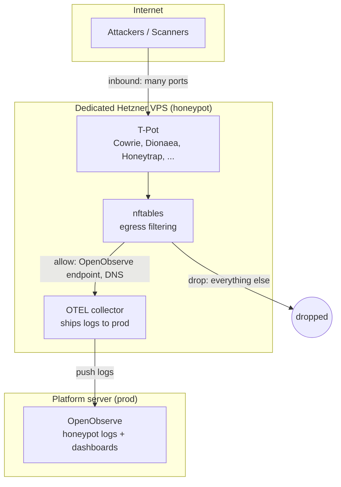

[**<---**](../README.md)

# Honeypot server

A dedicated Hetzner VPS running honeypot services to observe attacker behavior after a "compromise." Managed by this IaC project. **Not a real vulnerable system** -- uses established honeypot software that simulates services without giving real access.

**Prerequisite:** The [repo restructuring](restructuring.md) must be done first.

---

## Decisions

| Question | Decision |
|----------|----------|
| Interaction level | **Low-interaction** (simulated services). Safe, no real shell access for attackers. Graduate to high-interaction later if needed. |
| Software | **[T-Pot](https://github.com/telekom-security/tpotce)** -- multi-honeypot platform with built-in dashboards |
| Server | **Dedicated VPS**, completely isolated from the platform server |
| Logging | Ship to **prod platform's OpenObserve** (one-way push) |
| Egress | **Restricted** -- only allow outbound to logging endpoint + DNS |

---

## Why low-interaction first

| | Low-interaction | High-interaction |
|---|---|---|
| **What** | Simulated services (fake SSH, HTTP, SMB, etc.) | Real OS with weak passwords, real shell |
| **Risk** | Low -- attacker never gets real access | High -- real shell, real outbound abuse potential |
| **Data** | Who scans, what credentials they try, what commands they attempt | Full attacker toolkit, lateral movement, malware drops |
| **Outbound abuse** | Not possible | Real risk without strict egress filtering |
| **Complexity** | Deploy containers, done | Sandboxing, egress rules, legal considerations |

Low-interaction gives 90% of interesting data with 10% of the risk. T-Pot bundles ~20 honeypots (Cowrie for SSH, Dionaea for malware, Honeytrap for TCP, and more) with a Kibana dashboard out of the box.

---

## Server sizing and cost

T-Pot's [system requirements](https://github.com/telekom-security/tpotce?tab=readme-ov-file#system-requirements):

| T-Pot type | RAM | Storage |
|------------|-----|---------|
| Hive (standalone, all-in-one) | 16 GB | 256 GB SSD |
| Sensor (honeypots only, ships logs elsewhere) | 8 GB | 128 GB SSD |

Hetzner [pricing](https://costgoat.com/pricing/hetzner) (April 2026, Germany/Finland, incl. IPv4):

| Instance | vCPU | RAM | Storage | Monthly cost |
|----------|------|-----|---------|-------------|
| CX33 | 4 | 8 GB | 80 GB | €6.99 |
| CX43 | 8 | 16 GB | 160 GB | €12.49 |
| CX53 | 16 | 32 GB | 320 GB | €22.99 |
| CAX31 | 8 | 16 GB | 160 GB | €16.49 |

Block storage: €0.057/GB/month. IPv4: +€0.50/month (included in costs above).

### Option A: T-Pot Hive (standalone) -- recommended

Full T-Pot with Elastic Stack dashboards, attack maps, all honeypots. No dependency on the platform server for visualization.

- **CX43** (16 GB RAM, 160 GB) + **96 GB block storage** = **~€18/month**
- **CX53** (32 GB RAM, 320 GB) = **€23/month** -- headroom, no block storage needed

### Option B: T-Pot Sensor (honeypots only)

Runs honeypots only, ships all logs to a T-Pot Hive or (with adaptation) to OpenObserve on the platform. Cheaper, but no local Kibana/attack map.

- **CX33** (8 GB RAM, 80 GB) + **48 GB block storage** = **~€10/month**

### Recommendation

Start with **Option A on CX43 (~€18/month)**. T-Pot's built-in Kibana dashboards and attack map are the main appeal for exploring attacker behavior -- running as a Sensor without them loses most of the fun. If storage pressure builds from log volume, add block storage or bump to CX53.

T-Pot's requirements are for the full standard install (20+ honeypots + Elastic Stack). A custom subset via T-Pot's `customizer.py` could run on less, but it's not worth optimizing upfront.

---

## Architecture



**Port layout:**

| Port | Service | Notes |
|------|---------|-------|
| 22/TCP | Real SSH | Restricted to allowed IPs (admin only) |
| 2222/TCP | Cowrie (fake SSH) | Simulated SSH, logs everything |
| 80/TCP, 443/TCP | Web honeypots | Simulated HTTP/HTTPS |
| Many others | T-Pot services | Dionaea, Honeytrap, etc. on various ports |

Real SSH on 22 is firewalled to your IPs only. Attackers hitting 22 from other IPs get no response. Cowrie listens on 2222, but Hetzner firewall forwards external port 22 traffic from non-allowed IPs to 2222 -- or T-Pot handles this with its own port mapping.

---

## Isolation (safety)

This is the most important section. The honeypot must have **zero path** to real infrastructure.

| Concern | Mitigation |
|---------|-----------|
| **Network isolation** | Separate Hetzner server, no private network, no shared VPC. Hetzner servers can't reach each other unless you explicitly create a network. |
| **No shared secrets** | Own SSH keys, no SOPS key, no registry credentials, no Terraform Cloud token. Honeypot secrets are separate entries in `iac.yml` (or a dedicated file). |
| **Egress filtering** | nftables on the box: allow outbound to OpenObserve IP + DNS (53/UDP). Drop everything else. Prevents the server from being weaponized for spam/DDoS/mining. |
| **No shared credentials** | Hetzner API token is shared (same project), but the honeypot server has no access to it. The token only exists in the devcontainer. |
| **Hetzner ToS** | Low-interaction honeypots don't result in actual compromise -- no illegal content gets hosted, no outbound abuse. Safe under standard ToS. |
| **Logging survives wipe** | Logs ship to OpenObserve continuously. If an attacker somehow wipes the honeypot, data is preserved externally. |

### Egress rules (nftables)

```
# Allow established connections (responses to our outbound)
allow out: established/related
# Allow logging to OpenObserve
allow out: TCP to <openobserve_ip>:5081
# Allow DNS
allow out: UDP to any:53
# Drop everything else
drop out: all
```

Deployed by Ansible as part of `roles/honeypot/`.

---

## How it fits in the repo

Uses the composable patterns from the [restructuring](restructuring.md).

### Terraform

**`terraform/honeypot/`** -- composes `modules/server` with honeypot-specific resources:
- Firewall rules: wide-open inbound (the point is to attract traffic), restricted admin SSH
- One DNS record: `honeypot-dev.<base_domain>` / `honeypot-prod.<base_domain>`
- Backend prefix: `honeypot-`
- Server type: `cx43` (16 GB RAM, 160 GB disk) + 96 GB block storage volume

### Ansible

**`roles/honeypot/`** -- honeypot services:

| Task file | Purpose |
|-----------|---------|
| `tpot.yml` | T-Pot container deployment and config |
| `egress.yml` | nftables egress filtering rules |
| `otel-collector.yml` | OTEL collector, forwards to prod OpenObserve |

**`playbooks/honeypot.yml`**: `roles: [base, honeypot]` -- hardened server + honeypot services.

Note: `roles/base/` provides SSH hardening, unattended-upgrades, and Docker. The honeypot role adds T-Pot on top.

### Task

**`tasks/Taskfile.honeypot.yml`** -- calls shared internal tasks:

| Command | What it does |
|---------|-------------|
| `task honeypot:plan -- dev` | Terraform plan |
| `task honeypot:apply -- dev` | Terraform apply |
| `task honeypot:destroy -- dev` | Terraform destroy |
| `task honeypot:bootstrap -- dev` | First-time server setup |
| `task honeypot:run -- dev` | Ansible: configure honeypot server |

### Secrets

Honeypot secrets in `app/.iac/iac.yml`:

| Secret | Purpose |
|--------|---------|
| `honeypot_openobserve_endpoint` | Where to ship logs |
| `honeypot_openobserve_token` | Auth for log shipping |

Minimal secrets -- the honeypot doesn't need registry access, app tokens, or Terraform Cloud credentials beyond what the shared `_terraform:*` tasks already use.

---

## Observability

T-Pot includes its own **Kibana** dashboard (Elastic stack) for honeypot-specific analytics: attack maps, credential clouds, top source IPs, session replays (Cowrie). Access via SSH tunnel (`task honeypot:tunnel -- dev`).

Additionally, ship raw logs to **prod OpenObserve** for correlation with platform logs and long-term retention. The OTEL collector on the honeypot pushes to OpenObserve; the honeypot has no credentials to read or modify platform data.

---

## What you'll see

Typical data from a low-interaction honeypot on a public IP:

- **SSH brute-force:** credential lists, attempted commands after "login" (Cowrie logs full sessions)
- **Web scanning:** vulnerability probes, path enumeration, exploit attempts
- **Malware drops:** binaries uploaded to Dionaea, captured for analysis
- **Port scanning:** who's scanning what, from where, how often
- **Botnets:** automated attack patterns, C2 communication attempts (blocked by egress rules)

Most activity appears within hours of the server going live. A public IP on Hetzner gets scanned constantly.

---

## Risks

| Risk | Mitigation |
|------|-----------|
| Egress rules misconfigured, server used for abuse | Test egress rules in dev first. Verify with `curl` to external hosts (should fail). Monitor Hetzner abuse notifications. |
| T-Pot vulnerability gives real access | Keep T-Pot updated (unattended-upgrades + Renovate for container images). Even if compromised, egress rules limit damage. |
| Hetzner flags the server | Low-interaction = no actual compromise = no ToS violation. If flagged, explain it's a honeypot. Worst case: server gets suspended, destroy and move on. |
| Attacker detects it's a honeypot | Expected with low-interaction. Sophisticated attackers move on; you still capture the initial probe data. |
| Log volume overwhelms OpenObserve | Filter at the OTEL collector level -- ship summaries, not every packet. Monitor storage usage. |

---

## Implementation order

| Phase | What | When |
|-------|------|------|
| **1. Honeypot Terraform** | `terraform/honeypot/` composing the server module. | After restructuring |
| **2. Honeypot Ansible** | `roles/honeypot/` (T-Pot + egress rules). | After restructuring |
| **3. Honeypot Task namespace** | `tasks/Taskfile.honeypot.yml` calling shared internal tasks. | After restructuring |
| **4. Egress hardening** | nftables rules, test in dev. Verify no outbound leaks. | Before exposing to internet |
| **5. Log shipping** | OTEL collector → prod OpenObserve. | After platform OpenObserve is running |
| **6. Go live** | `task honeypot:apply -- prod`. Watch the dashboard. | When ready |
