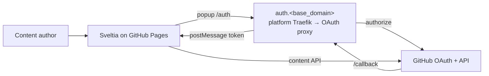

[**<---**](../../README.md)

# Plan: OAuth callback proxy for Sveltia CMS (GitHub Pages)

**Status:** decided — not implemented yet.  
**Audience:** implementor in this IaC repo.  
**Protocol contract:** Decap/Netlify CMS–style OAuth proxy (Sveltia-compatible). Stack choice (image vs tiny custom service) is still open at implement time; prefer an existing compatible image if it meets the contract.

---

## Locked decisions

| Decision | Choice |
|----------|--------|
| Who uses it | **2+ static sites on GitHub Pages** with **Sveltia CMS** (not hosted on this platform) |
| Where it runs | **Existing platform VPS**, behind **Traefik** |
| Public URL | **One** shared origin: `https://auth.<base_domain>` |
| GitHub OAuth App | **One** app; callback `https://auth.<base_domain>/callback` |
| Allowlist | Both (all) Pages hostnames that may open the CMS popup |
| Providers (v1) | **GitHub.com only** |
| IaC shape | **Platform service** (`roles/platform`), secrets in **`secrets/infra.yml`** — not an `apps/` deploy |
| Out of scope products | Authentik, oauth2-proxy, Keycloak (wrong model: forward-auth / IdP, not CMS popup handoff) |

After login, the proxy is **idle**. Stopping it does not take down Pages sites — only new CMS sign-ins fail.

---

## 1. Purpose

Provide a **minimal HTTPS service** that lets Sveltia (static SPA on GitHub Pages) complete GitHub’s **OAuth authorization-code** login.

The CMS cannot hold an OAuth **client secret**. This service holds the secret, exchanges `code` → access token, and returns the token via the browser popup protocol below.

This is **login glue only**. It is not the CMS, not the website, and not the git host.

---

## 2. Non-goals

Do **not** implement or host:

- The public websites or CMS admin UIs (stay on **GitHub Pages**).
- Content storage, media, or git commit/push after login.
- User accounts, passwords, or a separate identity system.
- PKCE-only public-client flow (no secret).
- Multi-tenant SaaS for arbitrary third-party sites.
- Per-site auth hostnames or separate OAuth apps (unless requirements change later).
- High availability beyond “reliable enough for occasional human logins.”
- Deploying these static sites via `task app:deploy` / Traefik app routers.

---

## 3. Actors and trust boundaries

| Actor | Role |
|-------|------|
| **Content author** | Opens Sveltia on a Pages URL; “Sign in with GitHub”. |
| **Sveltia (on GitHub Pages)** | Popup → this service; stores token client-side; calls GitHub API. |
| **This service (platform)** | Holds client id/secret; `/auth` + `/callback`; `postMessage` to opener. |
| **GitHub** | Issues codes/tokens; enforces repo permissions. |
| **Operator** | DNS/Traefik, OAuth App, `infra.yml` secrets, allowlist hostnames. |

**Trust rule:** Client secret never appears in Pages static assets or tracked source. Access tokens need not be persisted on this server after the browser response.

---

## 4. Integration contract (Sveltia / Decap-style)

Each site’s CMS config sets **`backend.base_url`** to this service’s origin (no path), e.g. `https://auth.example.com`.

Also configured in the **site** repos (not this IaC project): GitHub backend, repository identity.

### 4.1 Routes

| Method | Path | Role |
|--------|------|------|
| `GET` | `/auth` (alias `/oauth/authorize` OK) | Start login: validate, set CSRF state, redirect to GitHub authorize. |
| `GET` | `/callback` (alias `/oauth/redirect` OK) | Validate state, exchange `code`, HTML that talks to `window.opener`. |

Unknown paths: `404`.

### 4.2 `/auth` query parameters (from CMS popup)

- `provider` — required; v1 accept only `github`.
- `site_id` — hostname of the Pages site; **must** match allowlist when allowlist is set.
- `scope` — optional; only accept known-safe scopes; else documented default (typically repo + user identity for private/public content editing).

### 4.3 `/callback` query parameters (from GitHub)

- `code`, `state` (must match CSRF from `/auth`).

### 4.4 Popup → CMS handoff

Callback returns **HTML** in the OAuth popup using `postMessage`:

1. Ready signal to opener (GitHub: message data `authorizing:github`).
2. On matching reply, send result to `event.origin` (**not** `*` for the token message).
3. Success: `authorization:<provider>:success:` + JSON `{ provider, token }` (at least).
4. Failure: `authorization:<provider>:error:` + JSON `{ provider, error }` (optional `errorCode`).

Clear CSRF cookie after the callback attempt.

**CSRF:** Random state in an HttpOnly, Secure, short-lived cookie at `/auth`; verify on `/callback` before token exchange.

---

## 5. Operator / forge setup

1. Create **one** GitHub **OAuth App**.
2. Authorization callback URL: `https://auth.<base_domain>/callback`.
3. Put client id + secret in **`secrets/infra.yml`** (SOPS); never commit plaintext.
4. Authors who publish need **write** access to each site’s GitHub repo (OAuth does not bypass ACLs).
5. Point each Sveltia `backend.base_url` at `https://auth.<base_domain>`.

This repo **consumes** OAuth credentials; it does not create the GitHub App via API.

---

## 6. Configuration

| Name (illustrative) | Required | Meaning |
|---------------------|----------|---------|
| Client id | yes | GitHub OAuth app id |
| Client secret | yes | GitHub OAuth app secret |
| Public origin | yes | `https://auth.<base_domain>` (`redirect_uri`) |
| Allowed site hostnames | **yes for production** | Exact Pages hosts (e.g. `org.github.io`, `www.example.com`) |
| Forge hostname | no | Default `github.com`; enterprise only if ever needed |

---

## 7. Hosting in this IaC project

Platform enhancement (same pattern as other Traefik-fronted platform containers):

1. Container on the platform host, restart policy, internal listen port.
2. Traefik router for host `auth.<base_domain>` (TLS via existing ACME).
3. DNS A/AAAA for `auth.<base_domain>` → platform server (Terraform platform DNS, same as other names).
4. Public exposure: auth routes only; no admin UI.
5. Logs: enough to debug failed logins; **never** log client secret or access tokens.

Uptime: human login frequency. Brief downtime blocks **new** sign-ins only.

**Not** a separate VPS / Phase 3 server type unless isolation requirements change.

---

## 8. Security

- Client secret only on the server.
- CSRF as above.
- Allowlist enforced for `site_id` / opener host.
- HTTPS only in production (Traefik).
- No open relay: reject unknown `provider` and disallowed hosts.
- Least privilege on scopes (allowlist; no arbitrary scope strings).

---

## 9. Provider support

**v1:** `github` → github.com only.

Unsupported `provider` → error via postMessage (or HTML that still notifies the opener).

---

## 10. Deliverables

1. Platform Ansible (and DNS if needed) deploying the proxy behind Traefik at `auth.<base_domain>`.
2. Secrets keys documented for `infra.yml`.
3. Short operator notes: OAuth App callback, Sveltia `base_url`, allowlist, smoke test.
4. Declared default scopes and allowlist behavior.
5. No coupling to any one static site’s content model.

---

## 11. Acceptance criteria

1. Sveltia on an allowlisted Pages host signs in with GitHub via `base_url` = this origin (no PAT).
2. Wrong/reused `state` does not yield a token.
3. Non-allowlisted host cannot obtain a token.
4. Secrets absent from Pages assets and this repo’s tracked plaintext.
5. Stopping the proxy does not take down Pages sites; only fresh logins fail.
6. After login, content ops depend only on GitHub permissions + Sveltia config.

---

## 12. Smoke test

1. Secrets + `auth.<base_domain>` HTTPS live.
2. GitHub OAuth App callback → `/callback`.
3. Test site Sveltia `backend.base_url` → this origin; host on allowlist.
4. Sign in with GitHub → authenticated in Sveltia.
5. Confirm a GitHub API action from the CMS (e.g. list repo contents).
6. Stop the proxy → fresh login fails; Pages site still loads.

---

## 13. Handoff inputs (operator → implementor)

- `<base_domain>` (auth hostname derived)
- GitHub OAuth client id and secret
- Full allowlist of Pages hostnames (both/all CMS sites)
- Confirm GitHub.com only for v1

Do **not** require access to each static site’s build pipeline beyond documenting `base_url` and the callback URL.
