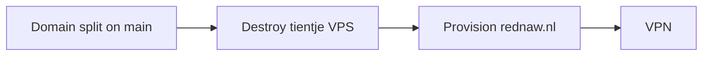

[**<---**](README.md)

# Platform cutover: new Hetzner account, `rednaw.nl`

Move the platform onto the **new, empty Hetzner account**. Band site stays on **`tientjeketama.nl`**. Old Hetzner account goes. Downtime is fine. VPN waits until this is done.

Hetzner does not move servers between accounts. Destroy, then apply.

**Blocked** on the domain split (below) on main. Cutover uses that code with **today’s** `infra.yml` until destroy has finished, then points secrets at the new account. An apply with today’s secrets must stay an empty plan.



---

## Decisions

| Question | Decision |
|----------|----------|
| Uptime | None required. Serial destroy, then apply. |
| Hetzner | One account (new). Close it after the site shows its data. |
| TFC | Same org **Rednaw**. Reuse **`platform-dev` / `platform-prod`**. |
| `base_domain` | **`rednaw.nl`** — `dev`/`prod` SSH, `auth`, `registry`. TF does not manage `@`/`www` on this zone. |
| Band site | **`dev`/`prod.tientjeketama.nl`**. Apex/`www` → `prod.tientjeketama.nl`. |
| Prod data | Postgres + uploads restore is required. |
| Dev data | Not restored. Gone. |
| Logs / Hetzner backups | Die with the VPS. Abort after destroy is restic + image on this laptop. |

---

## Domain split (blocking, implement first)

Today every `transip_dns_record.*` and Traefik apex/`www` use `var.base_domain`. `iac.yml` `app_domains` does not drive DNS. Compose labels already pin the app hosts.

Secret: **`app_domain`**. Unset = `base_domain` (today). Wire it in `scripts/platform-tf-secrets.sh`, the secrets template, and `Taskfile.app.yml` forbidden keys.

Do **not** rename existing `transip_dns_record.*` addresses. Today’s `infra.yml` must empty-plan.

- Existing `dev_*` / `prod_*` / `auth_*` / `registry_*`: still `domain = var.base_domain`.
- Existing `apex_*` / `www`: `domain = coalesce(var.app_domain, var.base_domain)`. `www` CNAME target is `prod.<that domain>.`, never `prod.rednaw.nl`.
- Existing anti-spoof (null MX, SPF, DMARC): stay on `base_domain`. Extra copies on `app_domain` gated with `count` when `app_domain` is set and differs. Neither zone handles mail.
- **New** site A/AAAA (`dev`/`prod` on `app_domain`) gated the same way. IPs: `prod.rednaw.nl` and `prod.tientjeketama.nl` → prod VPS; same for dev.
- Traefik apex/`www` redirects + ACME follow the app domain. Do **not** keep `Host(\`rednaw.nl\`)` routers (no `@`/`www` there; HTTP-01 would fail). `{env}.{base_domain}` stays the SSH/platform host. Vanity hosts stay compose labels.

`rednaw.nl` is the same TransIP account. Pre-flight: `dig NS rednaw.nl` is actually delegated. Leftover `@`/`www` on that zone are not TF’s; leave or delete in the console.

---

## Pre-flight (old account still up)

Split on main. `dig NS rednaw.nl` delegated. Current public IP in `allowed_ssh_ips`. New Hetzner: billing, API token, **same** laptop pubkey, new numeric `ssh_keys` IDs. TFC workspaces have no UI vars overriding `TF_VAR_*`. Confirm `rednaw.nl` is not used for mail.

---

## Backup

Restic is only on the VPS (`/opt/iac/prefect/backups/tientje-ketama`, password `local`). Nightly 03:00 UTC. There is no `task backup:run` — trigger one in Prefect (`:57802`) or `docker exec` on `prefect-worker`, **then** download.

`backup:snapshots` lists IDs, not files. Restore prints and continues if `postgres_db.dump` / `app_app_uploads.tar` are missing.

1. Trigger a fresh prod backup, then `task backup:snapshots -- prod tientje-ketama`.
2. `task backup:download -- prod tientje-ketama` → `.backup-repos/tientje-ketama/`.
3. On that copy:

```text
export RESTIC_REPOSITORY=.backup-repos/tientje-ketama RESTIC_PASSWORD=local
restic check
restic ls latest    # postgres_db.dump and app_app_uploads.tar
```

4. After new prod is up, app deployed, **stop the app container**, `task backup:upload -- prod tientje-ketama`, `task backup:restore -- prod tientje-ketama --confirm`, start app, check the site.

Prod/dev share slug `tientje-ketama`; a second download overwrites. Stop `app` around `pg_restore --clean`. Register cron only after restore (`workflow:deploy`) so 03:00 cannot run during restore.

---

## Registry

Registry DNS is prod-only. Ferry is a **tar on the workspace bind mount**, not Docker Desktop.

```text
crane pull --platform linux/amd64 \
  registry.tientjeketama.nl/rednaw/tientje-ketama:<sha> .backup-repos/tientje-ketama-image.tar
crane config .backup-repos/tientje-ketama-image.tar   # architecture: amd64
# later, after https://registry.rednaw.nl serves:
crane push .backup-repos/tientje-ketama-image.tar \
  registry.rednaw.nl/rednaw/tientje-ketama:<sha>
```

After rebuild, docker/crane auth is only the new host. Push, then deploy **that** sha to prod. Dev deploy is optional (same prod registry). Set GitHub `vars.REGISTRY_URL` **after** restore so a tientje-ketama `main` push cannot land a newer sha on the old dump.

---

## GitHub

One OAuth app; the proxy does not send `redirect_uri`. Homepage, callback (`https://auth.rednaw.nl/callback`), and both CMS `base_url`s flip together after `https://auth.rednaw.nl` serves. Pages sites stay up; CMS login is broken from destroy until that flip.

| What | Cutover |
|------|---------|
| CMS `base_url` | simonacella `admin/config.yml` and anticobagliosiciliano `static/admin/config.yml` → `https://auth.rednaw.nl`. Pages deploy, not only git. anticobagliosiciliano `tests/sveltia-admin.test.ts` asserts the old URL — change it or CI fails. |
| `cms_oauth_allowed_domains` | Unchanged. |
| `vars.REGISTRY_URL` | After restore. |

tientje-ketama does not use the OAuth proxy.

---

## Laptop after `base_domain` changes

**Rebuild** the container. Reopen is not enough: `provision:apply` uses `BASE_DOMAIN` from the environment (`hostkeys:*`); setup writes bashrc only if unset; `docker context create … || true` does not move `dev`/`prod`; `setup-remote-ssh.sh` runs on postCreate only. Otherwise apply SSHs a dead `tientjeketama.nl` name.

If not rebuilding: delete the bashrc `BASE_DOMAIN`/`REGISTRY` exports, `docker context rm dev prod`, rerun full setup, new shells.

Delete `secrets/.decrypted~infra.yml` after every `infra.yml` edit (forward and abort).

---

## Sequence

Starts only after the domain split is on main.

1. Pre-flight. New Hetzner token + ssh key IDs.
2. Fresh Prefect backup, then backup steps 1–3. Crane pull the prod **linux/amd64** tar. Stop if either ferry is incomplete.
3. `cp secrets/infra.yml secrets/infra.yml.pre-cutover`. Delete `.decrypted~infra.yml` on every edit.
4. Current secrets: `task platform:provision:destroy -- dev` then `-- prod`. Both workspaces `terraform state list` empty. Old Hetzner console: servers, **backup images** (`backups = true`), volumes, primary IPs, firewalls, leftover **SSH keys** (not in TF). A partial TransIP failure leaves state the new token cannot destroy.
5. Edit `infra.yml`: only `hcloud_token`, `ssh_keys` (new account IDs), `base_domain: rednaw.nl`, `app_domain: tientjeketama.nl`. Keep `allowed_ssh_ips`, TransIP, TFC, registry, OAuth. **Rebuild** the container.
6. `task platform:provision:apply -- dev` then `-- prod`. Wait until `dig +short prod.rednaw.nl` matches terraform output, then bootstrap.
7. Configure **prod** first. Wait until `https://registry.rednaw.nl` and `https://auth.rednaw.nl` serve. Crane push. Then configure **dev**.
8. Deploy tientje-ketama **prod** at the ferried sha. Stop `app`; upload + restore `--confirm`; start `app`; check the site. `task workflow:deploy -- prod` (and dev). Then `vars.REGISTRY_URL`. Dev app deploy optional.
9. OAuth homepage + callback + both CMS `base_url`s + anticobagliosiciliano test; Pages deploys. Prove CMS login.
10. Close the old Hetzner account. `git add -f secrets/infra.yml` and commit — the fork tracks it; git still has the dead token until this. Delete `secrets/infra.yml.pre-cutover`.

Let’s Encrypt may refuse duplicate `auth`/`registry`/`prod` hostnames if abort recreates them twice in a week.

---

## Abort / return

Until the old Hetzner account is closed: `secrets/infra.yml.pre-cutover` (and uncommitted git) is the old `hcloud_token` / `ssh_keys` / `base_domain`. Same main; old secrets recreate the old layout. Data is the laptop restic copy + image tar.

1. If a new VPS exists, destroy it **while the new secrets are still loaded**.
2. `cp secrets/infra.yml.pre-cutover secrets/infra.yml`. Delete `.decrypted~infra.yml`.
3. Rebuild the container. Apply; crane push; deploy; stop `app`; upload + restore; start. Revert OAuth homepage/callback, both `base_url`s (and the test), Pages, and `vars.REGISTRY_URL` if those changed.

After the old account is gone, there is no return.

## VPN

[vpn-travel-china.md](vpn-travel-china.md) — dedicated VPN VPS on this account, `vpn-dev.rednaw.nl` / `vpn-prod.rednaw.nl`.
