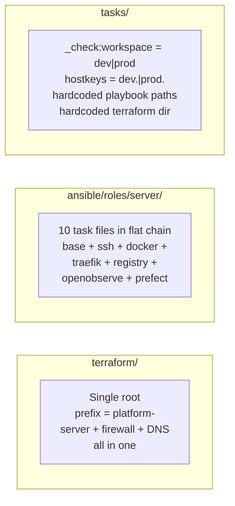
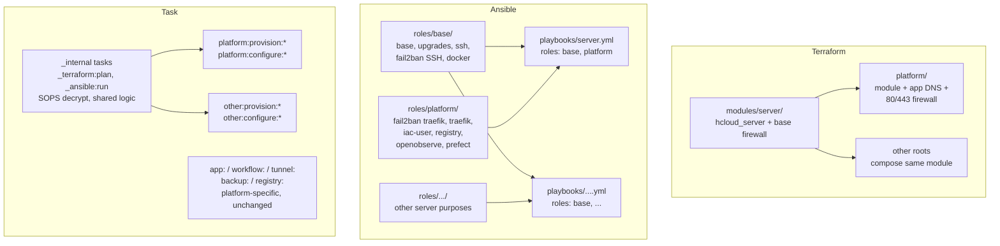

[**<---**](../README.md)

# Repo restructuring: composable server purposes

> **Status: implemented.** All three phases shipped. This doc is preserved as design context for future server types ([VPN](vpn-travel-china.md), [honeypot](honeypot.md), …).

The repo was built around **one implicit purpose** ("the platform") with two environments. Adding a second server type (e.g. a [VPN server](vpn-travel-china.md)) would have meant either duplicating everything in parallel or decomposing the repo so different server types compose from shared building blocks. This document covers the decomposition.

---

## What is coupled today



Three layers, each with platform assumptions baked in:

- **Terraform**: workspace prefix `platform-`, resource names `hcloud_server.platform`, DNS records for app subdomains, precondition limited to dev/prod.
- **Ansible**: [`roles/server/tasks/main.yml`](../../ansible/roles/server/tasks/main.yml) is a monolith -- base hardening and platform services in one flat import chain. No way to reuse the hardening without also getting Traefik, registry, OpenObserve, and Prefect.
- **Task**: workspace validation, hostname mapping, terraform directory, and playbook paths are all hardcoded to the single-purpose assumption.

---

## Target structure



---

## Ansible: decompose the server role

The biggest structural change. Split [`roles/server/`](../../ansible/roles/server/) into composable roles:

**`roles/base/`** -- generic hardened Ubuntu + Docker (reusable for any server):

| Task file | From |
|-----------|------|
| `base.yml` | `roles/server/tasks/base.yml` (as-is) |
| `unattended-upgrades.yml` | `roles/server/tasks/unattended-upgrades.yml` (as-is) |
| `ssh.yml` | `roles/server/tasks/ssh.yml` (as-is) |
| `fail2ban.yml` | `roles/server/tasks/fail2ban.yml` (**SSH jail only**; Traefik jails move out) |
| `docker.yml` | `roles/server/tasks/docker.yml` (as-is) |

**`roles/platform/`** -- existing app services (what makes it "the platform"):

| Task file | From |
|-----------|------|
| `fail2ban-traefik.yml` | Extracted from current `fail2ban.yml` (Traefik-specific jails + filters) |
| `traefik.yml` | moved from `roles/server/` |
| `iac-user.yml` | moved |
| `registry.yml` | moved |
| `openobserve.yml` | moved |
| `prefect.yml` | moved |

Playbooks become role compositions:
- [`playbooks/server.yml`](../../ansible/playbooks/server.yml): `roles: [base, platform]` -- identical behavior to today
- [`playbooks/bootstrap.yml`](../../ansible/playbooks/bootstrap.yml): unchanged (already generic)

New server purposes add a role and a playbook that composes `base` + that role. Shared pre-tasks ([`ansible/tasks/secrets.yml`](../../ansible/tasks/secrets.yml), [`ansible/tasks/authorized-keys.yml`](../../ansible/tasks/authorized-keys.yml)) work for any playbook unchanged.

### Why not decompose further?

The platform services (Traefik, registry, OpenObserve, Prefect) have **inter-dependencies**: fail2ban references Traefik logs, `iac-user` exists for registry + Prefect, OpenObserve has a Docker network that Traefik joins, registry needs Traefik's `auth/` directory. Making each fully independent would require conditional logic and interface contracts between roles -- complexity that doesn't pay for a project that runs 1-2 servers. The two-level split (base + purpose) covers the actual need. If a third purpose appears, the pattern is established and the next split is easier.

---

## Terraform: extract a shared module

**`terraform/modules/server/`** -- shared Hetzner VPS provisioning:
- `hcloud_server` (parameterized name, type, location, image, SSH keys)
- Base firewall rules (SSH from allowed IPs, ICMP)
- Outputs: IPv4, IPv6

**`terraform/platform/`** -- current infra, refactored as a thin wrapper:
- Calls `modules/server`
- Adds firewall rules for 80/TCP, 443/TCP
- All app DNS records from current [`dns.tf`](../../terraform/dns.tf)
- Backend prefix: `platform-`

New server purposes add a new root directory that calls the same module with different firewall rules and DNS records.

Migration: current `terraform/` becomes `terraform/platform/`. State stays in Terraform Cloud under `platform-*` workspaces -- no state migration, just a directory move and `terraform init`.

---

## Task: purpose-based namespaces

Currently namespaces are by **tool** (`terraform:plan`, `ansible:run`). With multiple server purposes the mental model shifts to **what you're managing**, split into two phases that mirror the underlying tools: `platform:provision:*` (Terraform) and `platform:configure:*` (Ansible). Both the current commands and any future purpose call the same underlying internals with different parameters.

### Rename `terraform:*` + `ansible:*` to `platform:provision:*` and `platform:configure:*`

| Before | After |
|--------|-------|
| `task terraform:plan -- dev` | `task platform:provision:plan -- dev` |
| `task terraform:apply -- dev` | `task platform:provision:apply -- dev` |
| `task terraform:destroy -- dev` | `task platform:provision:destroy -- dev` |
| `task terraform:output -- dev` | `task platform:provision:output -- dev` |
| `task terraform:reconfigure` | `task platform:provision:reconfigure` |
| `task ansible:bootstrap -- dev` | `task platform:configure:bootstrap -- dev` |
| `task ansible:run -- dev` | `task platform:configure:apply -- dev` |

### Stays the same (inherently platform-specific)

| Namespace | Why unchanged |
|-----------|--------------|
| `app:deploy`, `app:versions` | Only the platform deploys apps |
| `workflow:deploy` | Prefect is a platform service |
| `tunnel:start/stop` | Admin UI tunnels are platform-specific |
| `registry:overview` | Platform registry |
| `backup:*` | App backups |
| `secrets:*` | Shared (SOPS keys) |
| `test:*` | Shared (linting, validation) |

`server:check-status` extends to cover all known servers.

### Internal tasks (DRY)

The SOPS-decrypt-and-export block is currently copy-pasted across `plan`, `apply`, `destroy` (8 identical lines each). Extract into shared internal tasks:

| Internal task | What it does |
|---------------|-------------|
| `_terraform:init` | `terraform init` with SOPS-decrypted org, parameterized by `TF_DIR` |
| `_terraform:secrets` | Decrypt `iac.yml`, export `TF_VAR_*` -- called by plan/apply/destroy |
| `_terraform:plan` | `workspace select` + `terraform plan`, parameterized by `TF_DIR` and workspace prefix label |
| `_terraform:apply` | Same pattern for apply |
| `_terraform:destroy` | Same pattern for destroy |
| `_ansible:run` | `ansible-playbook` with parameterized playbook path, inventory name, and hostname |
| `_ansible:bootstrap` | Same for bootstrap playbook |

Each purpose namespace is a thin wrapper:

```
platform:provision:plan  -->  _terraform:plan  (TF_DIR=terraform,         PREFIX=platform)
vpn:provision:plan       -->  _terraform:plan  (TF_DIR=terraform/vpn,     PREFIX=vpn)
platform:configure:apply -->  _ansible:run     (PLAYBOOK=playbooks/server.yml)
vpn:configure:apply      -->  _ansible:run     (PLAYBOOK=playbooks/vpn.yml)
```

### Hostname resolution

`hostkeys:hostname` today is a `case` statement with only `dev`/`prod`. Change to a data-driven pattern where the purpose provides a prefix:

- `platform:configure:apply -- dev` resolves to `dev.<base_domain>` (unchanged behavior)
- New purposes resolve to `{purpose}-{env}.<base_domain>` (e.g. `vpn-dev.<base_domain>`)

---

## Extensibility notes

Phase 1 keeps the platform on one host on purpose. A future split (dedicated DB, registry, or observe host) is not in scope, but the boundaries below keep that path mechanical -- a move, not a rewrite. Co-location dependencies (fail2ban -> Traefik logs, registry -> Traefik `auth/`, OpenObserve Docker network shared with Traefik, shared `iac-user`) are artifacts of running on one box, not assumptions baked into role boundaries. They become interface contracts only when you split.

To preserve that path, enforce during implementation:

- **Keep each platform task file self-contained.** [`roles/platform/tasks/main.yml`](../../ansible/roles/platform/tasks/main.yml) stays a flat import chain. No cross-component glue in `main.yml`; if two components need `iac-user`, both `include_tasks` it -- don't rely on ordering.
- **Document co-location assumptions.** Add `roles/platform/README.md` listing the implicit cross-component links (paths, Docker networks, shared directories). Future-you needs this map to design the split.
- **Parameterize `modules/server` firewall.** Module takes `additional_firewall_rules` as input. `terraform/platform/` adds 80/443. A future `platform-data` host opens Postgres on a private IP only -- same pattern as VPN/honeypot will use.
- **Internal tasks take paths as parameters.** `_ansible:run` receives playbook, inventory, hostname; `_terraform:*` receives `TF_DIR` and workspace prefix label. No hardcoded `playbooks/server.yml` or `terraform/` paths inside the internals.

Explicitly **not** doing in Phase 1+2: private networking (Hetzner Cloud Network is free, add when needed -- no state surgery required), service discovery beyond Docker labels, cross-host secret distribution, multi-host deploy coordination.

---

## Risks

| Risk | Mitigation |
|------|-----------|
| Ansible role split breaks platform | Run `task platform:configure:apply -- dev` after split, diff the result. Same role chain, same outcome. |
| Terraform module extraction breaks state | Don't rename resources inside the module. Use `moved` blocks if needed. Plan should show zero changes. |
| fail2ban split (mixed generic + Traefik) | Keep SSH jail in `base`, move Traefik jails to `platform`. Test independently. |
| Two Terraform roots = duplicated provider config | ~5 lines each. Acceptable at this scale. |
| Task rename breaks muscle memory + docs | One-time update; all docs reference the new names. |

---

## Implementation order

| Phase | What | Status |
|-------|------|--------|
| **1. Restructure Task layer** | Extract internal tasks (`_terraform:*`, `_ansible:*`). Rename `terraform:*`+`ansible:*` to `platform:*`. Update help text and docs. | Done |
| **2. Restructure Ansible** | Split `roles/server/` into `roles/base/` + `roles/platform/`. Verify platform unchanged. | Done |
| **3. Restructure Terraform** | Extract `modules/server/`, move root to `platform/`. Verify zero-diff plan. | Done |
