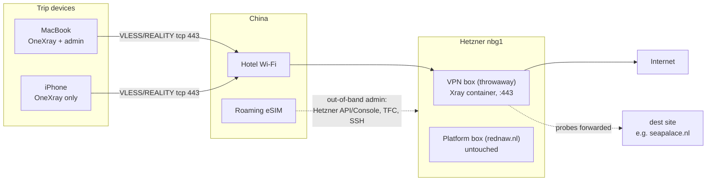

[**<---**](README.md)

# VPN for China — operator manual

Companion to the spec: [vpn-travel-china.md](vpn-travel-china.md). The spec holds decisions and pending work; this is the manual: how it works, how to install, run, debug, and recover it. All commands here (`task vpn:*`, `task hostkeys:accept`, `task ssh-allow-me`/`ssh-revoke-me`) are implemented; code lives in `terraform/vpn/`, `ansible/roles/vpn/`, `tasks/Taskfile.vpn.yml`, `tasks/Taskfile.hostkeys.yml`, `scripts/ssh-*.sh`. **Not legal advice.**

---

## 1. How it works

### The problem

The GFW (Great Firewall) kills VPNs four ways, and a countermeasure has to survive all of them:

1. **Protocol signatures.** WireGuard, OpenVPN, and IPsec have recognizable wire formats. They are detected and dropped regardless of port or IP within minutes to days.
2. **SNI / DNS blocking.** Plain TLS reveals the hostname you ask for (the SNI field in the ClientHello). Blocklisted names are reset; DNS answers are poisoned.
3. **Active probing.** When traffic to a server looks like "TLS, but the operator can't place the site", the GFW connects to it *itself*. A proxy that answers with a self-signed cert, an odd handshake, or proxy-protocol behaviour confirms the suspicion and the IP is blocked.
4. **IP reputation.** No proof needed. Enough odd-looking volume to one unremarkable IP and it gets blocked anyway.

### REALITY in one page

REALITY (an [Xray-core](https://github.com/XTLS/Xray-core) feature) defeats 1–3 by making your server a **perfect impostor of somebody else's real website** — the **dest** (currently `seapalace.nl`; it's a roster, see the spec).

- Our server on port 443 holds **no certificate at all**. There is no Let's Encrypt issuance, no certificate-transparency log entry, nothing tying the IP to us.
- Your client opens what looks exactly like a Chrome TLS 1.3 connection to `seapalace.nl`: SNI = dest, Chrome's ClientHello fingerprint (that is the `fp=chrome` parameter, via uTLS). Hidden inside the ClientHello's key-share randomness is an authentication blob derived from the **REALITY keypair** (X25519), the **short_id**, and the **current time**.
- **Authenticated client** → the server takes over the handshake and issues a temporary certificate signed with the REALITY private key. Your client verifies it against the public key from the share link — no CA involved. Inside the tunnel runs **VLESS** (a minimal proxy protocol; the **UUID** is your account) with **`xtls-rprx-vision`** flow control, which pads and reshapes the inner traffic so that "TLS inside TLS" — the classic proxy tell — isn't visible.
- **Anyone else** (GFW prober, internet scanner, a curious browser) → the server transparently relays the whole TCP stream to the real `seapalace.nl`. The prober completes a genuine handshake with the genuine certificate and sees the genuine site. There is nothing to find: to the entire internet, our IP appears to host that website.

This is why the dest has constraints (TLS 1.3, HTTP/2, **X25519** key exchange, looks like the real site from Hetzner `nbg1`): the impostor handshake borrows the dest's characteristics, so the dest must actually have them.

Two things REALITY does **not** fix:

- **The clock.** The auth blob embeds a timestamp. A device (or server) clock that is minutes off produces handshakes that fail. Both ends must have correct time.
- **IP reputation (way 4).** The GFW can still notice "one Chinese user moves a lot of traffic to a rare Dutch SNI" and block the IP without proof. That is expected and survivable: renew the **primary IPv4** (keep the disk) or wipe the box if wedged — same SOPS keys. That is the *Burned IP* runbook (§6.1). The GFW blocks the IP, not you.

### What runs where



- **OneXray** on both devices creates a TUN interface that captures *all* device traffic (IPv4 and IPv6) and routes it: domains in `geosite:cn` go **direct** (Chinese sites over the hotel network — normal, fast, and not a leak), everything else goes through the tunnel and exits in Nuremberg. We do not use `geoip:cn` rules because they require resolving the domain first, and Chinese DNS answers are poisoned.
- The **eSIMs** are out-of-band management only (they roam via the home carrier, so they exit outside the GFW). OneXray stays **off** on cellular. The eSIM is never the daily internet path.
- The **VPN box** shares nothing with the platform: its own Terraform root (`terraform/vpn/`, TFC workspace `vpn`), its own firewall (443 + SSH from home only), no Traefik, no apps, no DNS record, `backups = false`. SSH and Ansible always address it by its API IPv4 — it has no hostname anywhere.

### The four secrets

All in `secrets/infra.yml` (SOPS), generated **once** — they survive IP renew and wipe:

| Secret | What it is | Client or server |
|---|---|---|
| UUID | Your VLESS account id | Both |
| REALITY keypair | X25519; private key authenticates the server | Private: server. Public: in the share link |
| short_id | Hex tag that marks your client's handshakes | Both |
| dest | The site being impersonated (roster pick) | Both (server `dest`/`serverNames`, client `sni=`) |

Renewing the primary IPv4 (or wiping the box) changes the **address** in the share link / QR from `task vpn:config` (and SNI only if you also stepped dest). Rotate UUID/keys only if a QR or share link leaked.

---

## 2. Installation (at home, before the trip)

Prerequisites: this MacBook with the iac devcontainer, age key, and Hetzner/TFC/TransIP access working; OneXray ([App Store](https://apps.apple.com/us/app/onexray/id6745748773)) installed on Mac and iPhone; spec Do §0–§6 implemented; TFC workspace `vpn` created.

### 2.1 Generate secrets (once)

Inside the devcontainer, using the pinned Xray image (same digest as `ansible/roles/vpn/defaults/main.yml`; the image's entrypoint is the `xray` binary):

```bash
XRAY="ghcr.io/xtls/xray-core@sha256:592ec4d11f656db95598d01e76dbcc6e002d67360b96a5436500a938230f52c7"
docker run --rm "$XRAY" uuid      # → vpn_uuid
docker run --rm "$XRAY" x25519    # → vpn_reality_private_key + vpn_reality_public_key
openssl rand -hex 8               # → vpn_short_id
```

Put `vpn_uuid`, `vpn_reality_private_key`, `vpn_reality_public_key`, `vpn_short_id`, `vpn_dest` (leave the roster #1 for now), and `vpn_allowed_ssh_ips` (home only) into `secrets/infra.yml` via `sops`. Never regenerate these on apply.

### 2.2 Provision and configure

```bash
task vpn:provision:plan       # review: server, firewall (443 + SSH-from-home), no DNS
task vpn:provision:apply      # creates the box; prints/outputs the IPv4
task hostkeys:accept -- vpn   # SSH -4 to the API IPv4, accept-new (at home: no allow-me needed)
task vpn:configure:bootstrap  # one-time root bootstrap (ubuntu user, keys)
task vpn:configure:apply      # base hardening + Xray container on :443
```

Every step is also the recovery path — there is deliberately no "install" that differs from "reinstall".

### 2.3 Pick the dest (from the box, not from home)

The dest must look right *from the VPS's network*, not from your ISP. SSH in and try the roster (spec, "Dest roster") in order:

```bash
# TLS 1.3 + X25519 + h2 in one shot:
echo | openssl s_client -connect seapalace.nl:443 -servername seapalace.nl \
  -tls1_3 -groups x25519 -alpn h2 2>/dev/null | grep -E 'TLSv1.3|ALPN|Verification'
# Looks like the real site (200, not a CDN 403 / redirect-to-www):
curl -s -o /dev/null -w '%{http_code} %{redirect_url}\n' https://seapalace.nl
```

First host that passes both is the dest. Set `vpn_dest` in secrets, then `task vpn:configure:apply`.

### 2.4 Client setup

```bash
task vpn:config   # emits vless:// links + QR from secrets + current IPv4 (no SSH involved)
```

The link looks like `vless://<uuid>@<ipv4>:443?security=reality&sni=<dest>&fp=chrome&pbk=<pubkey>&sid=<short_id>&flow=xtls-rprx-vision&type=tcp`. Note it embeds the **IPv4, never a hostname** — a hostname would reintroduce poisoned DNS and IPv6 Happy-Eyeballs holes.

On **both** devices, in OneXray: import the link/QR; download GeoData (now, at home); routing rule `geosite:cn` → direct, everything else → the VLESS outbound, **no `geoip:cn`**; kill switch on; TUN IPv6 on (app default — do not disable IPv6 on the devices either); iOS: only one VPN profile active, iCloud Private Relay **off**; check the device clock is automatic and correct.

### 2.5 Smoke tests (all must pass before departure)

With OneXray **on**, at home:

| Check | How | Pass |
|---|---|---|
| IPv4 exit | `curl -4 https://ifconfig.co` / browser | VPS IP, not home |
| IPv6 exit | `curl -6 https://ifconfig.co`, [test-ipv6.com](https://test-ipv6.com) | VPS IPv6, not home — this catches the classic Happy-Eyeballs leak |
| DNS | [browserleaks.com/dns](https://browserleaks.com/dns) | Resolver is not your ISP |
| WebRTC | [browserleaks.com/webrtc](https://browserleaks.com/webrtc) | No home LAN / home public IP |
| Probe view | From another network: `curl -sI https://<vps-ip>` with `--resolve <dest>:443:<vps-ip>` | You get the dest site, like any stranger would |

Then rehearse the two drills **at home** while mistakes are cheap: **Burned IP renew** (§6.1, skipping `ssh-allow-me`), and a **VPN wipe** (§6.2: destroy → apply → `hostkeys:accept` → bootstrap → configure → `vpn:config`). Do **not** destroy the platform box — there is no disposable platform-dev.

Finally, work through the trip checklist at the bottom of the [spec](vpn-travel-china.md).

---

## 3. Usage (on the trip)

**Daily:** connect to hotel Wi-Fi, turn OneXray on, live normally. Chinese apps and sites go direct (that's the routing rule, not a leak); everything else exits in Nuremberg.

**New network / captive portal:** OneXray **off** → clear the portal → OneXray **on**. The kill switch will otherwise fight the portal.

**Cellular:** OneXray **off** on the eSIM, always. The eSIM already exits outside the GFW via the home carrier, and it exists for one purpose: managing infrastructure when the tunnel is down (tether the MacBook to it).

**Rules that keep the box alive:**

- Never share the QR / share link with anyone. One leaked UUID means manual key rotation (§4).
- No torrents, no SMTP, no scanning from the exit — Hetzner abuse mail is the account-level risk (it's the same account as `rednaw.nl`). Watch the Hetzner account email during the trip; answer any abuse mail the same day.
- Never change dest on a live burned IP — a dest swap on an address the GFW is already watching looks like exactly what it is. New dest only together with a **new** IPv4 (Burned IP renew or wipe).
- Never delete the VM from the Hetzner Console — that desyncs Terraform state. Destroy / renew is always via `task vpn:provision:*`.
- Do not download a VPN client inside China; app stores and downloads are poisoned/blocked. Everything is installed before departure.

---

## 4. Operations

### Where things are

- Current IP: `task vpn:provision:output` (or `hcloud server list`).
- On the box: Xray runs as a Docker container with `network_mode: host`, listening on 443. The image digest is pinned; `docker-ce` is apt-held for the travel window.
- Nothing else runs there. No Traefik, no port 80, no fail2ban jail on 443 (fail2ban only guards SSH via the base role).

### Health check

```bash
ssh -4 ubuntu@<vps-ip>
docker ps                      # xray container Up
docker logs --tail 50 xray     # accepted connections; REALITY auth failures show as fallbacks
sudo ss -tlnp | grep ':443'    # xray owns 443
timedatectl                    # clock synced (REALITY cares)
```

Away from home, SSH needs `task ssh-allow-me` first (see below).

### Travel SSH: `ssh-allow-me` / `ssh-revoke-me`

The standing firewall rules trust **home IPs only** — on both the platform and VPN boxes, permanently. On the road:

```bash
task ssh-allow-me    # adds your current public IPv4 /32 to *every* iac firewall (platform, VPN)
task ssh-revoke-me   # removes only rules carrying the allow-me marker; home rules untouched
```

Facts to remember: it detects and connects over IPv4 only; it refuses to add an IP that belongs to an iac server; the extra rule lives only in Hetzner (not Terraform, not git), so the **next `*:provision:apply` on a box silently drops that box's extra rule** — that is expected, just run allow-me again. Skip both tasks at home. CGNAT caveat: see §5.

### Changing dest (roster step)

Only at home, or together with a Burned IP **renew** (new IPv4): edit `vpn_dest` in secrets → `task vpn:configure:apply` if Xray must pick up the new dest on disk → `task vpn:config` → re-import on **both** devices.

### Rotating UUID / keys (only after a leak)

Regenerate UUID, keypair, and short_id (§2.1) in secrets → `task vpn:configure:apply` → `task vpn:config` → re-import on both devices. The IP stays; the old link is dead.

---

## 5. Troubleshooting

First split the problem in two: **can the client reach the box** (tunnel layer) vs **is the box healthy** (server layer). The eSIM is your out-of-band path to answer the second question.

| Symptom | Likely cause | Action |
|---|---|---|
| Never worked (home smoke fails) | Config mismatch, clock, Xray down | Check `docker logs xray`; re-scan QR from `task vpn:config`; `timedatectl` on box, clock on device |
| Handshake fails, was working | **Clock drift** (device or server), or dest site changed/moved | Fix time first — it is the most common REALITY failure; then re-test dest from the box (§2.3) |
| Worked for days in CN, now dead; box healthy via eSIM; 443 unreachable from hotel but fine from eSIM | **Burned IP** | Runbook §6.1 |
| Box unreachable even via eSIM/SSH; Hetzner Console shows it wedged | Wedged box (same disk) | Runbook §6.2 |
| Only one network fails (hotel blocks, other Wi-Fi / tether works) | Local network filtering, not the GFW | Not burned; use another network, don't recreate |
| SSH times out after `ssh-allow-me` | **CGNAT**: the detected eSIM IPv4 differs from your SSH egress IP, or rotated | Re-run allow-me once; if still refused, Hetzner Console → web console, or add the `/32` by hand (same marker; also wiped on next apply) |
| SSH: `REMOTE HOST IDENTIFICATION HAS CHANGED` | Recycled Hetzner IP with a stale known_hosts entry | `hostkeys:accept` wipes its own target IP first, so this shouldn't happen through the tasks; manually: `ssh-keygen -R <ip>` and retry |
| `vpn:provision:*` can't reach Terraform Cloud from CN | You're not on the eSIM path | Tether to the eSIM (exits abroad); if TFC itself is down, wait — the Console is only for emergencies, never for deleting the VM |
| Slow but working | GFW throttling or hotel congestion | Live with it; recreating for speed spends a fresh IP for nothing |
| Hetzner abuse email | Something from the exit tripped a report | Answer the same day, factually (personal single-user VPN). See spec "Exit use" |

Diagnosis discipline: distinguishing "burned IP" from "broken box" is the whole game. Burned = the box is provably healthy (SSH via eSIM works, `docker logs` clean, `curl` from the box egresses fine) while port 443 from Chinese networks is dead. Only then **renew the IPv4** (§6.1). Wedged disk → wipe (§6.2).

---

## 6. Disaster recovery

### 6.1 Burned IP (the expected disaster)

The GFW blocked the IPv4. Disk, Docker, Xray, and SOPS keys stay; you are swapping the **managed primary IPv4** only. Fail if the new address equals the old (Hetzner pool recycle) — retry until it differs. OneXray **off** on both devices, MacBook on eSIM:

```bash
task vpn:provision:renew-ip   # replace hcloud_primary_ip; assert new ≠ old; platform untouched
task ssh-allow-me             # trip only — skip at home
task hostkeys:accept -- vpn   # -4, accept-new, wipes its own target IP first
# optional: set next roster dest in secrets, then:
# task vpn:configure:apply    # only if dest stepped — Xray on disk must learn the new SNI
task vpn:config               # new QR (new IP; new SNI if you stepped dest)
```

No bootstrap — and no configure unless dest stepped. Re-import on **both** devices → OneXray on → optionally `task ssh-revoke-me`. Never change dest while keeping a burned address.

### 6.2 Wedged box (disk / Docker / compromise)

Via eSIM: `task ssh-allow-me`, SSH in, restart the container / reboot. No SSH? Hetzner Console → web console. Fixable → fix. Not fixable → **wipe**: destroy/recreate the server (and primary IP as needed) → `hostkeys:accept -- vpn` → bootstrap → configure → `vpn:config`. Never delete the VM only in the Console (TFC desync).

### 6.3 MacBook lost or stolen

The laptop holds everything: age key, SSH key, clone, and the API credentials for the **whole Hetzner account** (platform included). From any trusted browser, immediately: change the Hetzner password and revoke the API token; revoke TFC tokens; revoke TransIP access; rotate the platform's SSH exposure from home later. The phone's OneXray config keeps working meanwhile (the tunnel needs no laptop) — decide whether to destroy the box from the Hetzner Console *knowing that desyncs TFC* and must be repaired at home, or leave it running until home. There is no way to re-establish admin on the road: the age key exists nowhere else. That trade was accepted in the spec ("Cloud admin").

### 6.4 Everything failed

Both eSIMs dead, or box unrecoverable and recreate impossible: turn OneXray off and live directly — Chinese apps, offline maps, and banking were all tested VPN-free before departure. Do not improvise a new tunnel from inside China (no client downloads, no browsing "as normal" on the eSIM). Fix it at home.

---

## 7. Post-trip teardown

```bash
task vpn:provision:destroy    # primary IP + box + firewall
task ssh-revoke-me            # if any extra rules are left anywhere
```

Then delete the `vpn` workspace in Terraform Cloud. The secrets can stay in `secrets/infra.yml` for a next trip — they are worthless without a running box. There is no DNS record to clean up.

---

## 8. Abbreviations

Sysadmin staples (DNS, SSH, TCP, TLS, NAT…) are assumed; this covers the censorship-circumvention jargon and the few project-specific short names.

| Abbreviation | Meaning |
|---|---|
| ALPN | Application-Layer Protocol Negotiation — TLS extension where both ends agree on the inner protocol (we require the dest to offer `h2`) |
| CDN | Content Delivery Network — disqualifies a dest: the real site lives on many shared edge IPs, so a lone Hetzner IP claiming that name is implausible |
| CGNAT | Carrier-Grade NAT — mobile carriers put many customers behind one shared public IPv4; why `ssh-allow-me` over the eSIM can misdetect "your" IP |
| CN | China country code — as in `geosite:cn`, the domain list routed direct |
| dest | The real HTTPS website our server impersonates (REALITY term; picked from the roster in the spec) |
| fp | (uTLS) fingerprint — share-link parameter; `fp=chrome` makes the client's ClientHello byte-identical to Chrome's |
| geosite / geoip | Xray's bundled routing databases: domain lists / IP-range lists ("GeoData" in OneXray). We route by `geosite:cn` only, never `geoip:cn` |
| GFW | Great Firewall — China's national censorship system (DPI, DNS poisoning, active probing, IP blocking) |
| H2 | HTTP/2 — required of the dest because the impostor handshake advertises it |
| hcloud | Hetzner Cloud (API / CLI / Terraform provider) |
| pbk / sid | Share-link parameters: REALITY **p**ublic **k**ey / **s**hort **id** |
| REALITY | Xray's certificate-less TLS camouflage: authenticates real clients inside the ClientHello, forwards everyone else to the dest (not an acronym, just branded caps) |
| SNI | Server Name Indication — the plaintext hostname in a TLS ClientHello; what the GFW reads, and what we set to the dest |
| SOPS | Secrets OPerationS — encrypted-file tool (age keys) holding `secrets/infra.yml` |
| TFC | Terraform Cloud — remote Terraform state; workspace `vpn` |
| TUN | Virtual network interface at the IP layer — how OneXray captures *all* device traffic, both address families |
| uTLS | Go library that forges specific browsers' TLS ClientHello fingerprints (see `fp`) |
| UUID | Universally Unique Identifier — doubles as the VLESS account credential |
| VLESS | The lightweight, stateless proxy protocol carried inside the REALITY tunnel (successor of VMess; "less" = no built-in encryption, TLS provides it) |
| X25519 | Elliptic-curve Diffie-Hellman on Curve25519 — the TLS key exchange REALITY piggybacks its authentication on; the dest must support it |
| XTLS / xtls-rprx-vision | Xray's flow-control mode ("vision") that pads the inner traffic so TLS-in-TLS isn't detectable |
