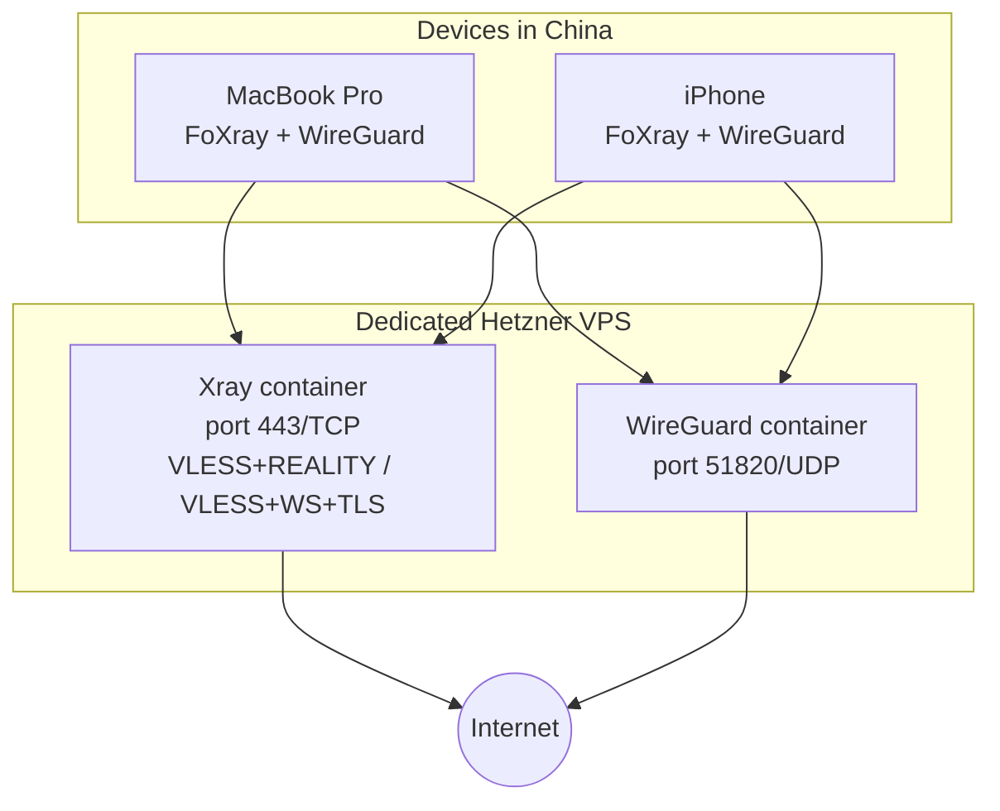

[**<---**](../README.md)

# VPN for China travel

Self-hosted VPN on a **dedicated Hetzner VPS** for personal use (MacBook Pro + iPhone) during a trip to China. Managed by this IaC project. **Not legal advice** -- check current rules before you travel.

**Prerequisite:** The [repo restructuring](restructuring.md) (composable Ansible roles, Terraform module, purpose-based Task namespaces) must be done first. This document assumes it is complete.

---

## Decisions

| Question | Decision |
|----------|----------|
| Server | **Dedicated VPS**, VPN-only (no app stack, registry, Traefik, etc.) |
| Locations | **`nbg1` (Nuremberg)** for dev/testing, **`sin1` (Singapore)** for actual use in China |
| Protocols | **All three**: Xray/VLESS+REALITY, Xray/VLESS+WS+TLS, WireGuard -- maximise chances |
| Clients | MacBook Pro + iPhone (personal) |
| Timeline | ~6 months -- enough to build, test, iterate |

---

## Architecture



**Port layout** (no Traefik on this server -- Xray owns 443):

| Port | Protocol | Service |
|------|----------|---------|
| 22/TCP | SSH | Admin (restricted to allowed IPs) |
| 443/TCP | REALITY + WS+TLS | Xray (two inbounds, one listener with fallback routing) |
| 51820/UDP | WireGuard | Fallback VPN |

Xray on 443 with REALITY as the primary inbound. Connections that don't match REALITY auth fall through to a **real HTTPS response** (static page or proxy to a legitimate site), making the server look like an ordinary web host to probes. The WS+TLS inbound shares 443 via Xray's path-based routing (e.g. `/ws`), using a real Let's Encrypt cert for `vpn.<base_domain>`.

WireGuard on a separate UDP port -- zero interaction with Xray. Works when filtering is light.

### Observability

No OpenObserve on the VPN server. An OTEL collector container ships logs and system metrics to the **prod platform's OpenObserve** in Nuremberg. The VPN server in Singapore has unrestricted internet access (the GFW sits between your devices and the internet, not between Singapore and Nuremberg), so this works during the trip too:

```
iPhone/Mac  --[GFW]-->  VPN (sin1)  --[open internet]-->  OpenObserve (nbg1 prod)
```

Check the OpenObserve dashboard through your VPN tunnel when needed. If the prod platform server is down, SSH into the VPN server and inspect container logs directly.

---

## How it fits in the repo

Uses the composable patterns from the [restructuring](restructuring.md):

### Terraform

**`terraform/vpn/`** -- composes `modules/server` with VPN-specific resources:
- Firewall rules for 443/TCP, 51820/UDP
- One DNS record: `vpn-dev.<base_domain>` / `vpn-prod.<base_domain>` A/AAAA
- Backend prefix: `vpn-`
- Default location: `sin1` for prod, `nbg1` for dev
- Minimal server type: `cx22` (~4 EUR/month)

### Ansible

**`roles/vpn/`** -- VPN services:

| Task file | Purpose |
|-----------|---------|
| `xray.yml` | Xray container, config template (REALITY + WS+TLS inbounds) |
| `wireguard.yml` | WireGuard container, key management |
| `otel-collector.yml` | OTEL collector, forwards to prod OpenObserve |

**`playbooks/vpn.yml`**: `roles: [base, vpn]` -- hardened server + VPN only.

### Task

**`tasks/Taskfile.vpn.yml`** -- calls the shared internal tasks with VPN parameters:

| Command | What it does |
|---------|-------------|
| `task vpn:plan -- dev` | Terraform plan for VPN server |
| `task vpn:apply -- dev` | Terraform apply |
| `task vpn:destroy -- dev` | Terraform destroy |
| `task vpn:bootstrap -- dev` | First-time server setup as root |
| `task vpn:run -- dev` | Ansible: configure VPN server |
| `task vpn:config` | Generate client configs / QR codes |

### Secrets

VPN secrets added to `app/.iac/iac.yml`:

| Secret | Purpose |
|--------|---------|
| `vpn_xray_uuid` | VLESS client auth (UUID) |
| `vpn_reality_private_key` | REALITY server key (x25519) |
| `vpn_reality_short_id` | REALITY short ID |
| `vpn_wg_server_private_key` | WireGuard server key |
| `vpn_wg_client_public_keys` | Per-device WireGuard public keys |
| `vpn_wg_preshared_key` | WireGuard PSK |

---

## Client apps

**Verify App Store availability in your region before committing to a client.** Some Xray clients are region-restricted (e.g. FoXray is unavailable in the Netherlands App Store). Install and test **before** the trip -- you cannot count on downloading new apps in China.

Xray (VLESS+REALITY, VLESS+WS+TLS) candidates -- pick one that's available in your App Store:

| App | iOS | macOS | Notes |
|-----|-----|-------|-------|
| [V2Ray Client+](https://apps.apple.com/app/v2ray-client/id6747379524) | Yes | -- | Free. Supports VLESS+REALITY. Import via vless:// link or QR. |
| [OneXray](https://apps.apple.com/app/onexray/id6745748773) | Yes | Yes (universal) | Free. Cross-platform Xray-core client. |
| [Streisand](https://apps.apple.com/app/streisand/id6450534064) | Yes | -- | Supports VLESS, VMess, Trojan. |
| [V2RayXS](https://github.com/tzmax/V2RayXS) | -- | Yes | Free, open source. macOS GUI for Xray-core. |
| [GoXRay Desktop](https://github.com/goxray/desktop) | -- | Yes | Free, open source. Go + Fyne UI. |
| [FoXray](https://apps.apple.com/app/foxray/id6448898396) | Yes | Yes | Region-restricted -- may not be available. |

WireGuard:

| App | iOS | macOS | Notes |
|-----|-----|-------|-------|
| [WireGuard](https://apps.apple.com/app/wireguard/id1441195209) | Yes | Yes | Official app. Import `.conf` file or QR code. |

You need **one Xray client** (same app on both devices if possible) and **WireGuard**. Two apps total, three protocol configs.

---

## Connection priority (when in China)

1. **VLESS+REALITY** -- try first. Looks like a TLS connection to a popular site. Best GFW resistance.
2. **VLESS+WS+TLS** -- if REALITY is disrupted. Looks like HTTPS to `vpn.<base_domain>`. Different fingerprint may bypass different filters.
3. **WireGuard** -- last resort. Fast when it works, but UDP is easily throttled.

Configure all three in the client apps before departure. Switching is a tap.

---

## Risks

| Risk | Mitigation |
|------|-----------|
| All protocols blocked in China | No technical fix; have non-VPN fallbacks for essentials. |
| Server IP gets flagged | Budget for changing IP (destroy + re-apply) or a second VPS on a different provider. |
| iOS client app removed from App Store | Download FoXray before trip; have WireGuard as backup (always available). |

---

## Implementation order

| Phase | What | When |
|-------|------|------|
| **1. VPN Terraform** | `terraform/vpn/` composing the server module. | After restructuring |
| **2. VPN Ansible** | `roles/vpn/` (WireGuard first -- validates full pipeline). | After restructuring |
| **3. VPN Task namespace** | `tasks/Taskfile.vpn.yml` calling shared internal tasks. | After restructuring |
| **4. Xray REALITY** | Add Xray container + REALITY inbound. Test with FoXray. | Middle |
| **5. Xray WS+TLS** | Second inbound, cert automation. | Middle |
| **6. Singapore prod** | `task vpn:apply -- prod`. Test latency. | Before trip |
| **7. Harden + client configs** | Final configs, offline backups, QR codes. | Before trip |
| **8. Post-trip** | `task vpn:destroy -- prod`. | After trip |

---

## Before travel checklist

- [ ] All three protocols tested from home (both devices, Wi-Fi + cellular)
- [ ] Client apps installed and configs imported **offline** (no cloud sync dependency)
- [ ] Singapore prod server running and tested for latency
- [ ] Hetzner console access verified (out-of-band recovery without SSH)
- [ ] Banking / essential services tested **without** VPN (some block VPN IPs)
- [ ] Server auto-updates enabled (unattended-upgrades)
- [ ] Destroy plan documented (`task vpn:destroy -- prod`)
