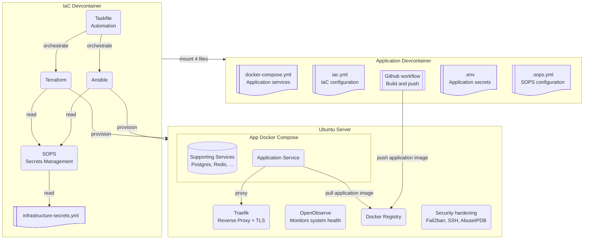

[**<---**](README.md)

# Getting started

## Requirements

- **[Docker](https://docs.docker.com/get-docker/)**
- **[VS Code](https://code.visualstudio.com/)** or **[Cursor](https://cursor.com/)** with the following extensions:
  - **[Dev Containers](https://marketplace.visualstudio.com/items?itemName=ms-vscode-remote.remote-containers)** (`ms-vscode-remote.remote-containers`).
  - **[SOPS](https://marketplace.visualstudio.com/items?itemName=signageos.signageos-vscode-sops)** by SignageOS (`signageos.signageos-vscode-sops`). Configure the key path in settings; see [Secrets](secrets.md#vs-code-integration).
  - **[Remote - SSH](https://marketplace.visualstudio.com/items?itemName=ms-vscode-remote.remote-ssh)** (`ms-vscode-remote.remote-ssh`) for [running VS Code or Cursor on the server](remote-vscode.md).

## Summary

1. Clone the repo, open the `iac` folder, VSCode/Cursor will offer to reopen in devcontainer, **do not do that yet**.
2. Set which app the devcontainer will mount: run **`./scripts/setup-app-path.sh /path/to/your/app`** (the app must have `iac.yml`, `docker-compose.yml`, `.env`, and `.sops.yaml`). See [Application deployment](application-deployment.md#app-mount).
3. For setting up a **new project** follow the [Install: new project](new-project.md) guide, if you want to join an **existing project** follow the [Install: joining an existing project](joining.md) guide.

## Result
When done you will be in full control of your application infrastructure using the IaC Devcontainer

