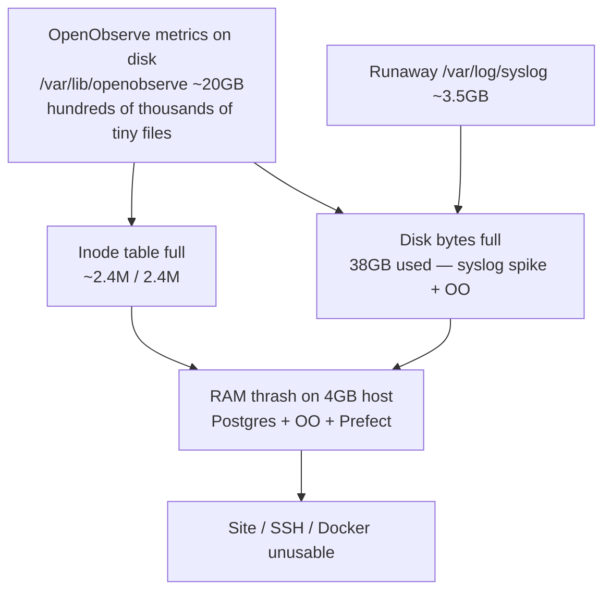

[**<---**](../README.md)

# RCA: prod outage 2026-08-27 (disk + inode exhaustion)

**tientjeketama.nl** was unreachable for an extended period. Prod (`tientjeketama-nl-prod`, cx23: 2 vCPU / 4 GB / 38 GB disk) was thrashing; SSH and HTTPS were intermittent or timed out.

## Impact

| Symptom | Cause in this incident |
|---------|------------------------|
| HTTPS / HTTP timeouts or 418/502 | Traefik/app down or overloaded; later app/db exited |
| SSH hangs / “banner exchange” timeouts | Load ~35–48 on 2 cores; ~50 MB RAM free |
| `sudo` / Docker “No space left on device” | **Inodes 100%** (and earlier **disk bytes 100%**) |
| App/DB containers exited after reboot | Disk full during Postgres recovery; stacks did not stay up |

## Timeline (UTC, 2026-08-27)

1. Investigation: DNS OK (`91.98.116.83`); CPU metrics ~200% for hours; RAM exhausted.
2. Soft reboot via `hcloud` → SSH briefly OK, then **disk 100%** → Docker failed to start; `sudo` broken (could not write iolog).
3. Hetzner **rescue**: truncated `/var/log/syslog` (~3.5 GB) and `apport.log` → ~2.7 GB free.
4. Normal reboot: Traefik + app briefly up; HTTPS responded; app/db and most platform containers later **Exited**.
5. Further inspect: after syslog wipe, **`/var/lib/openobserve` ≈ 20 GB** and **~733k+ files** under streams; inodes still ~100%.

## Root cause



**Primary:** Unbounded OpenObserve data on a small root disk — especially high-cardinality **container metrics** under `/var/lib/openobserve/.../stream/files/default/metrics` (~132 streams; one stream alone ~7k–10k files / tens of MB). That filled **inodes** and most of **disk**.

**Secondary / trigger:** A huge **`/var/log/syslog`** (~3.5 GB) pushed **byte** usage to 100%, so Docker could not start after reboot and `sudo` could not create files. Truncating syslog freed bytes but not the inode problem.

**Amplifiers:** cx23 (4 GB RAM) co-locating OpenObserve, Prefect (+ Postgres), registry, Traefik, and the app; no retention/compaction configured for OpenObserve in [`ansible/roles/platform/tasks/openobserve.yml`](../../ansible/roles/platform/tasks/openobserve.yml).

## Related finding: Host Metrics “Disk Used / Available” empty

After bringing OpenObserve back (read-only; OTEL left stopped), the **Host Metrics** dashboard showed CPU/memory/disk I/O history, but **Disk: Used** and **Disk: Available** had **no data**.

Those panels query PromQL on stream **`system_filesystem_usage`** ([`openobserve-host-metrics.json`](../../ansible/roles/platform/files/openobserve-host-metrics.json)). That stream **does not exist** in OpenObserve (and never did). Only `system_disk_*` I/O streams are present.

**Cause:** the OTEL Collector runs in Docker with a `filesystem` scraper filtered to `ext4` / `xfs` / `btrfs` ([`otel-collector-config.yaml.j2`](../../ansible/roles/platform/templates/otel-collector-config.yaml.j2)), but the container has **no host root mount** and **no `root_path: /hostfs`**. Inside the container, mounts are mostly overlay/tmpfs, so the scraper emits nothing. Disk I/O scrapers still produce `system_disk_io*`.

**Implication:** this outage could not have been spotted from those two panels — filesystem **usage** was never ingested. Fixing collection (mount `/:/hostfs:ro` + `root_path: /hostfs`) only helps **going forward**; historical used/available cannot be reconstructed.

## What was not the root cause

- DNS / Hetzner server deleted — server **running**, A record correct.
- Missing `secrets/infra.yml` in the clone — file present and decryptable; missing sibling app clones only affected local multi-root workspace, not the live outage.
- Traefik misconfig as first failure — box was resource-exhausted first.

## Recovery performed

| Step | Action |
|------|--------|
| A | Soft reboot; then rescue + truncate huge logs |
| Cleanup | `docker image prune` / remove unused tags (bytes + some inodes) |
| OpenObserve | Recreated container; later **wiped** `/var/lib/openobserve` for a fresh start |
| App / registry | Recreated from deploy tree + registry storage |
| Prefect | Recreated server + rebuilt worker image |

## Prevention (implemented in repo)

1. **OTEL `/hostfs` + `root_path`** so `system_filesystem_usage` is collected ([`openobserve.yml`](../../ansible/roles/platform/tasks/openobserve.yml), [`otel-collector-config.yaml.j2`](../../ansible/roles/platform/templates/otel-collector-config.yaml.j2)).
2. **Disable Docker block I/O metrics** (+ filter) to cut metric cardinality.
3. **OpenObserve** `ZO_RETENTION_DAYS=7`, compact on, telemetry off.
4. **Journald + rsyslog logrotate** size caps ([`roles/base/tasks/logging.yml`](../../ansible/roles/base/tasks/logging.yml)).
5. Troubleshooting: disk vs inode full — [Troubleshooting](../troubleshooting.md).
6. **Follow-up:** disk/inode alerts belong in OpenObserve (monitoring), not Prefect (scheduler).

Apply with `task platform:configure:apply -- prod`.

## Commands used

```bash
# Host API
hcloud server list
hcloud server reboot tientjeketama-nl-prod
hcloud server enable-rescue --ssh-key wander@casa tientjeketama-nl-prod

# On prod (when SSH works)
df -h /; df -i /
sudo du -xh --max-depth=1 /var/lib | sort -hr | head
sudo du -sh /var/lib/openobserve /var/lib/docker /var/lib/containerd /var/lib/docker-registry
```

See [Monitoring](../monitoring.md), [Troubleshooting](../troubleshooting.md).
