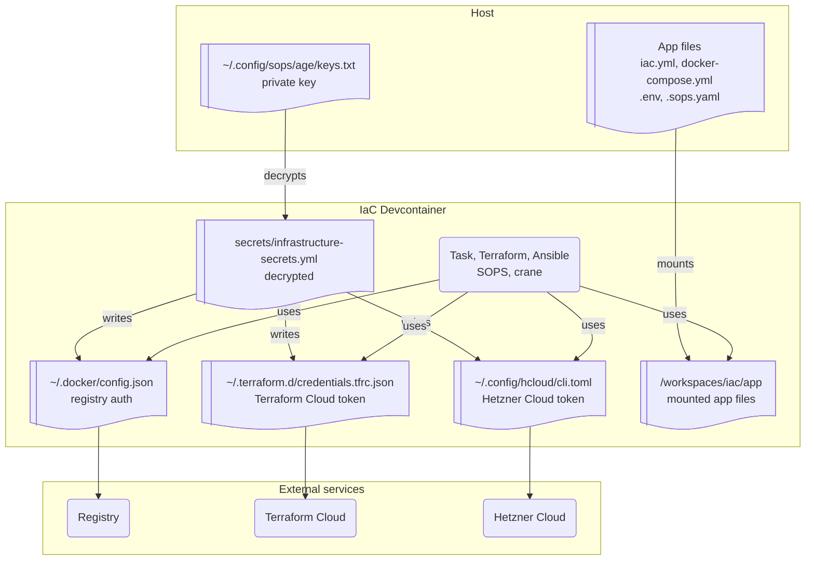

[**<---**](README.md)

# Launch the IaC devcontainer

The IaC devcontainer provides a standardized environment with all tools pre-installed (Task, Terraform, Ansible, SOPS, crane, Docker CLI, jq, and more via [mise](https://mise.jdx.dev/)). It automatically configures registry, Terraform Cloud, and hcloud from your secrets file so you don't need to log in manually.

**Before this:** You need Docker, VS Code or Cursor, and the [Dev Containers](https://marketplace.visualstudio.com/items?itemName=ms-vscode-remote.remote-containers) extension. If you're creating a new project, complete [New project](new-project.md) through creating and encrypting the secrets file first. If you're joining, complete [Joining](joining.md) through getting added to the SOPS keyring (and SSH if you need server access).

## 1. Set your app path (if you have an app to deploy)

On the **host**, run:

```bash
./scripts/setup-app-path.sh /path/to/your/app
```

Your app must have `iac.yml`, `docker-compose.yml`, `.env`, and `.sops.yaml`. If you don't have an app yet (e.g. you're only operating the platform), you can omit the path or use a placeholder; the script may prompt you.

The devcontainer mounts these four files from your app repo at `/workspaces/iac/app`, allowing you to run deployment commands without installing tools on your local machine. See [Application deployment → App mount](application-deployment.md#app-mount) for details.

## 2. Open the workspace in the devcontainer

1. **File → Open Workspace from File...** → select `iac.code-workspace` in the repo root.
2. When prompted, choose **Reopen in Container** (or **Cmd+Shift+P** → **Dev Containers: Reopen in Container**). Wait for the image to build.

## 3. What happens on startup

When the devcontainer starts, it decrypts `secrets/infrastructure-secrets.yml` using your mounted `~/.config/sops/age/keys.txt` and writes:

- **`~/.docker/config.json`** — Registry auth (for application deployment).
- **`~/.terraform.d/credentials.tfrc.json`** — Terraform Cloud token (shared state).
- **`~/.config/hcloud/cli.toml`** — Hetzner Cloud API token.

You don't need to run `task terraform:login` or `hcloud context create`; they are populated from the secrets file. You now have access to the registry, Terraform Cloud, and Hetzner from inside the devcontainer.

The devcontainer also includes VS Code extensions (SOPS, dotenv) and `files.associations` so encrypted `.env` files are edited as dotenv.

**If you don't have decrypt access yet:** The devcontainer will still start, but it won't write these credentials until you're part of the SOPS keyring and the secrets file is present. Complete [New project](new-project.md) (create and encrypt the file) or [Joining](joining.md) (get added to the keyring), then close and reopen the container.

## 4. Overview


