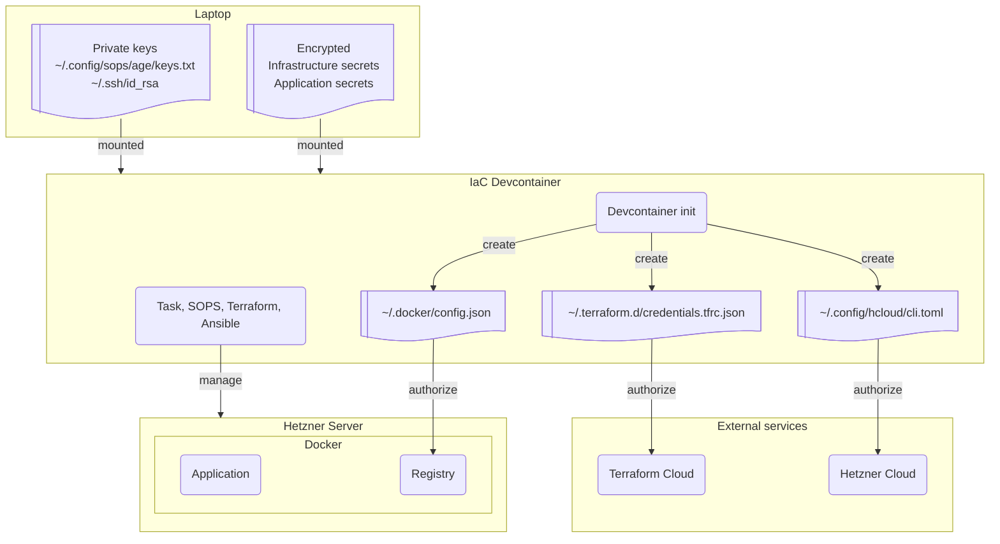

[**<---**](README.md)

# Launch the IaC devcontainer

The IaC devcontainer provides a standardized environment with all tools pre-installed (Task, Terraform, Ansible, SOPS, crane, Docker CLI, and more via [mise](https://mise.jdx.dev/)). On startup it decrypts your secrets file and configures registry, Terraform Cloud, and hcloud automatically.

**Before this:** Install Docker, VS Code or Cursor, and the required extensions — see [Onboarding: Before you start](onboarding.md#before-you-start). If you're creating a new project, complete [New project](new-project.md) through the secrets file. If you're joining, complete [Joining](joining.md) through the SOPS keyring.

---

## 1. Set your app path

On the **host** (not inside the devcontainer):

```bash
./scripts/setup-app-path.sh /path/to/your/app
```

The devcontainer bind-mounts three paths from your app repo:

| Mount | Purpose |
|-------|---------|
| `.iac/` | Platform config and secrets |
| `docker-compose.yml` | Your app stack |
| `.github/workflows/build-and-push.yml` | CI workflow |

If any of these files are missing, the container will fail to start. For a new app, create them first ([New project: step 1](new-project.md#1-prepare-your-app-repo)).

---

## 2. Open the workspace

1. Open `iac.code-workspace` in VS Code/Cursor (File → Open Workspace from File).
2. **Reopen in Container** when prompted (or Cmd+Shift+P → Dev Containers: Reopen in Container).

Your app appears at `/workspaces/iac/app` inside the container.

---

## 3. What happens on startup

The devcontainer has two modes:

**Bootstrap mode** (no `app/.iac/iac.yml`): All tools are available, but credentials are not configured. Use this mode to create the secrets file during [New project](new-project.md) setup.

**Operational mode** (`app/.iac/iac.yml` exists and is decryptable): The startup script decrypts secrets using your `~/.config/sops/age/keys.txt` and writes:

| File created | Purpose |
|-------------|---------|
| `~/.docker/config.json` | Registry auth for Docker, crane, and Trivy |
| `~/.terraform.d/credentials.tfrc.json` | Terraform Cloud token for shared state |
| `~/.config/hcloud/cli.toml` | Hetzner Cloud API token |
| Docker contexts **host**, **dev**, **prod** | So you can run `docker` against the host (default), dev server, or prod server |

No manual login needed — `terraform`, `hcloud`, and `crane` work immediately.

**If startup fails:** Check that your SOPS key is at `~/.config/sops/age/keys.txt` and that you've been added to the keyring. See [Secrets: Troubleshooting](secrets.md#troubleshooting).

---

## 4. Overview

How host files flow into the devcontainer and connect to external services:


```mermaid
flowchart TB
    subgraph HOST["Laptop"]
        SECRETS@{ shape: lin-doc, label: "Private keys<br/>~/.config/sops/age/keys.txt<br/>~/.ssh/id_rsa" }
        APP@{ shape: lin-doc, label: "Encrypted<br/>Infrastructure secrets<br/>Application secrets" }
    end

    subgraph DEVCONTAINER["IaC Devcontainer"]
        TOOLS(Task, SOPS, Terraform, Ansible)
        SETUP(Devcontainer init)
        DOCKER_CONFIG@{ shape: lin-doc, label: "~/.docker/config.json" }
        TF_CRED@{ shape: lin-doc, label: "~/.terraform.d/credentials.tfrc.json" }
        HCLOUD_CONFIG@{ shape: lin-doc, label: "~/.config/hcloud/cli.toml" }
    end

    subgraph EXTERNAL["External services"]
        TF_CLOUD(Terraform Cloud)
        HCLOUD(Hetzner Cloud)
    end

    subgraph SERVER[Hetzner Server]
      subgraph DOCKER[Docker]
        APP_SERVICE(Application)
        REGISTRY(Registry)
      end
    end


    SECRETS --->|mounted| DEVCONTAINER
    APP --->|mounted| DEVCONTAINER

    SETUP -->|create| DOCKER_CONFIG
    SETUP -->|create| TF_CRED
    SETUP -->|create| HCLOUD_CONFIG

    TOOLS -->|manage| SERVER

    DOCKER_CONFIG -->|authorize| REGISTRY
    TF_CRED -->|authorize| TF_CLOUD
    HCLOUD_CONFIG -->|authorize| HCLOUD
```
