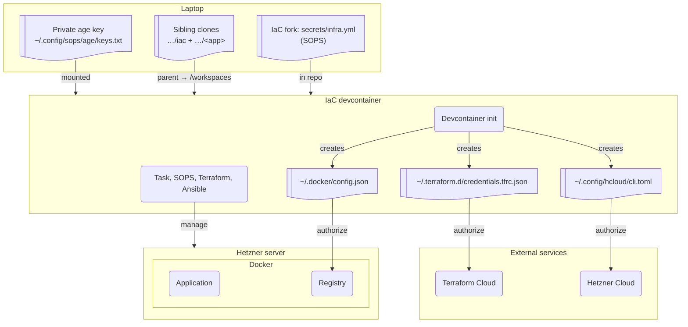

[**<---**](README.md)

# Launch the IaC devcontainer

The IaC devcontainer ships Task, Terraform, Ansible, SOPS, crane, Docker CLI, and more via [mise](https://mise.jdx.dev/). On startup it decrypts **fork-local** **`secrets/infra.yml`** and configures registry auth, Terraform Cloud, and **hcloud** when possible.

**Before this:** Docker, VS Code or Cursor, and the extensions in [Onboarding: Before you start](onboarding.md#before-you-start). New projects: [New project](new-project.md) through **`secrets/infra.yml`**. Joining: [Joining](joining.md) — add **`secrets/sops-key-*.pub`**, then teammates refresh **`secrets/.sops.yaml`** and app **`.iac/.sops.yaml`** (see [Secrets](secrets.md)).

---

## 1. Workspace layout on the host

The devcontainer mounts the **parent** of the IaC repo at **`/workspaces`** ([`.devcontainer/devcontainer.json`](../.devcontainer/devcontainer.json)). Clone **`iac`** and each app as **siblings** under the same parent.

**Convention:** Host folder basename **`<name>`** is **`<app>`** for **`task app:deploy`** / **`task app:versions`**. Inside the container that is **`/workspaces/<name>/`**.

| Host (example) | Inside container |
|----------------|------------------|
| `~/projects/iac/` | `/workspaces/iac` |
| `~/projects/tientje-ketama/` | `/workspaces/tientje-ketama/` |

---

## 2. Open the workspace

1. Clone the IaC repo and sibling app repo(s) (see [New project §1](new-project.md#1-directory-layout-on-your-machine) or [Joining §1](joining.md#1-clone-iac-and-sibling-apps)).
2. Open **`iac/iac.code-workspace`** in VS Code/Cursor (**File → Open Workspace from File**).
3. **Reopen in Container** when prompted, or Cmd+Shift+P → **Dev Containers: Reopen in Container**.

Add sibling app folders in **`iac.code-workspace`** for the sidebar — optional; tasks still resolve **`/workspaces/<app>`** by basename.

---

## 3. What happens on startup

When **`secrets/infra.yml`** is missing or your age key cannot decrypt it, tools are installed but registry / Terraform Cloud / **hcloud** are usually **not** configured yet. Create or fix infra secrets ([New project](new-project.md), [Secrets](secrets.md)).

When **`secrets/infra.yml`** decrypts successfully: [`devcontainer-setup.sh`](../.devcontainer/devcontainer-setup.sh) writes:

| File | Purpose |
|------|---------|
| `~/.docker/config.json` | Registry auth for Docker, crane, Trivy |
| `~/.terraform.d/credentials.tfrc.json` | Terraform Cloud |
| `~/.config/hcloud/cli.toml` | Hetzner Cloud API |
| Docker contexts **host**, **dev**, **prod** | `docker` against laptop vs servers |

**If startup fails:** SOPS key at **`~/.config/sops/age/keys.txt`**, and you are a recipient on **`secrets/infra.yml`**. See [Troubleshooting](troubleshooting.md).

---

## 4. Overview

```mermaid
flowchart TB
    subgraph HOST["Laptop"]
        SECRETS_KEY@{ shape: lin-doc, label: "Private age key<br/>~/.config/sops/age/keys.txt" }
        APPS@{ shape: lin-doc, label: "Sibling clones<br/>…/iac + …/&lt;app&gt;" }
        FORK_SEC@{ shape: lin-doc, label: "IaC fork: secrets/infra.yml<br/>(SOPS)" }
    end

    subgraph DEVCONTAINER["IaC devcontainer"]
        TOOLS(Task, SOPS, Terraform, Ansible)
        SETUP(Devcontainer init)
        DOCKER_CONFIG@{ shape: lin-doc, label: "~/.docker/config.json" }
        TF_CRED@{ shape: lin-doc, label: "~/.terraform.d/credentials.tfrc.json" }
        HCLOUD_CONFIG@{ shape: lin-doc, label: "~/.config/hcloud/cli.toml" }
    end

    subgraph EXTERNAL["External services"]
        TF_CLOUD(Terraform Cloud)
        HCLOUD(Hetzner Cloud)
    end

    subgraph SERVER["Hetzner server"]
      subgraph DOCKER[Docker]
        APP_SERVICE(Application)
        REGISTRY(Registry)
      end
    end

    SECRETS_KEY --->|mounted| DEVCONTAINER
    APPS --->|parent → /workspaces| DEVCONTAINER
    FORK_SEC --->|in repo| DEVCONTAINER

    SETUP -->|creates| DOCKER_CONFIG
    SETUP -->|creates| TF_CRED
    SETUP -->|creates| HCLOUD_CONFIG

    TOOLS -->|manage| SERVER

    DOCKER_CONFIG -->|authorize| REGISTRY
    TF_CRED -->|authorize| TF_CLOUD
    HCLOUD_CONFIG -->|authorize| HCLOUD
```

See [Private](private.md) for host files outside Git.
