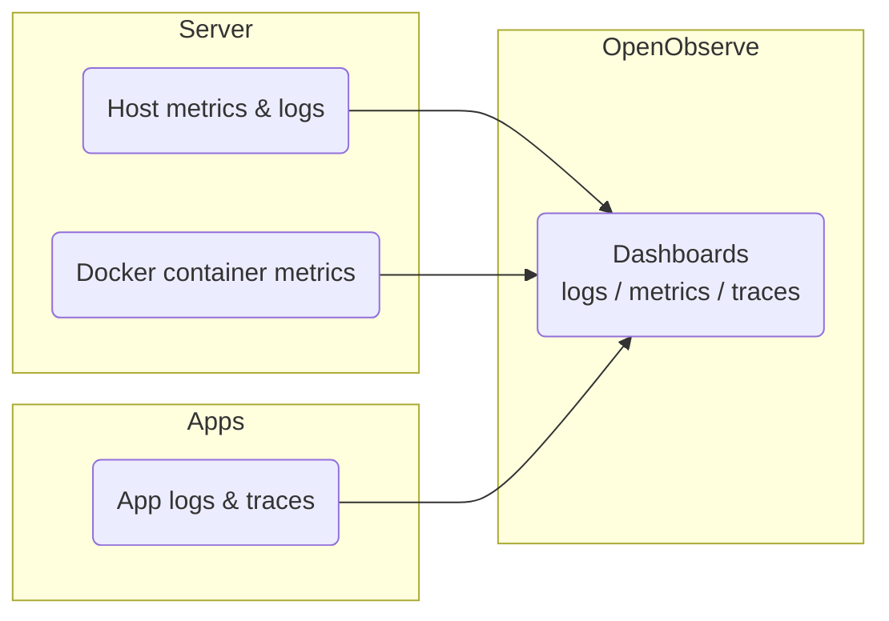

[**<---**](README.md)

# Monitoring

OpenObserve shows logs, metrics, and traces. An OpenTelemetry Collector on the server sends host and Docker container metrics automatically.

## Access

OpenObserve is not exposed publicly (no DNS). Use an SSH tunnel to the server, then open **http://localhost:5080** in your browser. See [Remote-SSH](remote-ssh.md) for setting up SSH and port forwarding. Log in with `openobserve_username@observe.local` and the password from `secrets/infrastructure-secrets.yml`.

## Dashboards

**Host Metrics**, **Docker Container Metrics**, and **Traefik Metrics** dashboards are managed by the server playbook: Ansible creates each dashboard if it does not exist and updates it in place if the JSON file has changed (`ansible/roles/server/files/openobserve-host-metrics.json`, `openobserve-docker-metrics.json`, `openobserve-traefik-metrics.json`). Add or change dashboards in the UI, or edit those files and re-run the playbook.

If panels show **No Data**, the dashboard PromQL or stream names may not match how OpenObserve stores metrics from the OTEL collector. In OpenObserve go to **Metrics** and confirm the stream/metric names (e.g. `system_cpu_load_average_5m` for host metrics); adjust the dashboard JSON or panels in the UI to use those names.
## Logs

Logs are sent from the server by the OTEL Collector into the **default** org. In OpenObserve, open **Logs** and choose a **stream**: `traefik-access`, `docker-containers`, `syslog`, `auth`, `fail2ban`. If you see no data, on the server check that the OTEL Collector is running and has read access to `/var/log` and Docker’s container log files.

## Related

For setup (secrets, deploy), see [Onboarding](onboarding.md) and [Secrets](secrets.md).
