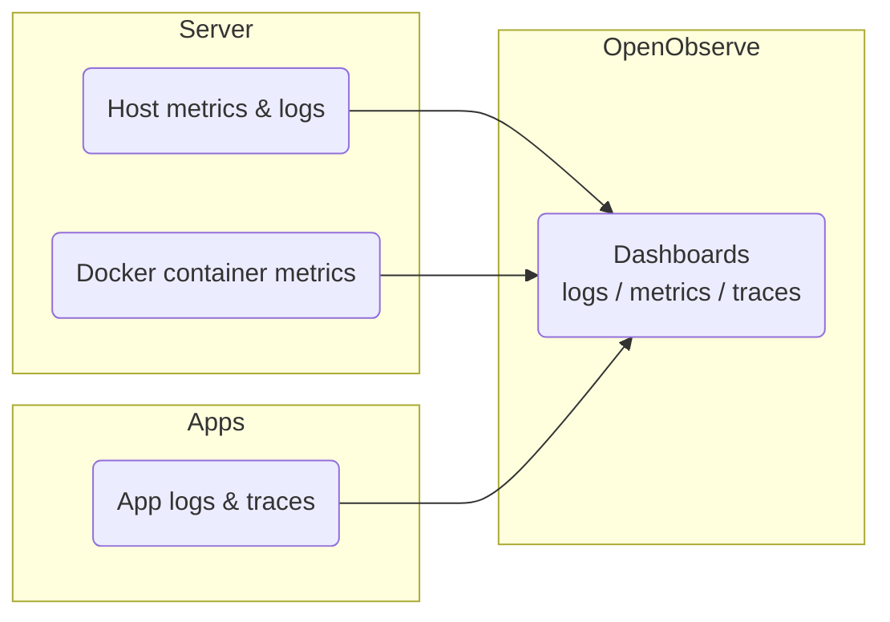

[**<---**](README.md)

# Monitoring

OpenObserve shows logs, metrics, and traces. An OpenTelemetry Collector on the server sends host and Docker container metrics automatically.

## Access

Open **https://observe.&lt;base_domain&gt;** (e.g. [https://observe.rednaw.nl](https://observe.rednaw.nl)). Log in with `openobserve_username@observe.local` and the password from `secrets/infrastructure-secrets.yml`.

## Dashboards

**Host Metrics** and **Docker Container Metrics** dashboards are imported when you run the server playbook (`ansible/roles/server/files/openobserve-host-metrics.json`, `openobserve-docker-metrics.json`). Add or change dashboards in the UI, or edit those files and re-run the playbook.

## Related

For setup (secrets, deploy), see [Onboarding](onboarding.md) and [Secrets](secrets.md).
