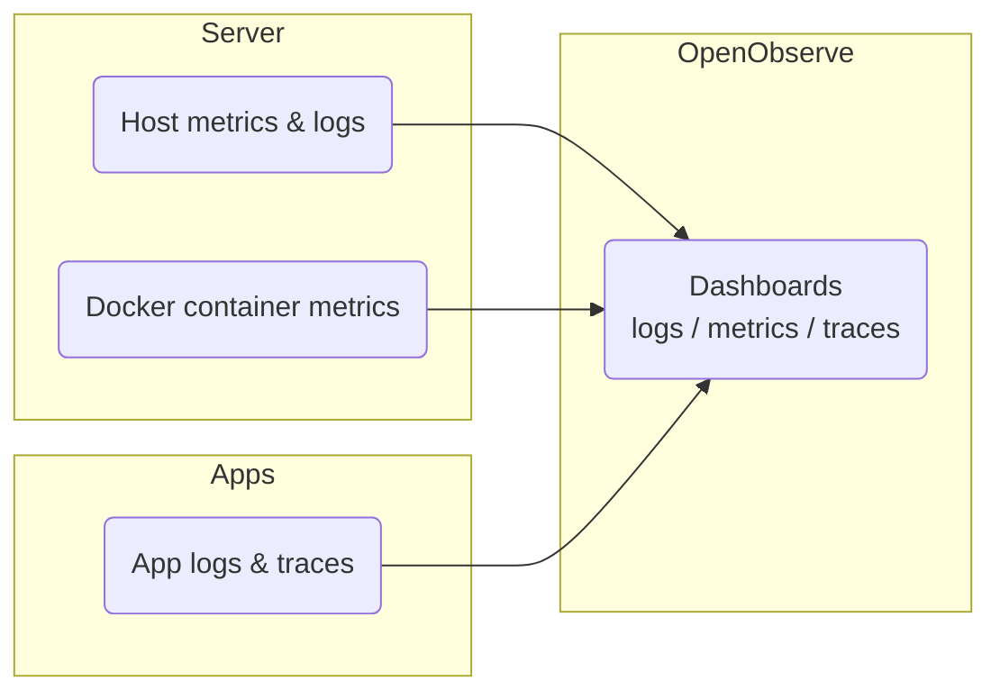

[**<---**](README.md)

# Monitoring

OpenObserve shows logs, metrics, and traces. An OpenTelemetry Collector on the server sends host and Docker container metrics automatically.

```mermaid
flowchart LR
    subgraph SERVER["Server"]
        H(Host metrics & logs)
        D(Docker container metrics)
    end

    subgraph APPS["Apps"]
        A(App logs & traces)
    end

    subgraph OPENOBSERVE["OpenObserve"]
        O(Dashboards<br/>logs / metrics / traces)
    end

    H --> O
    D --> O
    A --> O
```

## Access

OpenObserve is not exposed publicly (no DNS). Use an SSH tunnel to the server, then open **http://localhost:5081** in your browser. See [Remote-SSH](remote-ssh.md) for setting up SSH and port forwarding. Log in with `openobserve_username@observe.local` and the password from `app/.iac/iac.yml` (decrypt in VS Code).

## Dashboards

Three dashboards are pre-installed: **Host Metrics**, **Docker Container Metrics**, and **Traefik Metrics**. Ansible manages them — it creates each dashboard on first run and updates it when the source JSON changes. To add or modify a dashboard, edit the file in `ansible/roles/server/files/` and re-run the playbook, or make changes directly in the OpenObserve UI.

## Logs

Logs are sent from the server by the OTEL Collector into the **default** org. In OpenObserve, open **Logs** and choose a stream:

| Stream | Contents |
|--------|----------|
| `traefik-access` | HTTP access log from Traefik (method, path, status, duration) |
| `docker-containers` | stdout/stderr from all Docker containers on the server |
| `syslog` | System-level events from the host OS |
| `auth` | SSH authentication events (logins, failures) |
| `fail2ban` | IPs banned or unbanned by fail2ban |

## Related

For setup (secrets, deploy), see [Onboarding](onboarding.md) and [Secrets](secrets.md).
