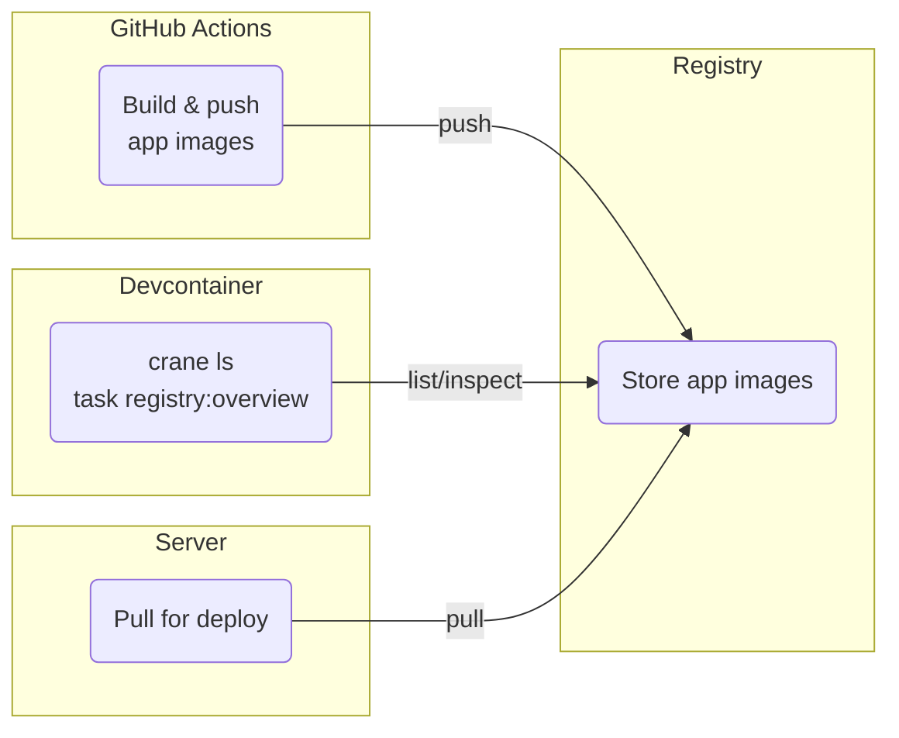

[**<---**](README.md)

# Registry

Private Docker registry for app images. Use the **devcontainer** to interact — auth and tools (crane, Docker) are configured there. Hostname: `registry.<base_domain>`. [Docker Registry](https://distribution.github.io/distribution/) (image `registry:3`), HTTPS + Basic Auth via Traefik. IaC dev image lives on ghcr.io only.



**Config:** [`ansible/roles/server/tasks/registry.yml`](../ansible/roles/server/tasks/registry.yml) · Storage: `/var/lib/docker-registry` · Config file: [`registry-config.yml.j2`](../ansible/roles/server/templates/registry-config.yml.j2). Credentials from SOPS `app/.iac/iac.yml` (`registry_username`, `registry_password`, `base_domain`, `registry_http_secret`).

## Authentication

Same credentials everywhere: SOPS-decrypted `app/.iac/iac.yml`. No manual `docker login`.

| Where | How |
|-------|-----|
| Devcontainer | [`devcontainer-setup.sh`](../.devcontainer/devcontainer-setup.sh) writes `~/.docker/config.json` on create. Crane, Docker, trivy work out of the box. |
| GitHub Actions | In app repo: Secrets `REGISTRY_USERNAME`, `REGISTRY_PASSWORD` (copy from decrypted iac.yml). Workflow uses `docker/login-action@v3`. |
| Server (ubuntu) | Ansible writes `~/.docker/config.json` in [`registry.yml`](../ansible/roles/server/tasks/registry.yml). |
| Server (iac + Prefect) | Ansible writes Docker config in [`iac-user.yml`](../ansible/roles/server/tasks/iac-user.yml). Used for deploys and Prefect flows. |

## Commands

```bash
task registry:overview   # list repos and tags
```

"No repositories found (or access denied)" → use the devcontainer. See [Troubleshooting](#troubleshooting).

## Reference

**Crane** (from devcontainer):

| Task | Command |
|------|--------|
| List repos | `crane catalog registry.<base_domain>` |
| List tags | `crane ls registry.<base_domain>/<image>` |
| Digest of tag | `crane digest registry.<base_domain>/<image>:<tag>` |
| Delete tag | `crane delete registry.<base_domain>/<image>:<tag>` |

SHA-only tags: `crane ls registry.<base_domain>/<image> | grep -E '^[0-9a-f]{7}$'`

**On server** (via Docker context from devcontainer): `docker exec registry registry garbage-collect`. Data size: `du -sh /var/lib/docker-registry`.

## Troubleshooting

| Problem | What to do |
|--------|------------|
| "No repositories found (or access denied)" | Use the devcontainer. |
| "Could not resolve digest" / image not found | `crane ls registry.<base_domain>/<repo>`. Check tag and auth. |
| Deploy fails to pull | Server auth in `/opt/iac/.docker/config.json`. Ensure Ansible ran and secrets have `base_domain`, `registry_username`, `registry_password`. |
| Registry unreachable | Check DNS/HTTPS for `registry.<base_domain>`; Traefik and registry container running. |

See [Application deployment](application-deployment.md), [Secrets](secrets.md), [Private](private.md).
