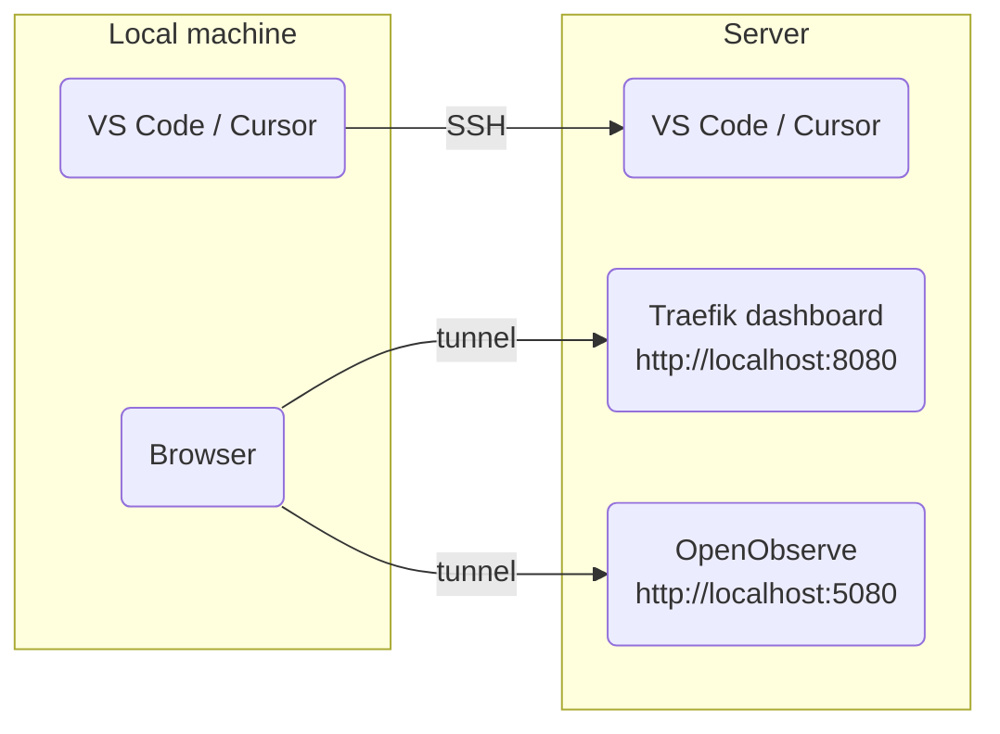

[**<---**](README.md)

# Remote-SSH

Connect to the server for troubleshooting (logs, files) and reach **internal** admin UIs (Traefik dashboard, OpenObserve) via SSH port forwarding. Those two are not exposed publicly. The **Registry** is internet-facing at `https://registry.<your-domain>` and does not need a tunnel.



---

## Option 1: Devcontainer tunnel (default)

Open this repo in the devcontainer. A tunnel to the server starts automatically (with retries).

| What | URL |
|------|-----|
| Traefik dashboard (internal) | http://localhost:8080/dashboard/ |
| OpenObserve (internal) | http://localhost:5080/ |

- **Server down?** The devcontainer still opens. Start the tunnel later: `task server:tunnel-start -- dev` (or `prod`).
- **Tunnel to prod by default?** Set `AUTO_START_TUNNEL=prod` in your environment.

---

## Option 2: Work on the server (Remote-SSH)

Use this when you need to work directly on the server (e.g. view `/var/log`, inspect files). Your editor runs on the server; port forwarding still gives you the dashboards in your local browser.

**Extension:** Install [Remote - SSH](https://marketplace.visualstudio.com/items?itemName=ms-vscode-remote.remote-ssh) (VS Code or Cursor).

### Setup

1. **One-time:** Open this repo in the devcontainer at least once. Setup writes **`~/.ssh/config.d/iac-admin`** on your host with `dev` and `prod` hosts and port forwarding.
2. On your host, ensure **`~/.ssh/config`** contains:
   ```
   Include config.d/iac-admin
   ```
3. In VS Code or Cursor: **Cmd+Shift+P** → **Remote-SSH: Connect to Host...** → choose `dev` or `prod`.
4. Open a folder (e.g. `/home/ubuntu`, `/var/log`). Port forwarding is active; use the dashboard URLs above in your local browser.

**Note:** Do not make manual changes on the server!, all configuration should be done via Ansible. Use Remote-SSH only for troubleshooting and inspection, treat it as read-only access. 

---

## Internal dashboards and credentials

Traefik and OpenObserve are internal only (no public DNS); use the tunnel URLs. The Registry is internet-facing at `https://registry.<your-domain>` and is not forwarded through the tunnel.

| Service | Via tunnel | Login |
|---------|------------|--------|
| Traefik dashboard | http://localhost:8080/dashboard/ | Basic auth (see `/etc/traefik/auth/htpasswd` on server) |
| OpenObserve | http://localhost:5080/ | `openobserve_username@observe.local`, password from `secrets/infrastructure-secrets.yml` |

**Traefik or OpenObserve not loading?** The tunnel may have dropped (e.g. after a reboot). Run `task server:tunnel-start -- dev` (or `prod`) again.

---
