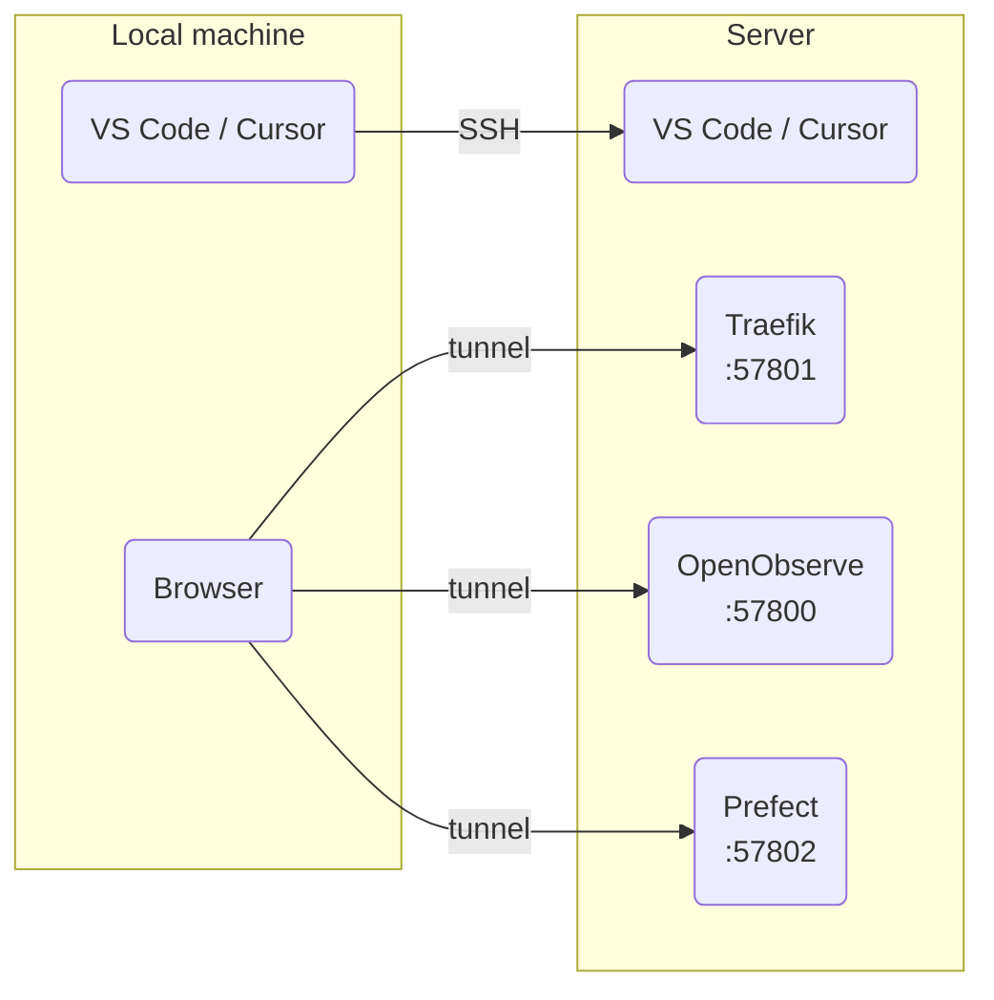

[**<---**](README.md)

# Remote-SSH

Connect to the server for troubleshooting (logs, files) and reach **internal** admin UIs (Traefik, OpenObserve, Prefect) via SSH port forwarding. Those services are not exposed publicly. The **Registry** is internet-facing at `https://registry.<your-domain>` and does not need a tunnel.


```mermaid
flowchart LR
    subgraph LOCAL["Local machine"]
        EDITOR(VS Code / Cursor)
        BROWSER(Browser)
    end

    subgraph SERVER["Server"]
        VSCODE(VS Code / Cursor)
        TRAEFIK(Traefik<br/>:57801)
        OBSERVE(OpenObserve<br/>:57800)
        PREFECT(Prefect<br/>:57802)
    end

    EDITOR -->|SSH| VSCODE
    BROWSER -->|tunnel| TRAEFIK
    BROWSER -->|tunnel| OBSERVE
    BROWSER -->|tunnel| PREFECT
```

---

## Option 1: SSH tunnel

Open this repo in the devcontainer. When you need the admin UIs, start the tunnel: `task tunnel:start -- dev` (or `prod`).

**Landing page:** When you run `task tunnel:start -- dev`, the output includes **`tools/internal-landing.html`**. That file lists all three UIs with one-click links. To open it in your host browser:


| What | URL |
|------|-----|
| Traefik dashboard | http://localhost:57801/dashboard/ |
| OpenObserve | http://localhost:57800/ |
| Prefect | http://localhost:57802/ |

Ports **57800–57802** are the **IaC system range**: used for the tunnel and for these admin services on the server, so common app ports stay free for deployed applications.

Stop the tunnel: `task tunnel:stop -- dev` (or `prod`).

---

## Option 2: Work on the server (Remote-SSH)

Use this when you need to work directly on the server (e.g. view `/var/log`, inspect files). Your editor runs on the server; port forwarding still gives you the dashboards in your local browser.

**Extension:** Install [Remote - SSH](https://marketplace.visualstudio.com/items?itemName=ms-vscode-remote.remote-ssh) (VS Code or Cursor).

### Setup

1. **One-time:** Open this repo in the devcontainer at least once. Setup writes **`~/.ssh/config.d/iac-admin`** on your host with `dev` and `prod` hosts and port forwarding.
2. On your host, ensure **`~/.ssh/config`** contains:
   ```
   Include config.d/iac-admin
   ```
3. In VS Code or Cursor: **Cmd+Shift+P** → **Remote-SSH: Connect to Host...** → choose `dev` or `prod`.
4. Open a folder (e.g. `/home/ubuntu`, `/var/log`). Port forwarding is active; use the dashboard URLs above in your local browser.

> [!WARNING]
> Do not make manual changes on the server. All configuration goes through Ansible. Use Remote-SSH for troubleshooting and inspection only — treat it as read-only.

---

## Internal dashboards and credentials

Traefik and OpenObserve are internal only (no public DNS); reach them via the tunnel URLs below.

| Service | Via tunnel | Login |
|---------|------------|--------|
| Traefik dashboard | http://localhost:57801/dashboard/ | Basic auth (see `/etc/traefik/auth/htpasswd` on server) |
| OpenObserve | http://localhost:57800/ | `openobserve_username@observe.local`, password from `app/.iac/iac.yml` |
| Prefect | http://localhost:57802/ | No auth (tunnel only) |

**UI not loading?** The tunnel may have dropped (e.g. after a reboot). Run `task tunnel:start -- dev` (or `prod`) again.

---
