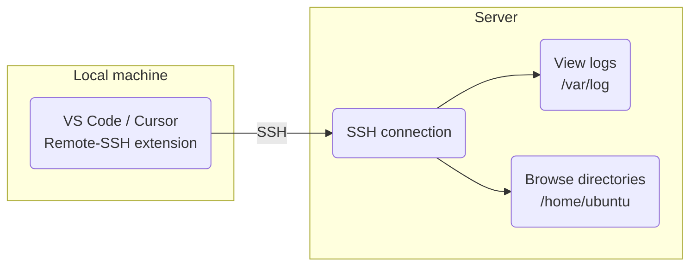

[**<---**](README.md)

# Remote VS Code / Cursor

Run VS Code or Cursor on the server via SSH for troubleshooting and inspection.



Run:

```bash
task server:setup-remote-cursor
```

Then in VS Code or Cursor:

1. Install "Remote - SSH" extension
2. Cmd+Shift+P → "Remote-SSH: Connect to Host..."
3. Select server name (from Terraform `server_name` variable, default = "platform-{environment}")
4. A new window will open on the server, open a directory, eg. `/home/ubuntu` or `/var/log`

**Note:** Only use this for troubleshooting, do not make actual changes on the server, these need to be made using ansible.
