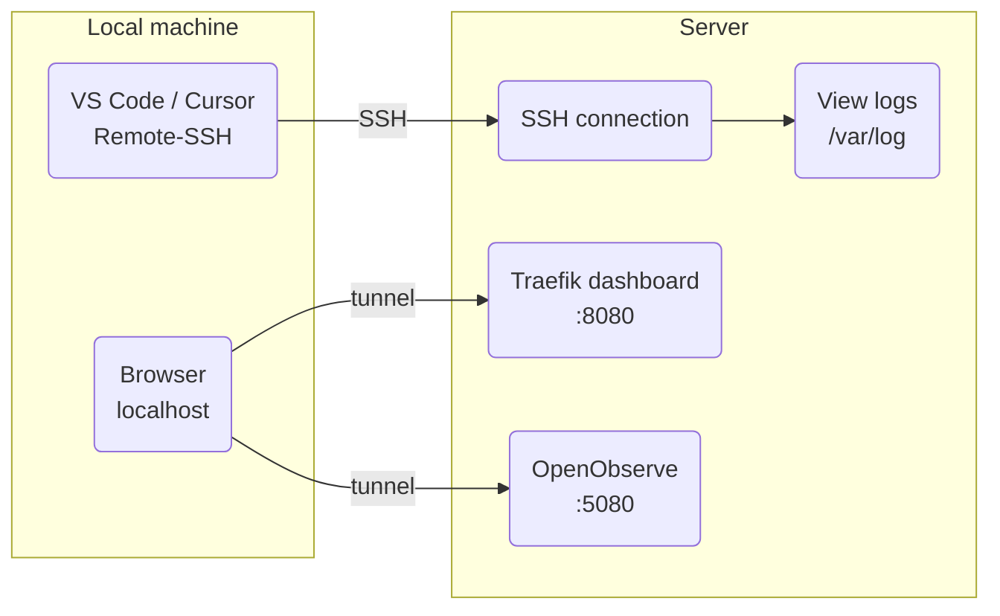

[**<---**](README.md)

# Remote VS Code / Cursor

Admin access to the server: run VS Code or Cursor on the server via SSH (troubleshooting, logs, files) and use SSH port forwarding to reach internal UIs (Traefik dashboard, OpenObserve). These are not exposed publicly.



## Setup

Run once:

```bash
task server:setup-remote-cursor
```

This writes **`~/.ssh/config.d/iac-admin`** (fully managed, overwritten each run) with `dev` and `prod` hosts and **port forwarding** (5080, 5000, 8080). Add this line to your **`~/.ssh/config`** if you don't have it:

```
Include config.d/iac-admin
```

Then when you SSH to `dev` or `prod`, those ports are forwarded automatically.

**Remote-SSH in VS Code/Cursor:**

1. Install "Remote - SSH" extension
2. Cmd+Shift+P → "Remote-SSH: Connect to Host..."
3. Select host (`dev` or `prod`)
4. A new window opens on the server; open a directory, e.g. `/home/ubuntu` or `/var/log`

**Port forwarding (Traefik dashboard, OpenObserve, Registry):**

- If you use **Remote-SSH** and connect to `dev` or `prod`, forwarding is already in your SSH config: open **http://localhost:5080** (OpenObserve), **http://localhost:5000** (Registry), **http://localhost:8080** (Traefik) in your local browser.
- If you are **not** in a Remote-SSH session, start a background tunnel:
  ```bash
  task server:tunnel-start -- dev
  ```
  Then open the same localhost URLs. Stop with:
  ```bash
  task server:tunnel-stop -- dev
  ```

Credentials: OpenObserve uses `openobserve_username@observe.local` and password from `secrets/infrastructure-secrets.yml`. Traefik dashboard uses basic auth (see `/etc/traefik/auth/htpasswd` on the server).

**Note:** Only use this for troubleshooting and inspection; do not make changes on the server that should be made via Ansible.
