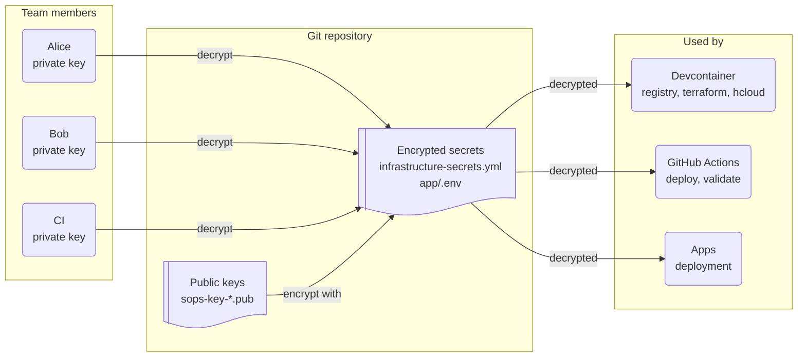

[**<---**](README.md)

# Secrets

Secrets are encrypted with [SOPS](https://github.com/getsops/sops) + [age](https://github.com/FiloSottile/age) and stored in Git. This doc covers file locations, editing, and setup for both infrastructure and app secrets.



## VS Code Integration

Install the **SOPS** extension (`signageos.signageos-vscode-sops`):

1. Open VS Code Extensions (Cmd+Shift+X)
2. Search for "SOPS" by SignageOS
3. Install

With the extension installed, encrypted files open decrypted — edit and save as normal.

---

## File Locations

| Type | File | Format |
|------|------|--------|
| Infrastructure | `iac/secrets/infrastructure-secrets.yml` | YAML |
| Application | `<app>/.env` | dotenv |

Both are encrypted and committed to Git.

---

## Adding a new person

When someone joins, they generate a key and get added to the keyring:

1. **Generate your key pair:**
   ```bash
   cd iac
   task secrets:keygen
   ```
   Creates `~/.config/sops/age/keys.txt` (private key, never share) and `iac/secrets/sops-key-<username>.pub` (public key, commit this).

2. **Commit your public key:**
   ```bash
   git add secrets/sops-key-*.pub
   git commit -m "Add SOPS public key for <username>"
   git push
   ```

3. **Ask a teammate to add you:**
   ```bash
   # Teammate runs:
   git pull
   task secrets:generate-sops-config    # Updates .sops.yaml with your key
   # Open secrets/infrastructure-secrets.yml in VS Code, save it
   git add -A && git commit -m "Add <username> to secrets" && git push
   ```

4. **Pull and verify:**
   ```bash
   git pull
   ```
   Open `secrets/infrastructure-secrets.yml` in VS Code — if it decrypts, you're set.

---

## Editing Secrets

### In VS Code (recommended)

Just open the file. The SOPS extension decrypts it automatically. Save to re-encrypt.

- `iac/secrets/infrastructure-secrets.yml` — Infrastructure secrets
- `tientje-ketama/.env` — Application secrets (dotenv; use SOPS + dotenv extension)

### From command line

```bash
# Uses $EDITOR (vim, nano, etc.)
SOPS_AGE_KEY_FILE=~/.config/sops/age/keys.txt sops <file>
```

---

## Creating app secrets

1. Create `.env` in your app directory (VS Code).
2. Add your variables in dotenv format:
   ```
   DATABASE_URL=postgres://...
   API_KEY=sk-...
   ```
3. Save — the SOPS extension encrypts automatically.
4. Commit.

The IAC devcontainer includes the **dotenv** extension (`mikestead.dotenv`) and `files.associations` so you edit `.env` as dotenv. Ensure the app's `.sops.yaml` has a `path_regex` that matches `.env` (e.g. `\.env$`). The deploy process uses the decrypted dotenv directly for docker-compose.

---

## How it works

**Multi-key encryption:** Each team member has their own key pair. Secrets are encrypted with all public keys, so anyone can decrypt with their private key.

**File structure:**
```
iac/
├── secrets/
│   ├── infrastructure-secrets.yml     # Encrypted YAML (committed)
│   ├── sops-key-alice.pub              # Alice's public key
│   ├── sops-key-bob.pub                # Bob's public key
│   └── sops-key-github-ci.pub          # CI public key
├── .sops.yaml                          # Encryption rules (committed)
└── ...

tientje-ketama/
└── .env                                # Encrypted dotenv (committed)
```

**Private keys** are stored outside the repo:
```
~/.config/sops/age/keys.txt
```

---

## Troubleshooting

### "Cannot decrypt: no matching keys"

Your public key isn't in the encrypted file. Ask a teammate to re-encrypt:
1. They open the file in VS Code
2. Make any change and save
3. Commit and push

### "SOPS key not found"

Generate your key pair:
```bash
cd iac && task secrets:keygen
```

### VS Code doesn't decrypt the file

1. Check the SOPS extension is installed
2. Check the extension is configured with your key path (see VS Code Integration above)
3. Ensure `.sops.yaml` exists: `task secrets:generate-sops-config`
4. Check your private key exists: `ls ~/.config/sops/age/keys.txt`

### File shows as binary/garbled

The file is encrypted. Install the VS Code SOPS extension to view it.

---

## CI/CD

GitHub Actions uses:
- **SOPS:** Public key `iac/secrets/sops-key-github-ci.pub` (committed); private key in secret `SOPS_AGE_KEY` (used for Terraform validation, deployment, and registry authentication)
- **Private registry:** Credentials come from SOPS-decrypted `infrastructure-secrets.yml`; see [Registry](registry.md)
- **OpenObserve:** `openobserve_username` and `openobserve_password` in `infrastructure-secrets.yml` (root login; the OTEL Collector auto-generates the ingest auth key from these); see [Monitoring](monitoring.md)

---

## Security

- **Never share your private key** (`~/.config/sops/age/keys.txt`)
- **Back up your private key** in a password manager (ProtonPass, 1Password, etc.)
- **Rotate secrets if compromised** — edit and save to re-encrypt
- **Review before committing** — encrypted files show as changed even for whitespace
