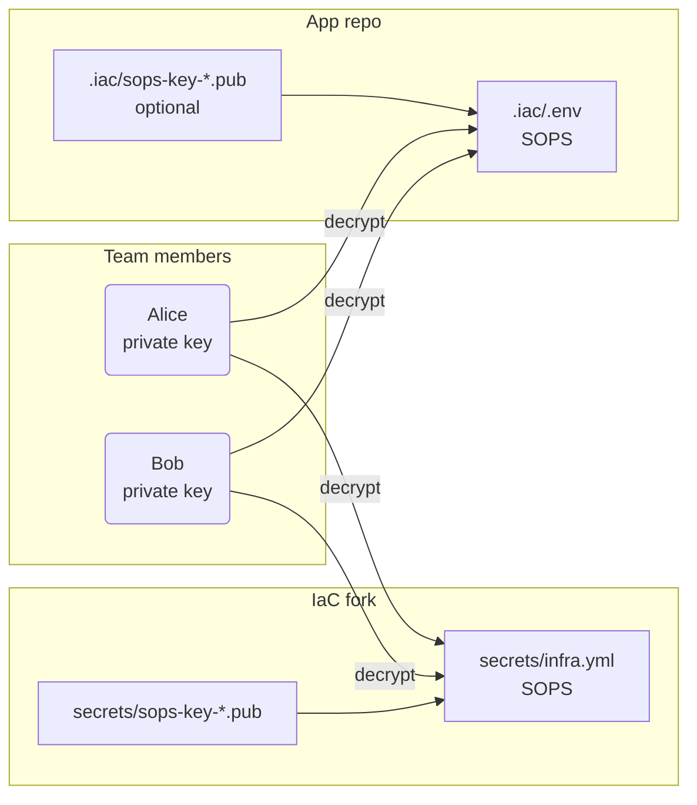

[**<---**](README.md)

# Secrets

Secrets use [SOPS](https://github.com/getsops/sops) + [age](https://github.com/FiloSottile/age). There are **two layers**:

1. **Infrastructure** — **`secrets/infra.yml`** in the **IaC fork** (org-wide: cloud API, Terraform Cloud, registry, platform observability, SSH allowlists, DNS credentials, …).
2. **Application runtime** — **`apps/<app>/.iac/.env`** in each **app repo** (database URLs, app tokens, …).

Per-app **`.iac/iac.yml`** is **plain YAML** (`image_name`, `app_domains`); it is **not** encrypted.

```mermaid
flowchart LR
    subgraph TEAM["Team members"]
        T1(Alice<br/>private key)
        T2(Bob<br/>private key)
    end
    subgraph FORK["IaC fork"]
        INFRA["secrets/infra.yml<br/>SOPS"]
        SPUB["secrets/sops-key-*.pub"]
    end
    subgraph APP["App repo"]
        ENV[".iac/.env<br/>SOPS"]
        APUB[".iac/sops-key-*.pub<br/>optional"]
    end
    T1 -->|decrypt| INFRA
    T2 -->|decrypt| INFRA
    T1 -->|decrypt| ENV
    T2 -->|decrypt| ENV
    SPUB --> INFRA
    APUB --> ENV
```

**VS Code:** Install the SOPS extension (`signageos.signageos-vscode-sops`). Encrypted files open decrypted; save to re-encrypt.

---

## File locations

| Layer | File | Format |
|-------|------|--------|
| Infrastructure | **`secrets/infra.yml`** (IaC repo) | YAML, SOPS |
| Infra keyring | **`secrets/sops-key-*.pub`**, **`secrets/.sops.yaml`** | age pubs / SOPS config |
| App config | **`apps/<app>/.iac/iac.yml`** | Plain YAML |
| App runtime | **`apps/<app>/.iac/.env`** | dotenv, SOPS |
| App SOPS rules | **`apps/<app>/.iac/.sops.yaml`** | Encrypt **`.env`** only |

**Infra:** `task secrets:keygen` and `task secrets:generate-sops-config` operate on **`secrets/`** in the IaC repo. Commit with **`git add -f secrets/`** when **`secrets/`** is gitignored upstream.

**App `.env`:** Maintain **`.iac/.sops.yaml`** in the app repo (recipients for `.env`). There is no shared Taskfile target in the app repo — copy the pattern from [tientje-ketama](https://github.com/rednaw/tientje-ketama/tree/main/.iac).

Registry hostnames and **`base_domain`** come from **`secrets/infra.yml`**.

---

## Adding a new person

### Infrastructure (`secrets/infra.yml`)

1. **New teammate** opens the IaC devcontainer and runs **`task secrets:keygen`** → private key in **`~/.config/sops/age/keys.txt`**, public key **`secrets/sops-key-<username>.pub`** in the IaC repo. They commit **`secrets/sops-key-*.pub`** (`git add -f secrets/`).
2. **Existing key-holder:** `git pull`, **`task secrets:generate-sops-config`**, open **`secrets/infra.yml`** in VS Code and **save** (re-encrypts with all recipients), commit and push.
3. **Verify:** New teammate pulls, opens **`secrets/infra.yml`** — it should decrypt.

### Application (`.iac/.env`)

Separately, add their age public key to the app repo’s **`.iac/.sops.yaml`** (or add a **`sops-key-*.pub`** file and document recipients). Open **`.iac/.env`** in VS Code and **save** so they can decrypt.

---

## Editing secrets

**VS Code:** Open the file; save to re-encrypt.

**CLI:** `SOPS_AGE_KEY_FILE=~/.config/sops/age/keys.txt sops <file>`

---

## Creating app secrets (`.env`)

Under **`apps/<app>/.iac/`**, create **`.env`**, encrypt with SOPS, commit. Deploy decrypts it on the server for Compose.

See [Troubleshooting](troubleshooting.md) for decrypt issues.

---

## CI/CD (app repo)

GitHub Actions: **Variables** `REGISTRY_URL`, `IMAGE_NAME`; **Secrets** `REGISTRY_USERNAME`, `REGISTRY_PASSWORD` — values match **`secrets/infra.yml`**. No SOPS in CI.

See [Registry](registry.md).

---

## Security

Never share your **private** age key. Back it up (password manager). Review diffs before committing encrypted files.

See [Application deployment](application-deployment.md), [Registry](registry.md), [New project](new-project.md).
