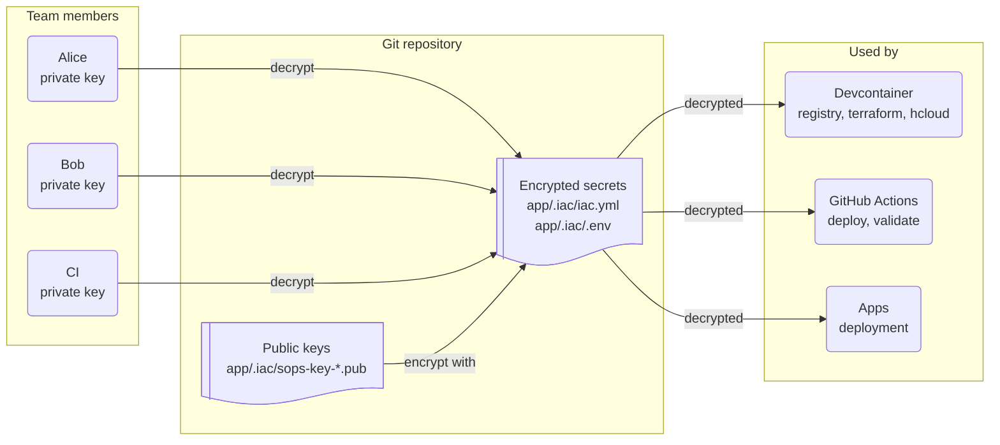

[**<---**](README.md)

# Secrets

Secrets are encrypted with [SOPS](https://github.com/getsops/sops) + [age](https://github.com/FiloSottile/age) and stored in Git. This doc covers file locations, editing, and setup for both infrastructure and app secrets.


```mermaid
flowchart LR
    subgraph TEAM["Team members"]
        direction LR
        T1(Alice<br/>private key)
        T2(Bob<br/>private key)
        T3(CI<br/>private key)
    end

    subgraph GIT["Git repository"]
        S@{ shape: lin-doc, label: "Encrypted secrets<br/>app/.iac/iac.yml<br/>app/.iac/.env" }
        P@{ shape: lin-doc, label: "Public keys<br/>app/.iac/sops-key-*.pub" }
    end

    subgraph USE["Used by"]
        D(Devcontainer<br/>registry, terraform, hcloud)
        G(GitHub Actions<br/>deploy, validate)
        A(Apps<br/>deployment)
    end

    T1 --->|decrypt| S
    T2 -->|decrypt| S
    T3 -->|decrypt| S
    S -->|decrypted| D
    S -->|decrypted| G
    S -->|decrypted| A
    P -->|encrypt with| S
```

## VS Code Integration

Install the **SOPS** extension (`signageos.signageos-vscode-sops`):

1. Open VS Code Extensions (Cmd+Shift+X)
2. Search for "SOPS" by SignageOS
3. Install

With the extension installed, encrypted files open decrypted — edit and save as normal.

---

## File Locations

| Type | File | Format |
|------|------|--------|
| Infrastructure (platform) | `app/.iac/iac.yml` | YAML |
| Application runtime | `app/.iac/.env` | dotenv |

Both live in the app repo under `.iac/` and are encrypted with SOPS. Public keys are in `app/.iac/sops-key-*.pub`; SOPS config is `app/.iac/.sops.yaml`.

---

## Platform parameterization (base_domain)

The file `app/.iac/iac.yml` must include `base_domain` (e.g. `example.com`) as an unencrypted key. Registry and hostnames are derived from it: `registry.<base_domain>`, `dev.<base_domain>`, `prod.<base_domain>`. The devcontainer and Ansible will fail with a clear error if this key is missing. The same file also has unencrypted `image_name` and `app_domains`; all credentials are encrypted.

---

## Adding a new person

When someone joins, they generate a key and get added to the keyring:

1. **Generate your key pair** (from the IaC repo with the app mounted):
   ```bash
   task secrets:keygen
   ```
   Creates `~/.config/sops/age/keys.txt` (private key, never share) and **`app/.iac/sops-key-<username>.pub`** (public key; commit this in the **app** repo).

2. **Commit your public key** (in the app repo):
   ```bash
   cd /path/to/app && git add .iac/sops-key-*.pub && git commit -m "Add SOPS public key for <username>" && git push
   ```

3. **Ask a teammate to add you:**
   ```bash
   # Teammate runs (with app mounted):
   git pull   # in the app repo
   task secrets:generate-sops-config    # Updates app/.iac/.sops.yaml with your key
   # Open app/.iac/iac.yml in VS Code, save (re-encrypt)
   git add .iac/ && git commit -m "Add <username> to secrets" && git push
   ```

4. **Pull and verify** (in the app repo):
   ```bash
   git pull
   ```
   Open `app/.iac/iac.yml` in VS Code — if it decrypts, you're set.

---

## Editing Secrets

### In VS Code (recommended)

Just open the file. The SOPS extension decrypts it automatically. Save to re-encrypt.

- `app/.iac/iac.yml` — Platform/infrastructure secrets (in the app repo)
- `app/.iac/.env` — Application runtime secrets (dotenv; use SOPS + dotenv extension)

### From command line

```bash
# Uses $EDITOR (vim, nano, etc.)
SOPS_AGE_KEY_FILE=~/.config/sops/age/keys.txt sops <file>
```

---

## Creating app secrets

1. Create `.env` in your app directory (VS Code).
2. Add your variables in dotenv format:
   ```
   DATABASE_URL=postgres://...
   API_KEY=sk-...
   ```
3. Save — the SOPS extension encrypts automatically.
4. Commit.

The IAC devcontainer includes the **dotenv** extension (`mikestead.dotenv`) and `files.associations` so you edit `.env` as dotenv. Ensure `app/.iac/.sops.yaml` exists (`task secrets:generate-sops-config`) and has a `path_regex` that matches `.env` (e.g. `\.env$`). The deploy process uses the decrypted dotenv directly for docker-compose.

---

## How it works

**Multi-key encryption:** Each team member has their own key pair. Secrets are encrypted with all public keys, so anyone can decrypt with their private key.

**File structure** (in the **app** repo):

```
<app-repo>/
├── .iac/
│   ├── iac.yml              # Encrypted platform secrets (base_domain, image_name, app_domains unencrypted)
│   ├── .env                 # Encrypted app runtime secrets (dotenv)
│   ├── .sops.yaml           # SOPS rules for iac.yml and .env (committed)
│   ├── docker-compose.override.yml   # Traefik labels, networks, restart (committed)
│   ├── sops-key-alice.pub   # Alice's public key
│   └── sops-key-bob.pub     # Bob's public key
└── docker-compose.yml       # Generic stack (committed)
```

**Private keys** are stored outside the repo:
```
~/.config/sops/age/keys.txt
```

---

## Troubleshooting

### "Cannot decrypt: no matching keys"

Your public key isn't in the encrypted file. Ask a teammate to re-encrypt:
1. They open the file in VS Code
2. Make any change and save
3. Commit and push

### "SOPS key not found"

Generate your key pair:
```bash
cd iac && task secrets:keygen
```

### VS Code doesn't decrypt the file

1. Check the SOPS extension is installed
2. Check the extension is configured with your key path (see VS Code Integration above)
3. Ensure `.sops.yaml` exists: `task secrets:generate-sops-config`
4. Check your private key exists: `ls ~/.config/sops/age/keys.txt`

### File shows as binary/garbled

The file is encrypted. Install the VS Code SOPS extension to view it.

---

## CI/CD (app repo)

For **build-and-push** in the app repo, set in GitHub Settings → Secrets and variables → Actions:

- **Variables:** `REGISTRY_URL` = `registry.<base_domain>`, `IMAGE_NAME` = value of `image_name` from `app/.iac/iac.yml`
- **Secrets:** `REGISTRY_USERNAME`, `REGISTRY_PASSWORD` (from `iac.yml`; decrypt in VS Code to copy)

The IaC reusable workflow `_build-and-push.yml` does not need SOPS; the app repo passes registry credentials as secrets. OpenObserve and other platform credentials stay in `app/.iac/iac.yml`; see [Registry](registry.md) and [Monitoring](monitoring.md).

---

## Security

- **Never share your private key** (`~/.config/sops/age/keys.txt`)
- **Back up your private key** in a password manager (ProtonPass, 1Password, etc.)
- **Rotate secrets if compromised** — edit and save to re-encrypt
- **Review before committing** — encrypted files show as changed even for whitespace
