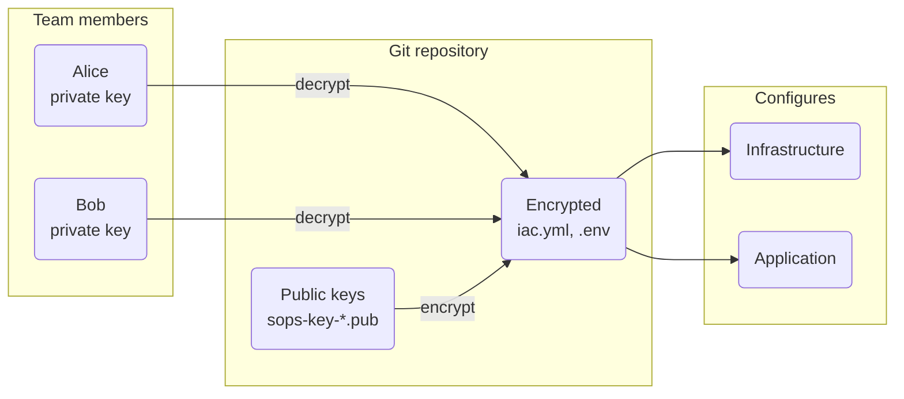

[**<---**](README.md)

# Secrets

Secrets are encrypted with [SOPS](https://github.com/getsops/sops) + [age](https://github.com/FiloSottile/age) and stored in Git. All in the **app repo** under `.iac/`.

```mermaid
flowchart LR
    subgraph TEAM["Team members"]
        T1(Alice<br/>private key)
        T2(Bob<br/>private key)
    end
    subgraph GIT["Git repository"]
        S(Encrypted<br/>iac.yml, .env)
        P(Public keys<br/>sops-key-*.pub)
    end
    subgraph USE["Configures"]
        D(Infrastructure)
        A(Application)
    end
    T1 --->|decrypt| S
    T2 -->|decrypt| S
    S --> D
    S --> A
    P -->|encrypt| S
```

**VS Code:** Install the SOPS extension (`signageos.signageos-vscode-sops`). Encrypted files open decrypted; save to re-encrypt.

## File locations

| Type | File | Format |
|------|------|--------|
| Infrastructure | `app/.iac/iac.yml` | YAML |
| Application runtime | `app/.iac/.env` | dotenv |

Public keys: `app/.iac/sops-key-*.pub`. SOPS config: `app/.iac/.sops.yaml` (run `task secrets:generate-sops-config` to create/update).

**Unencrypted in iac.yml:** `base_domain`, `image_name`, `app_domains`. Everything else encrypted. Registry and hostnames come from `base_domain` (`registry.<base_domain>`, `dev.<base_domain>`, etc.). Devcontainer and Ansible error clearly if it's missing.

## Adding a new person

1. **Generate key** (IaC repo, app mounted): `task secrets:keygen` → private key in `~/.config/sops/age/keys.txt`, public key in `app/.iac/sops-key-<username>.pub`. Commit the `.pub` in the **app** repo.
2. **Teammate adds you:** In app repo: `git pull`, `task secrets:generate-sops-config`, open `app/.iac/iac.yml` in VS Code and save (re-encrypt), commit and push.
3. **Verify:** `git pull` in app repo, open `iac.yml` in VS Code — if it decrypts, you're in.

## Editing secrets

**VS Code:** Open the file (SOPS decrypts). Save to re-encrypt. Use the dotenv extension for `.env` (`mikestead.dotenv`).

**CLI:** `SOPS_AGE_KEY_FILE=~/.config/sops/age/keys.txt sops <file>`

## Creating app secrets (.env)

Create `app/.iac/.env` in VS Code, add variables (dotenv), save (SOPS encrypts), commit. Ensure `.sops.yaml` exists and matches `.env` (`task secrets:generate-sops-config`). Deploy uses the decrypted dotenv for docker-compose.

## Troubleshooting

| Problem | What to do |
|--------|------------|
| "Cannot decrypt: no matching keys" | Your public key isn't in the file. Teammate opens file in VS Code, saves, commits and pushes. |
| "SOPS key not found" | `task secrets:keygen` (in IaC repo). |
| VS Code doesn't decrypt | SOPS extension installed? Key path set? `.sops.yaml` exists? `ls ~/.config/sops/age/keys.txt` |
| File shows binary | Encrypted. Install SOPS extension. |

## CI/CD (app repo)

GitHub Actions for build-and-push: **Variables** `REGISTRY_URL`, `IMAGE_NAME`; **Secrets** `REGISTRY_USERNAME`, `REGISTRY_PASSWORD` (from decrypted iac.yml). No SOPS in CI; app repo passes registry creds. See [Registry](registry.md).

## Security

Never share your private key. Back it up (password manager). Rotate by editing and saving to re-encrypt. Review diffs before commit — encrypted files show changes for any edit.

See [Application deployment](application-deployment.md), [Registry](registry.md), [New project](new-project.md).
