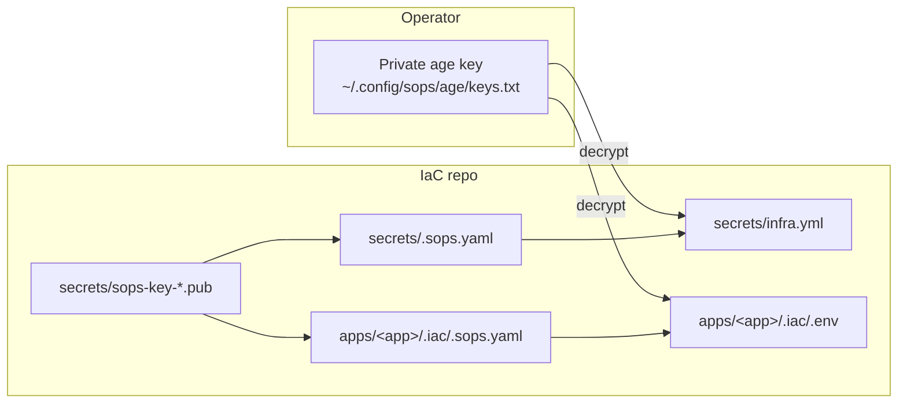

[**<---**](README.md)

# Secrets

Secrets use [SOPS](https://github.com/getsops/sops) + [age](https://github.com/FiloSottile/age). There is **one age identity** on your machine (`~/.config/sops/age/keys.txt`) and **one recipient list**, driven by **`secrets/sops-key-*.pub`**:

- **`secrets/infra.yml`** — platform / infra (Terraform, Ansible, devcontainer bootstrap).
- **`apps/<app>/.iac/.env`** — application runtime secrets for Compose.

Both use the **same** age public keys. **`task secrets:generate-sops-config`** builds **`secrets/.sops.yaml`**; **`task secrets:generate-app-env-sops-config -- <app>`** (or **`task secrets:sync-all-app-env-sops-configs`**) writes **`apps/<app>/.iac/.sops.yaml`** with matching **`age:`** recipients.

Per-app **`.iac/iac.yml`** stays **plain YAML** (`image_name`, `app_domains`); it is **not** encrypted.

```mermaid
flowchart LR
    subgraph OP["Operator"]
        PRIV["Private age key<br/>~/.config/sops/age/keys.txt"]
    end
    subgraph REPO["IaC repo"]
        PUBS["secrets/sops-key-*.pub"]
        RULE1["secrets/.sops.yaml"]
        RULE2["apps/&lt;app&gt;/.iac/.sops.yaml"]
        INFRA["secrets/infra.yml"]
        ENV["apps/&lt;app&gt;/.iac/.env"]
    end
    PRIV -->|decrypt| INFRA
    PRIV -->|decrypt| ENV
    PUBS --> RULE1
    PUBS --> RULE2
    RULE1 --> INFRA
    RULE2 --> ENV
```

**VS Code:** Install the SOPS extension (`signageos.signageos-vscode-sops`). Encrypted files open decrypted; save to re-encrypt.

---

## File locations

| What | Path |
|------|------|
| Platform secrets | **`secrets/infra.yml`** (SOPS) |
| Recipient pubs | **`secrets/sops-key-*.pub`** |
| Rules for **`infra.yml`** | **`secrets/.sops.yaml`** |
| App Compose secrets | **`apps/<app>/.iac/.env`** (SOPS) |
| Rules for **`.env`** | **`apps/<app>/.iac/.sops.yaml`** |
| Plain app config | **`apps/<app>/.iac/iac.yml`** |

**Workflow**

1. **`task secrets:keygen`** → private key on host, **`secrets/sops-key-<username>.pub`** (commit with **`git add -f`** when **`secrets/`** is gitignored upstream).
2. **`task secrets:generate-sops-config`** → **`secrets/.sops.yaml`** for **`infra.yml`**.
3. **`task secrets:generate-app-env-sops-config -- <app>`** per app (or **`task secrets:sync-all-app-env-sops-configs`**) after **`apps/<app>/`** exists.

Whenever you add or remove a **`secrets/sops-key-*.pub`**, rerun **`generate-sops-config`**, open **`secrets/infra.yml`** and save (re-encrypt), then **`sync-all-app-env-sops-configs`** and open each **`.iac/.env`** and save.

Registry hostnames and **`base_domain`** come from **`secrets/infra.yml`**.

---

## Adding a new person

1. They run **`task secrets:keygen`** and commit **`secrets/sops-key-*.pub`**.
2. You **`git pull`**, **`task secrets:generate-sops-config`**, open **`secrets/infra.yml`** → Save (re-encrypt).
3. **`task secrets:sync-all-app-env-sops-configs`**, then open each **`apps/<app>/.iac/.env`** → Save (re-encrypt).
4. Push IaC repo (and app submodule commits if **`.env`** / **`.sops.yaml`** changed inside submodule).

---

## Editing secrets

**VS Code:** Open the file; save to re-encrypt.

**CLI:** `SOPS_AGE_KEY_FILE=~/.config/sops/age/keys.txt sops <file>`

---

## Creating app secrets (`.env`)

1. **`task secrets:generate-app-env-sops-config -- <app>`** (or bulk **`sync-all`**).
2. Create **`apps/<app>/.iac/.env`**, encrypt: **`sops --encrypt --in-place apps/<app>/.iac/.env`** from repo root (or VS Code save).

See [Troubleshooting](troubleshooting.md) for decrypt issues.

---

## CI/CD (app repo)

GitHub Actions: **Variables** `REGISTRY_URL`, `IMAGE_NAME`; **Secrets** `REGISTRY_USERNAME`, `REGISTRY_PASSWORD` — values match **`secrets/infra.yml`**. No SOPS in CI.

See [Registry](registry.md).

---

## Security

Never share your **private** age key. Back it up (password manager). Review diffs before committing encrypted files.

See [Application deployment](application-deployment.md), [Registry](registry.md), [New project](new-project.md).
