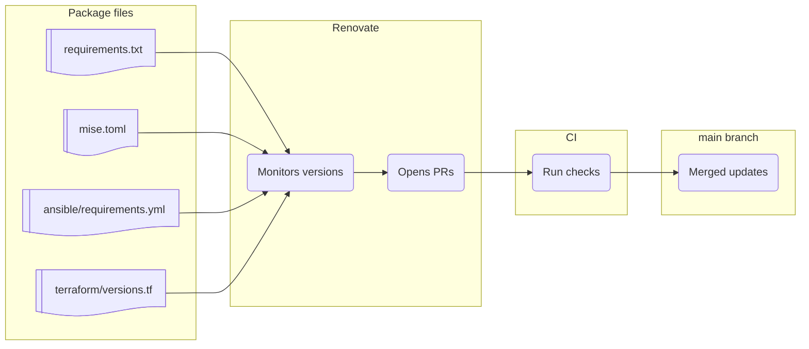

[**<---**](README.md)

# Technologies and upgrading

What the platform uses and how dependencies are kept up to date.

## Tools and technologies

| Tool | Notes | Package file |
|------|-------|--------------|
| **Server provisioning** | | |
| [Ansible](https://docs.ansible.com/) | Configuration management | [`requirements.txt`](../requirements.txt), [`ansible/requirements.yml`](../ansible/requirements.yml) |
| [hcloud](https://github.com/hetznercloud/cli) | Hetzner Cloud CLI | [`mise.toml`](../mise.toml) |
| [Terraform](https://developer.hashicorp.com/terraform) | IaC for cloud resources | [`terraform/versions.tf`](../terraform/versions.tf) |
| **Secrets** | | |
| [Age](https://github.com/FiloSottile/age) | Encryption (age format) | [`mise.toml`](../mise.toml) |
| [SOPS](https://getsops.io/) | Encrypt secrets in Git. See [Secrets](secrets.md) | [`mise.toml`](../mise.toml) |
| **Task runner** | | |
| [Task](https://taskfile.dev/) | Task runner for build/deploy commands | [`mise.toml`](../mise.toml) |
| **Version management** | | |
| [Mise](https://mise.jdx.dev/) | CLI version manager (terraform, sops, crane, …) | [`Dockerfile`](../Dockerfile), [`mise.toml`](../mise.toml) |
| [Renovate](https://docs.renovatebot.com/) | Upgrade PRs (above) | [`.github/workflows/renovate.yml`](../.github/workflows/renovate.yml) |
| **Application deployment** | | |
| [Crane](https://github.com/google/go-containerregistry/tree/main/cmd/crane) | Registry CLI (catalog, digest, delete). See [Registry](registry.md) | [`mise.toml`](../mise.toml) |
| [Docker](https://www.docker.com/) | Containers | [`prefect/Dockerfile.worker`](../prefect/Dockerfile.worker) |
| [Docker Registry](https://distribution.github.io/distribution/) | Image storage. See [Registry](registry.md) | [`ansible/roles/server/tasks/registry.yml`](../ansible/roles/server/tasks/registry.yml) |
| **Web server and TLS** | | |
| [Traefik](https://doc.traefik.io/traefik/) | Reverse proxy, Let's Encrypt. See [Traefik](traefik.md) | [`ansible/roles/server/tasks/traefik.yml`](../ansible/roles/server/tasks/traefik.yml) |
| **Intrusion prevention** | | |
| [Fail2ban](https://github.com/fail2ban/fail2ban) | Ban IPs after failed SSH/auth. See [Traefik](traefik.md#security) | [`ansible/roles/server/tasks/fail2ban.yml`](../ansible/roles/server/tasks/fail2ban.yml) |
| **Workflows** | | |
| [Prefect](https://www.prefect.io/) | Scheduled tasks and flows. See [Workflows](workflows.md) | [`ansible/roles/server/tasks/prefect.yml`](../ansible/roles/server/tasks/prefect.yml) |
| [Restic](https://restic.net/) | Encrypted app backups (Prefect flow + restore). See [Backups](backups.md) | [`prefect/Dockerfile.worker`](../prefect/Dockerfile.worker) |
| **Monitoring** | | |
| [OpenObserve](https://openobserve.ai/) | Logs, metrics, traces. See [Monitoring](monitoring.md) | [`ansible/roles/server/tasks/openobserve.yml`](../ansible/roles/server/tasks/openobserve.yml) |
| [OpenTelemetry Collector](https://opentelemetry.io/docs/collector/) | Sends host/container data to OpenObserve | [`ansible/roles/server/tasks/openobserve.yml`](../ansible/roles/server/tasks/openobserve.yml) |
| **Testing / linting** | | |
| [Ansible Lint](https://docs.ansible.com/projects/lint/) | Ansible best practices | [`requirements.txt`](../requirements.txt) |
| [ShellCheck](https://www.shellcheck.net/) | Shell script checks | [`mise.toml`](../mise.toml) |
| [TFsec](https://aquasecurity.github.io/tfsec/) | Terraform security scanner | [`mise.toml`](../mise.toml) |
| [Trivy](https://aquasecurity.github.io/trivy/) | Container image scanner | [`mise.toml`](../mise.toml) |

## Upgrading

**[Renovate](https://docs.renovatebot.com/)** opens upgrade PRs. It runs in CI via [`.github/workflows/renovate.yml`](../.github/workflows/renovate.yml) (daily or manual). Config: [`renovate.json`](../renovate.json); repo secret `RENOVATE_TOKEN` (GitHub PAT with `repo` and `workflow` scope).

**Dependency Dashboard:** GitHub Issues (search "Renovate Dependency Dashboard") — pending, open, closed updates. Use it to recreate or rebase PRs. Review, CI green, merge.

Renovate monitors the **package file** column in the table below, plus GitHub Actions in workflow files and the devcontainer base image in [`Dockerfile`](../Dockerfile). For mise tools not in Renovate’s [mise manager](https://docs.renovatebot.com/modules/manager/mise/#supported-default-registry-tool-short-names) list, add a `# owner/repo` comment so regex can match GitHub tags (see [`mise.toml`](../mise.toml)).

