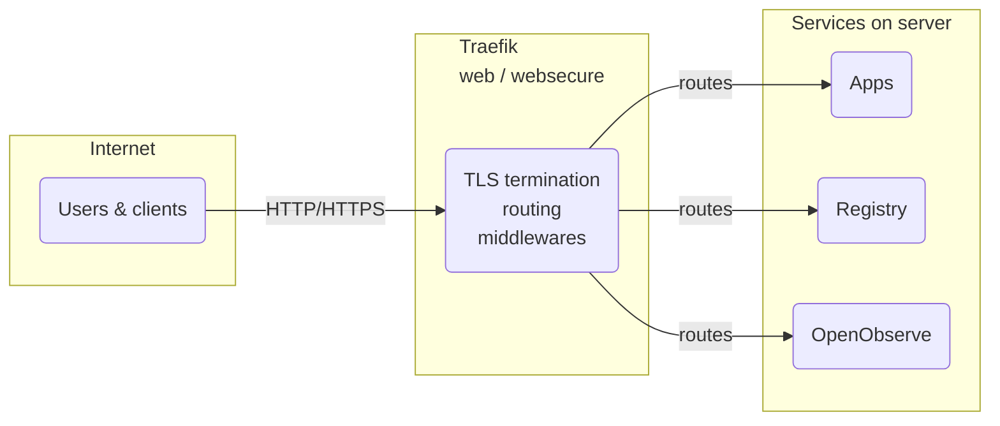

[**<---**](README.md)

# Traefik

Traefik is the reverse proxy and TLS termination layer. It discovers containers via Docker labels, provisions Let's Encrypt certificates, and routes traffic.



## Quick Reference

**Dashboard:** Via SSH tunnel only — see [Remote VS Code / Cursor](remote-vscode.md) (admin access).  
**Configuration:** Managed by Ansible (`ansible/roles/server/tasks/traefik.yml`)  
**Logs:** `/var/log/traefik/access.log` (common format for fail2ban)

---

## Adding an application

To expose an application through Traefik, add the following to your app's `docker-compose.yml`:

1. **Add Traefik network:**
   ```yaml
   networks:
     default:
       name: <app-network>
     traefik:
       external: true
   ```

2. **Add Traefik labels to your service:**
   ```yaml
   services:
     app:
       # ... other config ...
       networks:
         - default
         - traefik
       labels:
         - traefik.enable=true
         - traefik.http.routers.app.rule=Host(`dev.rednaw.nl`) || Host(`prod.rednaw.nl`)
         - traefik.http.routers.app.entrypoints=websecure
         - traefik.http.routers.app.tls.certresolver=letsencrypt
         - traefik.http.services.app.loadbalancer.server.port=3000  # Your app's internal port
         - traefik.http.routers.app.middlewares=app-headers,app-buffering
   ```

3. **Required middlewares:**

All apps should use these middlewares:

- **`app-headers`**: Security headers (`X-Frame-Options`, `Referrer-Policy`, `Strict-Transport-Security`, `X-Content-Type-Options`)
- **`app-buffering`**: Request body size limit (20MB)

Defined in `ansible/roles/server/templates/traefik-dynamic-middlewares.yml.j2`.

---

## Operations

### Restart Traefik

```bash
ssh ubuntu@dev.rednaw.nl 'sudo docker restart traefik'
```

### View Logs

```bash
ssh ubuntu@dev.rednaw.nl 'sudo docker logs traefik'
ssh ubuntu@dev.rednaw.nl 'sudo tail -f /var/log/traefik/access.log'
```

### Check Status

```bash
ssh ubuntu@dev.rednaw.nl 'sudo docker ps | grep traefik'
ssh ubuntu@dev.rednaw.nl 'sudo docker network inspect traefik'
```

### Access Dashboard

The Traefik dashboard is not exposed publicly (no DNS). Use an SSH tunnel to the server, then open **http://localhost:8080** in your browser. See [Remote VS Code / Cursor](remote-vscode.md) for setting up SSH and port forwarding. On the server the API/dashboard listens on port 8080 (internal).

---

## Security

### Security Headers

All Traefik-managed endpoints send:
- `X-Frame-Options: DENY`
- `Referrer-Policy: strict-origin-when-cross-origin`
- `Strict-Transport-Security: max-age=31536000; includeSubDomains`
- `X-Content-Type-Options: nosniff`

### Fail2ban Integration

Traefik access logs are monitored by fail2ban for:
- **`traefik-auth`**: Failed authentication attempts (401/403 on `/api/auth/login`)
- **`traefik-forbidden`**: 403 Forbidden responses
- **`traefik-badbots`**: Requests to known scanner paths (wp-login.php, .env, etc.)

Check status:
```bash
ssh ubuntu@dev.rednaw.nl 'sudo fail2ban-client status traefik-auth'
```

---

## Configuration

### Static configuration

- **File:** `/etc/traefik/traefik.yml`
- **Template:** `ansible/roles/server/templates/traefik.yml.j2`
- **Changes:** Requires Traefik restart

### Dynamic configuration

- **Directory:** `/etc/traefik/dynamic/`
- **Templates:** `ansible/roles/server/templates/traefik-dynamic-*.yml.j2`
- **Changes:** Hot-reloaded by Traefik

### Key files

- **Redirects:** `traefik-dynamic-redirects-http.yml.j2` (HTTP→HTTPS)
- **Middlewares:** `traefik-dynamic-middlewares.yml.j2` (security headers, buffering)
- **App host:** `traefik-dynamic-app-host.yml.j2` (ensures cert for main hostname)

---

## Troubleshooting

### Certificate issues

If certificates aren't provisioning:
1. Check Traefik logs: `sudo docker logs traefik`
2. Verify HTTP→HTTPS redirect excludes ACME path: `/.well-known/acme-challenge`
3. Ensure router exists for the hostname (even if app isn't running)

### HTTP→HTTPS redirect not working

- Check `traefik-dynamic-redirects-http.yml.j2` priority (should be `10000`)
- Verify rule excludes ACME path: `!PathPrefix(\`/.well-known/acme-challenge\`)`

### Container not discovered

- Verify container is on `traefik` network: `docker network inspect traefik`
- Check labels are correct: `docker inspect <container> | grep -A 20 Labels`
- Ensure `traefik.enable=true` label is present

### IPv6 connectivity

Traefik binds to both IPv4 (`0.0.0.0`) and IPv6 (`[::]`) for ports 80 and 443. If IPv6 isn't working:
- Verify DNS AAAA records exist
- Check Docker port bindings: `docker inspect traefik | grep -A 10 Ports`

---

## Architecture

- **Entrypoints:** `web` (80), `websecure` (443)
- **Certificate Resolver:** `letsencrypt` (HTTP-01 challenge)
- **Providers:** Docker (container discovery), File (routing rules)
- **Network:** `traefik` (external Docker network)

All services (apps, registry, OpenObserve) attach to the `traefik` network and are discovered via Docker labels.

## Related

For setup (secrets, deploy), see [Onboarding](onboarding.md) and [Application deployment](application-deployment.md).
