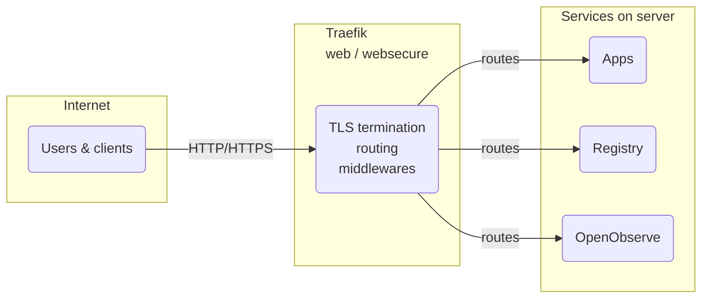

[**<---**](README.md)

# Traefik

Traefik is the reverse proxy and TLS termination layer. It discovers containers via Docker labels, provisions Let's Encrypt certificates, and routes traffic.


```mermaid
flowchart LR
    subgraph INTERNET["Internet"]
        U(Users & clients)
    end

    subgraph TRAEFIK["Traefik<br/>web / websecure"]
        T(TLS termination<br/>routing<br/>middlewares)
    end

    subgraph SERVICES["Services on server"]
        A(Apps)
        R(Registry)
        O(OpenObserve)
    end

    U -->|HTTP/HTTPS| T
    T -->|routes| A
    T -->|routes| R
    T -->|routes| O
```

**Dashboard:** Via SSH tunnel — see [Remote-SSH](remote-ssh.md)  
**Configuration:** [`ansible/roles/server/tasks/traefik.yml`](../ansible/roles/server/tasks/traefik.yml)  
**Logs:** `/var/log/traefik/access.log`

---

## Adding an application

Add Traefik labels in **`.iac/docker-compose.override.yml`** (in the app repo):

```yaml
services:
  app:
    labels:
      traefik.enable: "true"
      traefik.http.routers.app.priority: "1"
      traefik.http.routers.app.rule: "Host(`example.com`)"
      traefik.http.routers.app.entrypoints: "websecure"
      traefik.http.routers.app.tls.certresolver: "letsencrypt"
      traefik.http.routers.app.middlewares: "app-headers,app-buffering"
      traefik.http.services.app.loadbalancer.server.port: "3000"
    networks:
      - default
      - traefik
    restart: unless-stopped

networks:
  traefik:
    external: true
```

**Required middlewares:**
- `app-headers` — Security headers (X-Frame-Options, HSTS, etc.). Defined in [`traefik-dynamic-middlewares.yml.j2`](../ansible/roles/server/templates/traefik-dynamic-middlewares.yml.j2)
- `app-buffering` — 20MB request limit

**TLS domains:** List app domains in `app/.iac/iac.yml` under `app_domains` for Let's Encrypt pre-warming.

**Optional CSP/Permissions-Policy:** Set in your app or add a Traefik middleware in the override:

```yaml
traefik.http.routers.app.middlewares: "app-headers,app-buffering,myapp-security"
traefik.http.middlewares.myapp-security.headers.customResponseHeaders.Content-Security-Policy: "default-src 'self'"
```

---

## Operations

From the devcontainer, use Docker contexts (`docker context use dev`) to skip typing `ssh`. From the host, use the `ssh` form.

| Task | Command |
|------|---------|
| Restart | `docker restart traefik` |
| Logs | `docker logs traefik` |
| Access log | `ssh ubuntu@<host> 'sudo tail -f /var/log/traefik/access.log'` |
| Status | `docker ps \| grep traefik` |
| Network | `docker network inspect traefik` |
| Dashboard | SSH tunnel to port 57801 — see [Remote-SSH](remote-ssh.md) |

### HTTP 418 (I'm a teapot)

The `noop@internal` service returns 418 and is used by the app-host router to get Let's Encrypt certs before your app is deployed. If you see 418 after deploy:

1. Ensure your router has `priority: "1"` or higher (app-host uses -10)
2. Check app container is running and on `traefik` network
3. Check Traefik logs: `docker logs traefik`

---

## Security

**Headers** (via `app-headers` middleware):
- X-Frame-Options: DENY
- Referrer-Policy: strict-origin-when-cross-origin
- Strict-Transport-Security: max-age=31536000; includeSubDomains
- X-Content-Type-Options: nosniff

CSP and Permissions-Policy not set by default — add in app or via middleware.

**Fail2ban:** Monitors `/var/log/traefik/access.log` for auth failures (401/403), forbidden responses, and scanner paths. Check: `ssh ubuntu@<host> 'sudo fail2ban-client status traefik-auth'`

---

## Configuration

| Type | Location | Notes |
|------|----------|-------|
| Static | `/etc/traefik/traefik.yml` | Template: [`traefik.yml.j2`](../ansible/roles/server/templates/traefik.yml.j2). Requires restart. |
| Dynamic | `/etc/traefik/dynamic/` | Templates: [`traefik-dynamic-*.yml.j2`](../ansible/roles/server/templates/). Hot-reloaded. |

Key dynamic files: [`traefik-dynamic-redirects-http.yml.j2`](../ansible/roles/server/templates/traefik-dynamic-redirects-http.yml.j2) (HTTP→HTTPS), [`traefik-dynamic-middlewares.yml.j2`](../ansible/roles/server/templates/traefik-dynamic-middlewares.yml.j2) (headers, buffering), [`traefik-dynamic-app-host.yml.j2`](../ansible/roles/server/templates/traefik-dynamic-app-host.yml.j2) (cert pre-warming).

---

## Troubleshooting

| Problem | Fix |
|---------|-----|
| Certificates not provisioning | Check `docker logs traefik`. Ensure HTTP→HTTPS redirect excludes `/.well-known/acme-challenge` and router exists. |
| HTTP→HTTPS not working | Verify [`traefik-dynamic-redirects-http.yml.j2`](../ansible/roles/server/templates/traefik-dynamic-redirects-http.yml.j2) priority is 10000 and excludes ACME path. |
| Container not discovered | Check container is on `traefik` network (`docker network inspect traefik`), has `traefik.enable=true` label. |
| IPv6 not working | Verify DNS AAAA records. Check port bindings: `docker inspect traefik \| grep -A 10 Ports`. |

---

Traefik runs on ports 80/443, discovers containers via Docker labels, handles TLS via Let's Encrypt HTTP-01. Network: `traefik` (external). See [`ansible/roles/server/tasks/traefik.yml`](../ansible/roles/server/tasks/traefik.yml).
