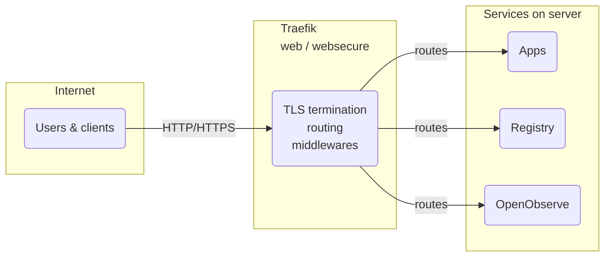

[**<---**](README.md)

# Traefik

Traefik is the reverse proxy and TLS termination layer. It discovers containers via Docker labels, provisions Let's Encrypt certificates, and routes traffic.


```mermaid
flowchart LR
    subgraph INTERNET["Internet"]
        U(Users & clients)
    end

    subgraph TRAEFIK["Traefik<br/>web / websecure"]
        T(TLS termination<br/>routing<br/>middlewares)
    end

    subgraph SERVICES["Services on server"]
        A(Apps)
        R(Registry)
        O(OpenObserve)
    end

    U -->|HTTP/HTTPS| T
    T -->|routes| A
    T -->|routes| R
    T -->|routes| O
```

## Quick Reference

**Dashboard:** Via SSH tunnel only — see [Remote-SSH](remote-ssh.md) (admin access).  
**Configuration:** Managed by Ansible (`ansible/roles/server/tasks/traefik.yml`)  
**Logs:** `/var/log/traefik/access.log` (common format for fail2ban)

---

## Adding an application

Production routing is defined in **`.iac/docker-compose.override.yml`** in the app repo (not in the main `docker-compose.yml`). That override is copied to the server by the deploy task.

1. **In `.iac/docker-compose.override.yml`**, add the Traefik network and labels to your app service (including the required middlewares):

   ```yaml
   services:
     app:
       labels:
         traefik.enable: "true"
         traefik.http.routers.app.priority: "1"
         traefik.http.routers.app.rule: "Host(`example.com`)"
         traefik.http.routers.app.entrypoints: "websecure"
         traefik.http.routers.app.tls.certresolver: "letsencrypt"
         traefik.http.routers.app.middlewares: "app-headers,app-buffering"
         traefik.http.services.app.loadbalancer.server.port: "3000"
       networks:
         - default
         - traefik
       restart: unless-stopped
     # ... other services with restart: unless-stopped as needed ...

   networks:
     traefik:
       external: true
   ```

2. **Domains for TLS** — List your app domains in `app/.iac/iac.yml` under **`app_domains`** (unencrypted). Traefik uses this list to pre-warm Let's Encrypt certificates; the override file supplies the actual routing labels.

3. **Required middlewares:**

All apps should use these middlewares on their router:

- **`app-headers`**: Security headers — `X-Frame-Options`, `Referrer-Policy`, `Strict-Transport-Security`, `X-Content-Type-Options`. No CSP or Permissions-Policy; set those in the app (e.g. SvelteKit, Next.js) or via an extra Traefik middleware if needed.
- **`app-buffering`**: Request body size limit (20MB).

Add them to your router, e.g.:

```yaml
labels:
  traefik.http.routers.app.middlewares: "app-headers,app-buffering"
```

Defined in `ansible/roles/server/templates/traefik-dynamic-middlewares.yml.j2`.

4. **Optional: Content-Security-Policy or Permissions-Policy**

The platform does not set CSP or Permissions-Policy by default. Prefer setting them in the app (framework or server). If you want them in Traefik instead, add a middleware in **`.iac/docker-compose.override.yml`** and attach it after the shared ones:

```yaml
traefik.http.routers.app.middlewares: "app-headers,app-buffering,myapp-security"
traefik.http.middlewares.myapp-security.headers.customResponseHeaders.Content-Security-Policy: "default-src 'self'; script-src 'self'"
traefik.http.middlewares.myapp-security.headers.customResponseHeaders.Permissions-Policy: "geolocation=(), microphone=(), camera=()"
```

---

## Operations

From the **IaC devcontainer**, use Docker contexts so you don't need to type `ssh`: run `docker context use dev` (or `prod`), then run the commands below without the `ssh` wrapper. See [Launch the devcontainer](launch-devcontainer.md) for context setup. From outside the devcontainer, use the `ssh` form.

### Restart Traefik

```bash
# From devcontainer (after: docker context use dev)
docker restart traefik

# From host
ssh ubuntu@dev.<base_domain> 'sudo docker restart traefik'   # e.g. dev.rednaw.nl
```

### View Logs

```bash
# From devcontainer (after: docker context use dev)
docker logs traefik
# Access log on server: sudo tail -f /var/log/traefik/access.log (via ssh)

# From host
ssh ubuntu@dev.<base_domain> 'sudo docker logs traefik'
ssh ubuntu@dev.<base_domain> 'sudo tail -f /var/log/traefik/access.log'
```

### Check Status

```bash
# From devcontainer (after: docker context use dev)
docker ps | grep traefik
docker network inspect traefik

# From host
ssh ubuntu@dev.<base_domain> 'sudo docker ps | grep traefik'
ssh ubuntu@dev.<base_domain> 'sudo docker network inspect traefik'
```

### Access Dashboard

The Traefik dashboard is not exposed publicly (no DNS). Use an SSH tunnel to the server, then open **http://localhost:8080** in your browser. See [Remote-SSH](remote-ssh.md) for setting up SSH and port forwarding. On the server the API/dashboard listens on port 8080 (internal).

### HTTP 418 (I'm a teapot)

Traefik's built-in `noop@internal` service returns 418. It is used by the **app-host** router (in `traefik-dynamic-app-host.yml.j2`) so Let's Encrypt can obtain certificates for your app domains even when the app container is not running. When the app is deployed, the app's Docker router must win over app-host so traffic goes to your app, not to noop.

If you see 418 on your app URL after deploy:

1. **Priority** — Ensure your app router has `traefik.http.routers.app.priority: "1"` (or higher) in `.iac/docker-compose.override.yml`. The app-host router uses priority -10 so priority 1 always wins.
2. **App container** — Confirm the app container is running and on the `traefik` network: `docker ps` and `docker network inspect traefik` on the server.
3. **Traefik logs** — Check for router or middleware errors: `sudo docker logs traefik`.

---

## Security

### Security Headers

Apps using the **`app-headers`** middleware get:
- `X-Frame-Options: DENY`
- `Referrer-Policy: strict-origin-when-cross-origin`
- `Strict-Transport-Security: max-age=31536000; includeSubDomains`
- `X-Content-Type-Options: nosniff`

CSP and Permissions-Policy are not set by the platform; set them in the app or via an optional [Traefik middleware](#4-optional-content-security-policy-or-permissions-policy).

### Fail2ban Integration

Traefik access logs are monitored by fail2ban for:
- **`traefik-auth`**: Failed authentication attempts (401/403 on `/api/auth/login`)
- **`traefik-forbidden`**: 403 Forbidden responses
- **`traefik-badbots`**: Requests to known scanner paths (wp-login.php, .env, etc.)

Check status:
```bash
ssh ubuntu@dev.<base_domain> 'sudo fail2ban-client status traefik-auth'   # e.g. dev.rednaw.nl
```

---

## Configuration

### Static configuration

- **File:** `/etc/traefik/traefik.yml`
- **Template:** `ansible/roles/server/templates/traefik.yml.j2`
- **Changes:** Requires Traefik restart

### Dynamic configuration

- **Directory:** `/etc/traefik/dynamic/`
- **Templates:** `ansible/roles/server/templates/traefik-dynamic-*.yml.j2`
- **Changes:** Hot-reloaded by Traefik

### Key files

- **Redirects:** `traefik-dynamic-redirects-http.yml.j2` (HTTP→HTTPS)
- **Middlewares:** `traefik-dynamic-middlewares.yml.j2` (security headers, buffering)
- **App host:** `traefik-dynamic-app-host.yml.j2` (ensures cert for main hostname)

---

## Troubleshooting

### Certificate issues

If certificates aren't provisioning:
1. Check Traefik logs: `sudo docker logs traefik`
2. Verify HTTP→HTTPS redirect excludes ACME path: `/.well-known/acme-challenge`
3. Ensure router exists for the hostname (even if app isn't running)

### HTTP→HTTPS redirect not working

- Check `traefik-dynamic-redirects-http.yml.j2` priority (should be `10000`)
- Verify rule excludes ACME path: `!PathPrefix(\`/.well-known/acme-challenge\`)`

### Container not discovered

- Verify container is on `traefik` network: `docker network inspect traefik`
- Check labels are correct: `docker inspect <container> | grep -A 20 Labels`
- Ensure `traefik.enable=true` label is present

### IPv6 connectivity

Traefik binds to both IPv4 (`0.0.0.0`) and IPv6 (`[::]`) for ports 80 and 443. If IPv6 isn't working:
- Verify DNS AAAA records exist
- Check Docker port bindings: `docker inspect traefik | grep -A 10 Ports`

---

## Architecture

- **Entrypoints:** `web` (80), `websecure` (443)
- **Certificate Resolver:** `letsencrypt` (HTTP-01 challenge)
- **Providers:** Docker (container discovery), File (routing rules)
- **Network:** `traefik` (external Docker network)

All services (apps, registry, OpenObserve) attach to the `traefik` network and are discovered via Docker labels.

## Related

For setup (secrets, deploy), see [Onboarding](onboarding.md) and [Application deployment](application-deployment.md).
