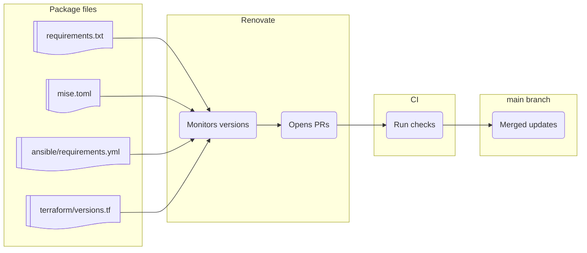

[**<---**](README.md)

# Upgrading

Upgrades are automated by **[Renovate](https://docs.renovatebot.com/)**. See [Tools and technologies used](technologies.md) for what's tracked.



Renovate runs in CI: the workflow [`.github/workflows/renovate.yml`](../.github/workflows/renovate.yml) runs daily and can be triggered manually. Configured by [`renovate.json`](../renovate.json) and repository secret `RENOVATE_TOKEN` (GitHub PAT with `repo` and `workflow` scope).

Renovate opens upgrade PRs and maintains a [**Dependency Dashboard**](https://github.com/rednaw/iac/issues/41) listing all pending, open, and closed updates. Use it to recreate PRs or rebase branches.

## Package files

Renovate monitors these files for versioned dependencies:

| File | What |
|--------|------|
| **requirements.txt** | Python dependencies: ansible, ansible-lint, PyYAML |
| **mise.toml** | CLI tools: terraform, sops, crane, tfsec, ... |
| **ansible/requirements.yml** | Ansible collections |
| **GitHub Actions** | Marketplace actions in workflow files |
| **Dockerfile** | Base image (`FROM mcr.microsoft.com/devcontainers/base:...`) |
| **terraform/** | Providers in `versions.tf` and `.terraform.lock.hcl` |

## mise.toml and Renovate

Renovate uses native mise manager for [supported tools](https://docs.renovatebot.com/modules/manager/mise/#supported-default-registry-tool-short-names).

For GitHub-hosted tools not supported by Renovate's mise manager, add a `# owner/repo` comment so a custom regex can find versions in GitHub project tags:

```toml
task   = "3.40.0"     # go-task/task
tfsec  = "1.28.14"
```

See [`mise.toml`](../mise.toml). 

